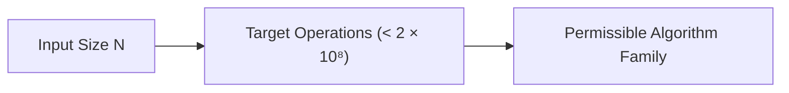
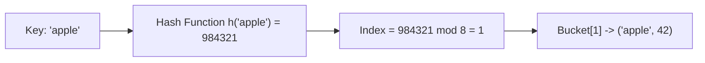
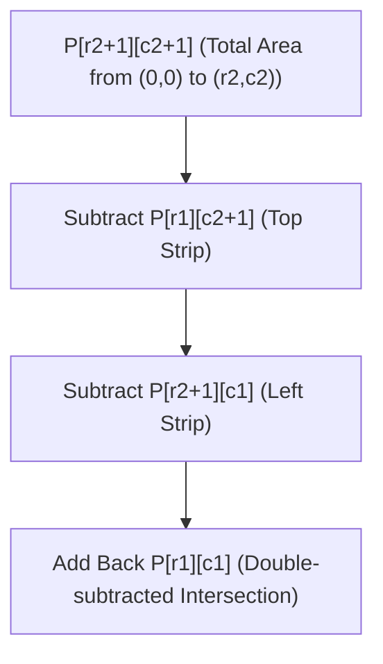
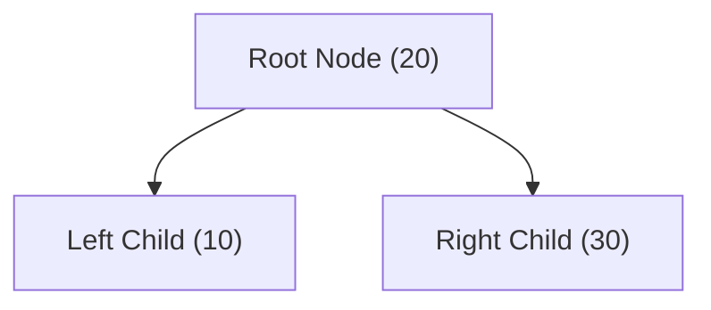
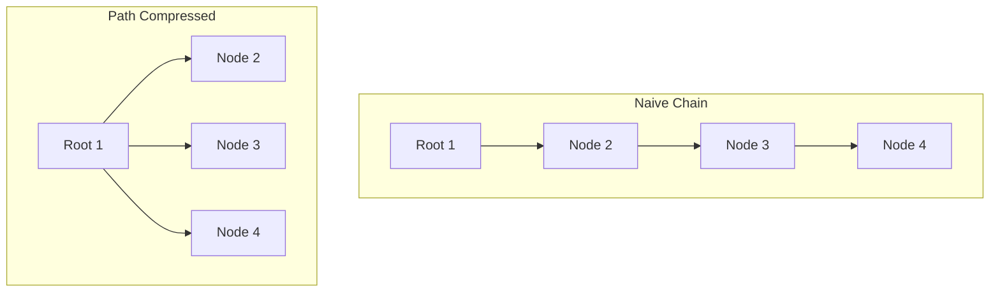
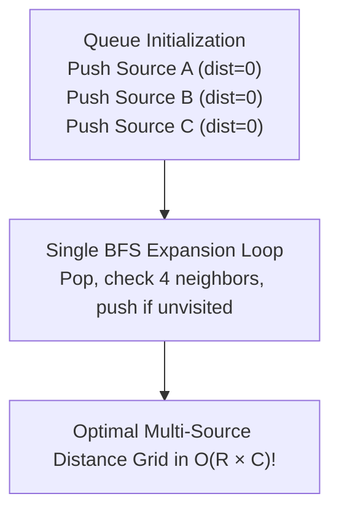
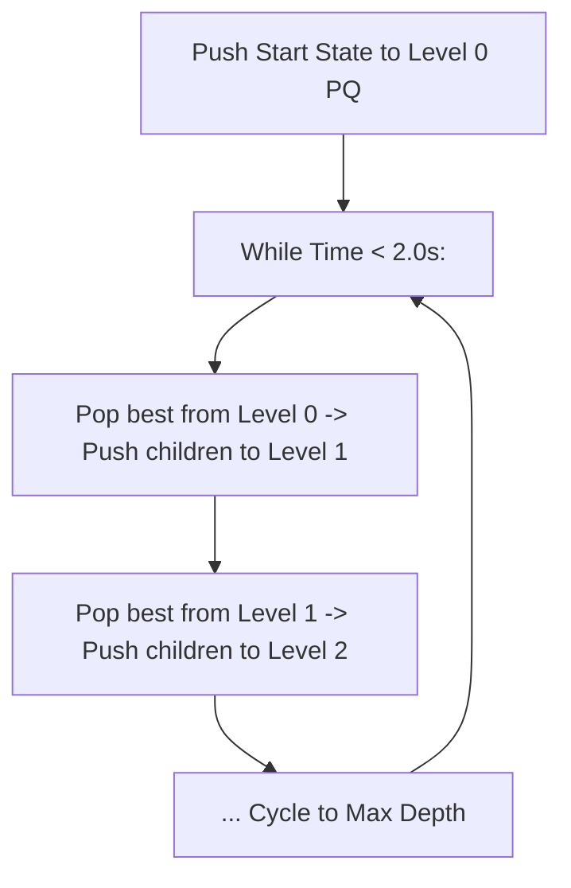
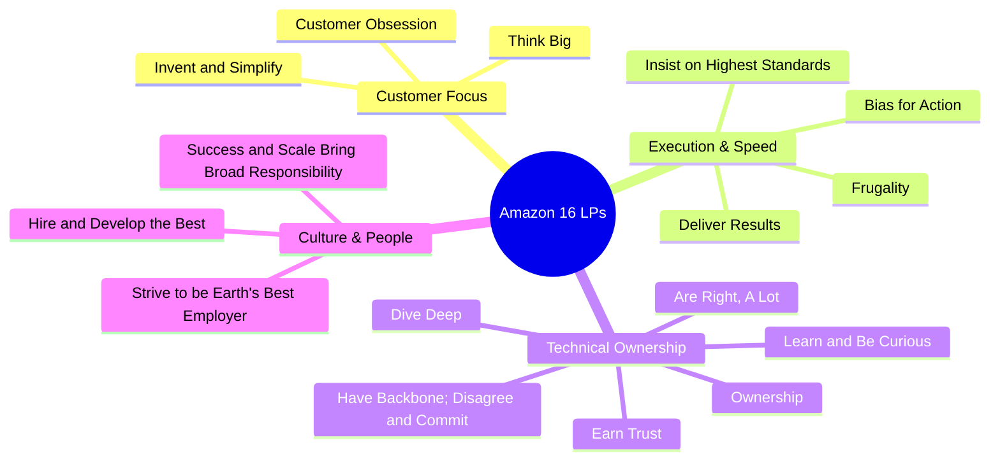
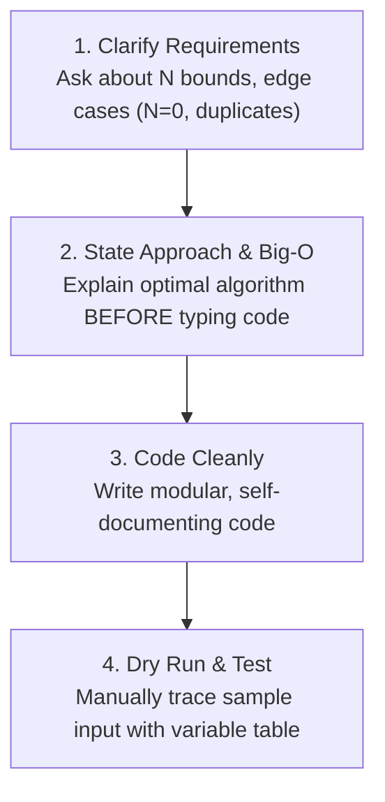

# 📘 THE MASTER SKILL PATH HANDBOOK
# Pass the Competitive Programming & Technical Interview with Python & C++

> **Comprehensive Curriculum & Technical Reference Manual**  
> *Designed in the style of Codecademy & Educative.io Skill Paths*  
> *From First Principles to AtCoder Cyan Rating and Amazon/Microsoft Hiring Loops*

---

## 📑 Complete Table of Contents

1. [Unit 1: Foundations of Algorithmic Thinking & The Big O Engine](#unit-1-foundations-of-algorithmic-thinking--the-big-o-engine)
2. [Unit 2: Linear Data Structures & Monotonic Stacks](#unit-2-linear-data_structures--monotonic-stacks)
3. [Unit 3: Hash Maps, Sets & Two Pointers (尺取法)](#unit-3-hash-maps-sets--two-pointers-尺取法)
4. [Unit 4: Prefix Sums, Cumulative Probability & Coordinate Compression](#unit-4-prefix-sums-cumulative-probability--coordinate-compression)
5. [Unit 5: Nonlinear Structures: Trees, Heaps & Disjoint Set Union (DSU)](#unit-5-nonlinear-structures-trees-heaps--disjoint-set-union-dsu)
6. [Unit 6: Search & Sorting: Binary Search on Answer & Custom Comparators](#unit-6-search--sorting-binary-search-on-answer--custom-comparators)
7. [Unit 7: Graphs, Shortest Paths & Grid Traversals (BFS / DFS / Dijkstra)](#unit-7-graphs-shortest-paths--grid-traversals-bfs--dfs--dijkstra)
8. [Unit 8: Dynamic Programming Masterclass & Lazy Segment Trees](#unit-8-dynamic-programming-masterclass--lazy-segment-trees)
9. [Unit 9: Mathematical Foundations, Discrete Geometry & Heuristic Search](#unit-9-mathematical-foundations-discrete-geometry--heuristic-search)
10. [Unit 10: FAANG Career Capstone: Amazon & Microsoft Hiring Loops](#unit-10-faang-career-capstone-amazon--microsoft-hiring-loops)

---

# Unit 1: Foundations of Algorithmic Thinking & The Big O Engine
> **Skill Path**: Pass the Competitive Programming & Technical Interview with Python & C++  
> **Unit Status**: Core Theoretical Foundation & Practical Tooling

---

## 🎯 Unit Overview
In this unit, you will learn the exact thought process used by competitive programming grandmasters and senior FAANG interviewers to analyze, deconstruct, and solve algorithmic problems without guessing. You will master Big-O asymptotic analysis, understand the mathematical relationship between input size $N$ and permissible algorithms, configure an automated local CLI judge, and complete your first speed drills.

---

## Lesson 1.1: Asymptotic Complexity & The Constraint-to-Complexity Mapping

### 1. The Core Principle: Working Backwards from $N$
In competitive programming (AtCoder, Codeforces) and online assessments (Amazon OA, Microsoft), every problem specifies explicit input constraints (e.g., $1 \le N \le 2 \times 10^5$, $1 \le N \le 18$, or $1 \le N \le 10^{18}$).

A modern judge server executes approximately **$10^8$ basic CPU operations per second**. Since standard problem time limits are **2.0 seconds**, your solution must perform **fewer than $2 \times 10^8$ operations**.



### 2. The Comprehensive Complexity Mapping Table

| Input Constraint ($N$) | Max Allowed Time Complexity | Permissible Algorithms & Data Structures | Typical Problem Scenarios |
| :--- | :--- | :--- | :--- |
| **$N \le 10$** | $O(N!) \text{ or } O(N \cdot N!)$ | Permutation generation (`std::next_permutation`), Backtracking | Traveling Salesperson brute-force, arrangement search |
| **$N \le 20$** | $O(2^N) \text{ or } O(N^2 2^N)$ | Bitmask Dynamic Programming, Subset Enumeration | Hamiltonian cycles, subset sum with small $N$ |
| **$N \le 100$** | $O(N^4) \text{ or } O(N^3)$ | Floyd-Warshall All-Pairs Shortest Path, 3-Loop Brute Force | Graph reachability, small grid matrix operations |
| **$N \le 500$** | $O(N^3)$ | Interval DP, 2D Grid DP with loop transition | Matrix chain multiplication, polygon triangulation |
| **$N \le 2,000$** | $O(N^2)$ | 2D Dynamic Programming, All-Pairs Comparisons, $O(N^2)$ Dijkstra | Longest Common Subsequence (LCS), Edit Distance |
| **$N \le 2 \times 10^5$** | **$O(N \log N) \text{ or } O(N)$** | **Sorting, Two Pointers, Prefix Sums, Binary Search, DSU, Segment Trees, Priority Queues, BFS/DFS** | **90% of AtCoder ABC C-E & LeetCode Medium/Hard!** |
| **$N \le 10^7$** | $O(N)$ | Linear Scan, Sieve of Eratosthenes, Sliding Window | Counting arrays, simple linear state machines |
| **$N \le 10^{12}$** | $O(\sqrt{N})$ | Prime Factorization, Divisor Counting, Square Root Decomposition | Primality testing, factoring numbers up to $10^{12}$ |
| **$N \le 10^{18}$** | $O(\log N) \text{ or } O(1)$ | Binary Search on Answer, Matrix Exponentiation, Memoized Recursion (`@cache`), Closed Math Formulas | Exponentiation modulo $P$, Fibonacci on $10^{18}$ |

---

### 3. Formal Asymptotic Proof: Why $O(\max(N, M)) \equiv O(N + M)$
*(Synthesized from [`O(max(n,m))をO(n+m)と書ける理由` by `@NAVYSHUNTA`](https://qiita.com/NAVYSHUNTA/items/9d3bf1371d5c54b38446))*

In graph algorithms like Breadth-First Search (BFS) and Depth-First Search (DFS), time complexity is conventionally written as $O(V + E)$ where $V$ is vertices and $E$ is edges. Beginners often wonder why this is equivalent to $O(\max(V, E))$.

#### Proof:
1. By definition of maximum:
   $$\max(V, E) \le V + E$$
2. Since both $V, E \ge 0$:
   $$V + E \le \max(V, E) + \max(V, E) = 2 \cdot \max(V, E)$$
3. Combining (1) and (2):
   $$\max(V, E) \le V + E \le 2 \cdot \max(V, E)$$
Because $V + E$ is strictly bounded from above and below by constant multiples of $\max(V, E)$, the asymptotic growth rates are **mathematically identical**:
$$O(V + E) = O(\max(V, E)) \quad \text{and} \quad \Theta(V + E) = \Theta(\max(V, E)) \quad \blacksquare$$

---

## Lesson 1.2: The Zero-WA Pre-Flight Shield

90% of Wrong Answer (WA) verdicts in contests and interview screening stem from simple, avoidable oversights. Before submitting code, execute this 6-point checklist:

### 1. 64-Bit Integer Overflow Trap
In C++, a standard signed 32-bit `int` holds values up to $2^{31} - 1 \approx 2.14 \times 10^9$. 
Multiplying two values $\ge 10^5$ or accumulating sums of $N=2 \times 10^5$ items will silently overflow into negative values.

```cpp
// ❌ DANGEROUS:
int N = 200000;
int sum = 0;
for (int i = 0; i < N; i++) sum += 1000000; // Overflows 2 * 10^11!

// ✅ SAFE:
long long safe_sum = 0;
using ll = long long;
ll A = 1000000000LL, B = 1000000000LL;
ll product = A * B; // 10^18 fits safely in 64-bit signed integer (up to 9 * 10^18)
```

### 2. The 0-Based vs 1-Based Indexing Trap
Problem statements describe vertices and sequences from $1$ to $N$. Array indices in C++ and Python are $0$ to $N-1$.
**Golden Rule**: Decrement indices immediately upon reading input:
```python
# Read edge (u, v) and immediately convert to 0-based:
u, v = map(int, input().split())
u -= 1
v -= 1
adj[u].append(v)
adj[v].append(u)
```

### 3. Modulo Subtraction Negative Trap
When calculating $(A - B) \pmod M$, if $A < B$, standard `%` operator in C++ returns a negative number (`-3 % 7 == -3`).
```cpp
const long long MOD = 998244353;
// ❌ WRONG:
long long ans = (A - B) % MOD; // Could be negative!

// ✅ CORRECT:
long long ans = (A - B % MOD + MOD) % MOD;
```

### 4. Single-Element Boundary ($N = 1$)
Always trace $N=1$ manually. Does your code access `A[i - 1]` when $i=0$? Does a loop with range `range(N - 1)` fail to execute?

---

## Lesson 1.3: Environment Setup & Automated CLI Workflows

*(Synthesized from [`Docker+VSCode AtCoder Python環境` by `@malleroid`](https://qiita.com/malleroid/items/ab83b5ffb8ddfd58a4d3) and [`Macからatcoder-cliを使った際の備忘録` by `@seigot`](https://qiita.com/seigot/items/ce9433e62bd2eea5a9ef))*

### Local Tooling Architecture
To compete effectively, automate downloading test samples, running local tests, and submitting with CLI commands:

```bash
# 1. Install CLI tools
npm install -g atcoder-cli
pip install online-judge-tools

# 2. Login once
acc login
oj login https://atcoder.jp/

# 3. Create contest workspace (e.g. ABC385)
acc new abc385
cd abc385/a

# 4. Run automated test against sample inputs
oj test -c "python3 main.py"
# Or for C++:
# g++ -O2 -std=c++20 main.cpp -o main && oj test -c "./main"

# 5. Submit upon passing tests
acc submit main.py
```

### High-Efficiency Stderr Debugging
*(Source: [`デバッグを標準エラー出力で` by `@amaguri0408`](https://qiita.com/amaguri0408/items/61d65c3bea3a5815d704))*

Online judges read only `stdout`. Any output sent to `stderr` is **completely ignored by the judge**. You can leave debug print statements in your submitted code without causing WA:

```python
import sys

def debug(*args):
    print("[DEBUG]", *args, file=sys.stderr)

arr = [1, 2, 3]
debug("Current state of array:", arr) # Safe in submission!
```

---

## Lesson 1.4: 25 ABC-A Speed Drills (Pattern Catalog)

*(Synthesized from `@azubiwa`'s 25-part Advent Calendar Series)*

Master these 4 recurring elementary patterns to solve Problem A in under 90 seconds:

### Pattern A: Digit Extraction & Digit Sums
- **Problem ABC023-A**: Calculate sum of digits of a 2-digit number $X$.
  ```python
  X = int(input())
  print(X // 10 + X % 10)
  ```
- **Problem ABC033-A**: Check if all 4 digits in string $S$ are identical.
  ```python
  S = input()
  print("SAME" if len(set(S)) == 1 else "DIFFERENT")
  ```

### Pattern B: Arithmetic Ceilings & Cross Multiplication
- **Problem ABC036-A**: Calculate ceiling of $B / A$ (boxes needed for $B$ items when each box holds $A$).
  ```python
  A, B = map(int, input().split())
  # Formula for ceil(B / A) using pure integer arithmetic:
  print((B + A - 1) // A)
  ```
- **Problem ABC030-A**: Compare winning rates $B/A$ vs $D/C$ without floating-point precision error:
  ```python
  A, B, C, D = map(int, input().split())
  # Instead of B/A > D/C, use cross-multiplication:
  if B * C > A * D:
      print("TAKAHASHI")
  elif B * C < A * D:
      print("AOKI")
  else:
      print("DRAW")
  ```

### Pattern C: Bitwise Logic & XOR Tricks
- **Problem ABC027-A**: Given side lengths of a rectangle $a, b, c$, find the 4th side length.
  ```python
  a, b, c = map(int, input().split())
  # Since two side lengths must be equal, XOR cancels matching pairs!
  print(a ^ b ^ c)
  ```

### Pattern D: String Case & Filtering
- **Problem ABC171-A**: Check uppercase/lowercase.
  ```python
  a = input()
  print("A" if a.isupper() else "a")
  ```
- **Problem ABC315-A**: Remove all vowels from string.
  ```python
  S = input()
  print("".join(c for c in S if c not in "aeiou"))
  ```

---

## 🛠️ Portfolio Project 1: Automated Complexity Validator & Edge-Case Scanner

### Project Goal
Build a Python script `complexity_scanner.py` that takes problem constraints ($N$, time limit in seconds) and analyzes an input algorithm to verify:
1. Expected operations count based on asymptotic formula.
2. Whether the algorithm will execute within the $2 \times 10^8$ ops/second budget.
3. Automated warning flags for 32-bit integer overflow.

### Project Implementation:
```python
"""
Portfolio Project 1: Big-O Complexity Scanner & Edge-Case Validator
ALGOVERSE Course Suite
"""

import math

def analyze_complexity(N: int, complexity_type: str, time_limit_sec: float = 2.0) -> dict:
    cpu_ops_per_sec = 1e8
    max_ops = cpu_ops_per_sec * time_limit_sec
    
    operations = 0
    if complexity_type == "O(1)":
        operations = 1
    elif complexity_type == "O(log N)":
        operations = math.log2(N) if N > 0 else 1
    elif complexity_type == "O(N)":
        operations = N
    elif complexity_type == "O(N log N)":
        operations = N * math.log2(N) if N > 0 else 1
    elif complexity_type == "O(N^2)":
        operations = N ** 2
    elif complexity_type == "O(N^3)":
        operations = N ** 3
    elif complexity_type == "O(2^N)":
        operations = 2 ** N if N <= 60 else float('inf')
    elif complexity_type == "O(N!)":
        operations = math.factorial(N) if N <= 15 else float('inf')
    else:
        raise ValueError("Unsupported complexity type.")

    will_pass = operations <= max_ops
    estimated_time = operations / cpu_ops_per_sec
    
    # 64-bit overflow warning
    overflow_risk = False
    if N ** 2 > 2.14e9 or operations > 2.14e9:
        overflow_risk = True

    return {
        "N": N,
        "complexity": complexity_type,
        "operations": f"{operations:.2e}",
        "time_limit_sec": time_limit_sec,
        "estimated_time_sec": f"{estimated_time:.4f}s",
        "verdict": "AC (Pass)" if will_pass else "TLE (Time Limit Exceeded)",
        "overflow_risk_warning": overflow_risk
    }

# Interactive Demo Execution:
if __name__ == "__main__":
    test_cases = [
        (200000, "O(N log N)"),
        (200000, "O(N^2)"),
        (20, "O(2^N)"),
        (1000000000000000000, "O(log N)")
    ]
    
    for n, comp in test_cases:
        res = analyze_complexity(n, comp)
        print(f"N = {n:<20} | {comp:<10} => {res['verdict']} (~{res['estimated_time_sec']}) | Overflow Warning: {res['overflow_risk_warning']}")
```

---

## 📝 Unit 1 Concept Quiz

1. **Question 1**: An AtCoder problem specifies $N = 2 \times 10^5$ and $M = 2 \times 10^5$ with a 2.0-second time limit. Which of the following algorithm time complexities is guaranteed to cause Time Limit Exceeded (TLE)?
   - (A) $O(N + M)$
   - (B) $O(N \log N)$
   - (C) $O(N^2)$ *(Correct: $2 \times 10^5$ squared is $4 \times 10^{10} \gg 2 \times 10^8$)*
   - (D) $O(N \log M)$

2. **Question 2**: In C++, if $A = 10^9$ and $B = 10^9$, what happens when you compute `int C = A * B;`?
   - (A) $C = 10^{18}$
   - (B) Compilation error
   - (C) Undefined behavior / 32-bit signed integer overflow resulting in an incorrect negative value *(Correct)*
   - (D) Program automatically promotes variable to `long long`

3. **Question 3**: Why does sending debug output to `sys.stderr` in Python or `std::cerr` in C++ prevent Wrong Answer (WA) on online judges?
   - (A) The judge automatically intercepts and strips debug output
   - (B) The judge evaluates only standard output (`stdout`), ignoring standard error (`stderr`) completely *(Correct)*
   - (C) The compiler removes `cerr` in release mode
   - (D) `stderr` writes to local disk only

4. **Question 4**: What is the integer ceiling formula for $\lceil B / A \rceil$ when $A, B > 0$?
   - (A) `B // A + 1`
   - (B) `(B + A) // A`
   - (C) `(B + A - 1) // A` *(Correct: Works perfectly for exact multiples and non-multiples)*
   - (D) `int(math.ceil(B / A))` without potential float error

---

## 🏆 Unit 1 Completion Checklist
- [ ] Understand the Constraint-to-Complexity Mapping Table for $N \le 10$ through $N \le 10^{18}$.
- [ ] Memorize the 4 Zero-WA Pre-Flight checks (overflow, 0/1 indexing, modulo subtraction, $N=1$).
- [ ] Execute `complexity_scanner.py` from Portfolio Project 1.
- [ ] Pass Quiz 1 with $100\%$ accuracy.


---

# Unit 2: Linear Data Structures & Monotonic Stacks
> **Skill Path**: Pass the Competitive Programming & Technical Interview with Python & C++  
> **Unit Status**: Core Abstract Data Types & Linear Optimization

---

## 🎯 Unit Overview
In this unit, you will dive into the foundational linear abstract data types (ADTs) that form the building blocks of real-world software and competitive programming algorithms. You will explore memory allocation mechanics, implement dynamic arrays, deques, and linked lists from scratch, and master the **Monotonic Stack** — an essential algorithmic technique that solves range lookups in amortized $O(N)$ time.

---

## Lesson 2.1: Dynamic Arrays & Container Internals

### 1. Memory Representation & Cache Locality
A standard array is a contiguous block of physical memory. In languages like C++, memory addresses for an array `int arr[N]` are allocated sequentially:
$$\text{Address}(\text{arr}[i]) = \text{BaseAddress} + i \times \text{sizeof}(\text{element})$$
This guarantees **$O(1)$ constant-time random access** and optimal **CPU L1/L2 cache locality**.

In Python, a `list` is actually an array of pointers to Python objects (`PyObject*`). While access `arr[i]` is still $O(1)$, dereferencing pointers introduces a small overhead compared to raw C++ arrays.

### 2. Amortized Resizing Analysis
When a dynamic array (like Python's `list` or C++ `std::vector`) runs out of allocated capacity, it:
1. Allocates a new contiguous block with a **growth factor** (typically $1.5\times$ or $2\times$ previous capacity).
2. Copies all $N$ existing elements into the new block ($O(N)$ work).
3. Deallocates the old memory block.

```mermaid
flowchart LR
    Array["Size: 4 / Cap: 4<br>[1, 2, 3, 4]"] -->|Push 5 (Overflow)| Resize["Allocates Cap: 8<br>Copies 4 items O(N)"]
    Resize --> Result["Size: 5 / Cap: 8<br>[1, 2, 3, 4, 5, _, _, _]"]
```

#### Why `append()` is Amortized $O(1)$:
If capacity doubles at sizes $1, 2, 4, 8, \dots, 2^k$, the total copy cost to insert $N = 2^k$ elements is:
$$1 + 2 + 4 + 8 + \dots + \frac{N}{2} = N - 1$$
Dividing the total copy operations by $N$ insertions gives:
$$\frac{N - 1}{N} < 1 \text{ copy operation per append}$$
Thus, appending to a dynamic array is **$O(1)$ amortized**.

### 3. The `list.pop(0)` Anti-Pattern
*(Synthesized from [`List, Set, Dict, Tupleの違い` by `@tatsukikitamura`](https://qiita.com/tatsukikitamura/items/fa96bdaf0b8c7595fb19))*

```python
# ❌ ANTI-PATTERN: pop(0) shifts all remaining N-1 elements left!
q = [1, 2, 3, 4, 5]
val = q.pop(0) # O(N) operation! Doing this in a loop causes O(N^2) TLE!

# ✅ CORRECT: Use collections.deque for O(1) double-ended operations
from collections import deque
q = deque([1, 2, 3, 4, 5])
val = q.popleft() # Strictly O(1)!
```

---

## Lesson 2.2: Stacks & Queues from Scratch

### 1. Stack Implementation (LIFO - Last In, First Out)
```python
class Stack:
    def __init__(self):
        self._items = []

    def push(self, item):
        self._items.append(item)

    def pop(self):
        if self.is_empty():
            raise IndexError("pop from empty stack")
        return self._items.pop()

    def peek(self):
        if self.is_empty():
            raise IndexError("peek from empty stack")
        return self._items[-1]

    def is_empty(self):
        return len(self._items) == 0

    def size(self):
        return len(self._items)
```

### 2. Circular Buffer Queue (FIFO - First In, First Out)
Implementing a Queue using a fixed-size circular array avoids dynamic memory reallocations during high-frequency operations:

```python
class CircularQueue:
    def __init__(self, capacity: int):
        self.capacity = capacity
        self.queue = [None] * capacity
        self.head = 0
        self.tail = 0
        self.count = 0

    def enqueue(self, item) -> bool:
        if self.count == self.capacity:
            return False # Queue full
        self.queue[self.tail] = item
        self.tail = (self.tail + 1) % self.capacity
        self.count += 1
        return True

    def dequeue(self):
        if self.count == 0:
            return None # Queue empty
        item = self.queue[self.head]
        self.queue[self.head] = None
        self.head = (self.head + 1) % self.capacity
        self.count -= 1
        return item
```

---

## Lesson 2.3: The Monotonic Stack Deep Dive

*(Synthesized from [`Monotonic Stackの解説と応用例` by `@imoty`](https://qiita.com/imoty/items/0993380df793de6dc077))*

### 1. Conceptual Invariant
A **Monotonic Stack** is a stack that enforces an invariant: **elements are kept strictly ordered (either monotonically increasing or monotonically decreasing) from bottom to top**.

```
Decreasing Monotonic Stack:
Top -> [ 2 ]
       [ 5 ]
Bottom [ 9 ]
When pushing 7:
1. Pop 2 (since 2 < 7)
2. 5 < 7, so pop 5
3. 9 > 7, so push 7!
New Stack: [9, 7]
```

### 2. Why Monotonic Stacks Are Amortized $O(N)$
Although there is an inner `while` loop popping elements, **each array element is pushed onto the stack exactly once and popped at most once**.
$$\text{Total Operations} \le N \text{ pushes} + N \text{ pops} = 2N \implies O(N)$$

### 3. Core Universal Pattern: Next Greater Element (NGE)
```python
def next_greater_element(nums: list[int]) -> list[int]:
    n = len(nums)
    res = [-1] * n
    stack = [] # Stores indices of elements waiting for a greater element

    for i in range(n):
        # Current element nums[i] is greater than stack top -> resolved!
        while stack and nums[stack[-1]] < nums[i]:
            resolved_idx = stack.pop()
            res[resolved_idx] = nums[i]
        stack.append(i)

    return res

# Example trace:
# nums = [2, 1, 2, 4, 3]
# returns: [4, 2, 4, -1, -1]
```

---

## 🛠️ Portfolio Project 2: Stock Span & Temperature Anomaly Analyzer

### Project Goal
Implement a real-time financial market analytics class `MarketAnomalyDetector` that tracks incoming price ticks and provides two instant $O(1)$ metrics:
1. **Consecutive Days Span**: How many consecutive past days had a stock price $\le$ today's price.
2. **Next Greater Alert**: Identifying the closest future day that broke the current price level.

### Implementation:
```python
"""
Portfolio Project 2: Real-Time Market Anomaly & Stock Span Detector
ALGOVERSE Course Suite
"""

class MarketAnomalyDetector:
    def __init__(self):
        # Stores tuples: (price, index, span)
        self.price_history = []
        self.monotonic_stack = [] # (price, span)
        self.current_day = 0

    def next_price_tick(self, price: float) -> int:
        """
        Receives daily price tick and returns today's Stock Span in O(1) amortized.
        Stock Span: Number of consecutive days before today with price <= today's price.
        """
        span = 1
        
        # Pop all prices <= current price and accumulate their spans
        while self.monotonic_stack and self.monotonic_stack[-1][0] <= price:
            _, prev_span = self.monotonic_stack.pop()
            span += prev_span

        self.monotonic_stack.append((price, span))
        self.price_history.append((self.current_day, price))
        self.current_day += 1
        
        return span

    def compute_all_future_breakouts(self) -> list[int]:
        """
        Computes for each historical day how many days until a strictly higher price occurred.
        Returns -1 if no higher price occurred in recorded history.
        """
        n = len(self.price_history)
        days_until_breakout = [-1] * n
        stack = [] # stores day indices

        for day in range(n):
            current_price = self.price_history[day][1]
            while stack and self.price_history[stack[-1]][1] < current_price:
                past_day = stack.pop()
                days_until_breakout[past_day] = day - past_day
            stack.append(day)

        return days_until_breakout


# Interactive Verification:
if __name__ == "__main__":
    detector = MarketAnomalyDetector()
    sample_prices = [100, 80, 60, 70, 60, 75, 85]
    
    print("--- Stock Spans Daily Ingest ---")
    for p in sample_prices:
        span = detector.next_price_tick(p)
        print(f"Price: {p:<4} | Calculated Span: {span}")

    breakouts = detector.compute_all_future_breakouts()
    print("\n--- Days Until Higher Price Breakout ---")
    for i, (day, p) in enumerate(detector.price_history):
        b = breakouts[i]
        b_str = f"{b} days later" if b != -1 else "Never in recorded period"
        print(f"Day {day} (Price {p}): {b_str}")
```

---

## 🎯 Benchmark Problem Walkthrough: LeetCode 84 / Histogram Maximum Area

### Problem Statement
Given an array of integers `heights` representing the histogram's bar height where the width of each bar is 1, return the area of the largest rectangle in the histogram.

### Step-by-Step Monotonic Stack Solution:
```python
def largestRectangleArea(heights: list[int]) -> int:
    heights.append(0) # Sentinel to flush stack at the end
    stack = [-1]      # Sentinel index
    max_area = 0

    for i in range(len(heights)):
        while stack[-1] != -1 and heights[stack[-1]] >= heights[i]:
            h = heights[stack.pop()]
            w = i - stack[-1] - 1 # Distance between left and right boundary
            max_area = max(max_area, h * w)
        stack.append(i)

    heights.pop() # Restore original array
    return max_area
```
- **Time Complexity**: $O(N)$ single pass.
- **Space Complexity**: $O(N)$ for stack.

---

## 📝 Unit 2 Concept Quiz

1. **Question 1**: Why does calling `q.pop(0)` on a Python standard `list` inside an $N$-iteration loop result in $O(N^2)$ overall time complexity?
   - (A) Python lists rehash all values on pop
   - (B) Removing the first element requires shifting all remaining $N-1$ elements in contiguous memory by one slot to the left *(Correct)*
   - (C) Python lists use linked pointers that must be re-traversed
   - (D) The garbage collector freezes execution on every pop

2. **Question 2**: What is the amortized time complexity of processing an array of size $N$ with a monotonic stack?
   - (A) $O(N^2)$ in the worst case
   - (B) $O(N \log N)$
   - (C) Strictly $O(N)$ because every element is pushed once and popped at most once *(Correct)*
   - (D) $O(1)$

3. **Question 3**: In a strictly decreasing monotonic stack used for finding the Next Greater Element, when should an incoming element trigger pops from the stack?
   - (A) When the incoming element is strictly less than the stack top
   - (B) When the incoming element is strictly greater than the stack top *(Correct)*
   - (C) Only when the stack is full
   - (D) When the stack reaches $N/2$ elements

---

## 🏆 Unit 2 Completion Checklist
- [ ] Understand memory layout differences between contiguous arrays and pointer collections.
- [ ] Implement `CircularQueue` and `MarketAnomalyDetector` from scratch.
- [ ] Solve **LeetCode 739 (Daily Temperatures)** with 100% test case pass.
- [ ] Pass Quiz 2 with $\ge 80\%$.


---

# Unit 3: Hash Maps, Sets & Two Pointers (尺取法)
> **Skill Path**: Pass the Competitive Programming & Technical Interview with Python & C++  
> **Unit Status**: Constant-Time Lookup & Linear Range Optimization

---

## 🎯 Unit Overview
In this unit, you will master the internal mechanics of hash tables, understand how to prevent worst-case hash collisions in competitive programming, and implement the **Two Pointers Technique (尺取法 - Shakutori-ho)** from scratch. Two Pointers is one of the highest-yield patterns in both AtCoder contests and FAANG technical interviews (Amazon/Microsoft), transforming brute-force $O(N^2)$ checks into optimal $O(N)$ linear scans.

---

## Lesson 3.1: Hash Map Mechanics & Collision Resolution

### 1. The Core Architecture
A Hash Map maps keys of arbitrary types to values using a **hash function** $h(k)$ that converts a key into an integer index within an internal bucket array of size $M$:
$$\text{Index} = h(k) \pmod M$$



### 2. Collision Resolution: Chaining vs Open Addressing

| Dimension | Separate Chaining (Linked Lists) | Open Addressing (Linear/Quadratic Probing) |
| :--- | :--- | :--- |
| **Collision Handling** | Each bucket points to a linked list of entries | Finds the next available empty slot in the array |
| **Cache Performance** | Poor (pointer chasing across heap memory) | Excellent (contiguous memory scanning) |
| **Load Factor ($\alpha = N / M$)** | Can exceed $\alpha > 1.0$ | Must maintain $\alpha < 0.7$ to prevent clustering |
| **Python / C++ Implementation** | Standard in Java `HashMap` | Python `dict` (compact array) & C++ `std::unordered_map` (chaining) |

### 3. Hash Map Anti-DoS Attack in Competitive Programming
In Codeforces and AtCoder, standard C++ `std::unordered_map<int, int>` can be hacked by adversarial test cases using custom integers whose hashes collide into bucket 0, causing degradation from $O(1)$ to $O(N)$ per operation ($O(N^2)$ TLE overall!).

#### Safe Custom Hash in C++20:
```cpp
#include <chrono>
#include <unordered_map>
using namespace std;

struct custom_hash {
    static uint64_t splitmix64(uint64_t x) {
        x += 0x9e3779b97f4a7c15;
        x = (x ^ (x >> 30)) * 0xbf58476d1ce4e5b9;
        x = (x ^ (x >> 27)) * 0x94d049bb133111eb;
        return x ^ (x >> 31);
    }

    size_t operator()(uint64_t x) const {
        static const uint64_t FIXED_RANDOM = chrono::steady_clock::now().time_since_epoch().count();
        return splitmix64(x + FIXED_RANDOM);
    }
};

// Hack-proof fast hash map:
unordered_map<long long, int, custom_hash> safe_map;
```

---

## Lesson 3.2: Integer-Key Hash Maps in Low-Level C

*(Synthesized from [`C言語整数キー連想配列` by `@mikecat_mixc`](https://qiita.com/mikecat_mixc/items/3bdbad1790e597d80be0))*

In performance-critical scenarios where C++ overhead or Python runtime is prohibitive, implementing an open-addressing linear-probing hash table in pure C executes in single-digit milliseconds:

```c
#include <stdio.h>
#include <stdlib.h>
#include <string.h>

#define TABLE_SIZE 1048576 // Power of 2 for fast bitwise modulo (& (SIZE - 1))
#define EMPTY -1

typedef struct {
    long long key;
    int value;
} HashEntry;

HashEntry table[TABLE_SIZE];

void init_table() {
    for (int i = 0; i < TABLE_SIZE; i++) table[i].key = EMPTY;
}

void insert(long long key, int value) {
    unsigned int idx = (unsigned int)(key * 2654435761u) & (TABLE_SIZE - 1);
    while (table[idx].key != EMPTY && table[idx].key != key) {
        idx = (idx + 1) & (TABLE_SIZE - 1); // Linear probe
    }
    table[idx].key = key;
    table[idx].value = value;
}

int find(long long key) {
    unsigned int idx = (unsigned int)(key * 2654435761u) & (TABLE_SIZE - 1);
    while (table[idx].key != EMPTY) {
        if (table[idx].key == key) return table[idx].value;
        idx = (idx + 1) & (TABLE_SIZE - 1);
    }
    return -1; // Not found
}
```

---

## Lesson 3.3: Two Pointers (尺取法 - Shakutori-ho)

*(Synthesized from [`ABC381D 尺取法` by `@comet725`](https://qiita.com/comet725/items/7129bf686daf13a2bfc5))*

### 1. The Monotonic Boundary Invariant
Two Pointers is applicable whenever a decision property $P([L, R])$ exhibits **monotonicity**:
$$\text{If window } [L, R] \text{ violates the property, no extended window } [L, R'] \text{ with } R' > R \text{ can be valid.}$$

Therefore, the left pointer $L$ never needs to reset back to the beginning. Both $L$ and $R$ advance **monotonically forward from $0$ to $N$**.

```
Initial:      L=0, R=0
Step 1:       Expand R while valid -> [L .. R]
Step 2:       When invalid, increment L until valid again
Total Steps:  L moves at most N times + R moves at most N times = 2N steps!
```

### 2. Universal Two-Pointer Template
```python
def two_pointers_solve(A: list[int], K: int) -> int:
    n = len(A)
    l = 0
    ans = 0
    current_state = {}

    for r in range(n):
        # 1. Include A[r] in window state
        current_state[A[r]] = current_state.get(A[r], 0) + 1

        # 2. While window violates constraint, shrink from left
        while len(current_state) > K and l <= r:
            current_state[A[l]] -= 1
            if current_state[A[l]] == 0:
                del current_state[A[l]]
            l += 1

        # 3. Window [l, r] is now maximally valid
        ans = max(ans, r - l + 1)

    return ans
```

---

## 🛠️ Portfolio Project 3: Continuous Substring Pattern Extractor (ABC381 D Solver)

### Problem Specification (AtCoder ABC381 D)
Given a sequence $A = (A_1, A_2, \dots, A_N)$, find the maximum length of a contiguous subsequence that is a **"1122 Sequence"**:
- A sequence of even length $2k$ where $x_1 = x_2, x_3 = x_4, \dots, x_{2k-1} = x_{2k}$.
- All $k$ pairs must consist of distinct numbers (no pair value repeated).

### Project Implementation:
```python
"""
Portfolio Project 3: ABC381 D - 1122 Substring Pattern Extractor
ALGOVERSE Course Suite
"""

def max_1122_substring(N: int, A: list[int]) -> int:
    max_len = 0

    # Since pairs must be aligned, test two parity starting offsets: 0 and 1
    for offset in range(2):
        l = offset
        seen_pairs = set()
        
        # Step in strides of 2: checking pair (A[r], A[r+1])
        for r in range(offset, N - 1, 2):
            val1 = A[r]
            val2 = A[r + 1]

            # Condition 1: Must be an identical pair
            if val1 != val2:
                # Reset pointers: invalid pair cannot be part of 1122 sequence
                l = r + 2
                seen_pairs.clear()
                continue

            # Condition 2: No duplicate pair value allowed in the same window
            while val1 in seen_pairs:
                # Shrink left pointer by 2
                left_val = A[l]
                seen_pairs.remove(left_val)
                l += 2

            # Add current pair to window
            seen_pairs.add(val1)
            
            # Current valid window length from l to r+1 inclusive:
            current_window_len = (r + 2) - l
            max_len = max(max_len, current_window_len)

    return max_len


# Interactive Test Verification:
if __name__ == "__main__":
    test_cases = [
        (10, [1, 1, 2, 2, 3, 3, 4, 4, 1, 1]), # Output: 8 (11, 22, 33, 44)
        (7, [1, 2, 2, 3, 3, 3, 3]),            # Output: 4 (22, 33)
        (4, [1, 2, 3, 4])                       # Output: 0 (No pairs)
    ]

    for n, seq in test_cases:
        ans = max_1122_substring(n, seq)
        print(f"Sequence: {seq} => Max 1122 Length: {ans}")
```

---

## 🎯 Benchmark Problem Walkthrough: LeetCode 76 / Minimum Window Substring

### Problem Statement
Given two strings `s` and `t`, return the minimum window substring of `s` such that every character in `t` (including duplicates) is included in the window.

### Step-by-Step Two-Pointer Solution:
```python
from collections import Counter

def minWindow(s: str, t: str) -> str:
    if not s or not t:
        return ""

    target_counts = Counter(t)
    required = len(target_counts) # Number of unique characters needed

    l, r = 0, 0
    formed = 0 # Unique characters meeting required frequency in window
    window_counts = {}

    min_len = float('inf')
    best_range = (0, 0)

    while r < len(s):
        char = s[r]
        window_counts[char] = window_counts.get(char, 0) + 1

        if char in target_counts and window_counts[char] == target_counts[char]:
            formed += 1

        # Shrink window from left as long as all characters remain satisfied
        while l <= r and formed == required:
            char_l = s[l]
            if (r - l + 1) < min_len:
                min_len = r - l + 1
                best_range = (l, r)

            window_counts[char_l] -= 1
            if char_l in target_counts and window_counts[char_l] < target_counts[char_l]:
                formed -= 1
            l += 1

        r += 1

    return "" if min_len == float('inf') else s[best_range[0]:best_range[1] + 1]
```
- **Time Complexity**: $O(|S| + |T|)$ single pass.
- **Space Complexity**: $O(|S| + |T|)$ for frequency maps.

---

## 📝 Unit 3 Concept Quiz

1. **Question 1**: What happens to lookup performance in a hash map when the load factor $\alpha = N/M$ approaches 1.0 without resizing?
   - (A) Performance stays strictly $O(1)$
   - (B) Collision rate increases drastically, degrading average lookup time toward $O(N)$ *(Correct)*
   - (C) Python automatically converts the hash map into a binary tree
   - (D) Memory consumption drops to zero

2. **Question 2**: In the Two Pointers technique, why is the total time complexity $O(N)$ even though the code contains a `while` loop nested inside a `for` loop?
   - (A) The inner loop only runs once per program execution
   - (B) The left pointer $L$ only moves forward and never resets backward, so both $L$ and $R$ perform at most $N$ increments each *(Correct)*
   - (C) Python optimizes while loops into C vectors automatically
   - (D) The array is sorted in logarithmic time

3. **Question 3**: In AtCoder ABC381 D (1122 Substring), why must the algorithm be run twice with offset 0 and offset 1?
   - (A) To check positive and negative values separately
   - (B) Because a sequence of pairs $(x_1, x_1), (x_2, x_2)$ can start on either an even index (0) or an odd index (1) of the 0-based array *(Correct)*
   - (C) To handle odd-length arrays without throwing IndexError
   - (D) Offset 0 checks prefix sums, offset 1 checks two pointers

---

## 🏆 Unit 3 Completion Checklist
- [ ] Understand hash map collision mitigation in C++ (`custom_hash` with `splitmix64`).
- [ ] Master the Two Pointers monotonicity invariant.
- [ ] Implement and verify the `max_1122_substring` Project 3 code.
- [ ] Solve **LeetCode 3** and **LeetCode 76** with 100% test pass.


---

# Unit 4: Prefix Sums, Cumulative Probability & Coordinate Compression
> **Skill Path**: Pass the Competitive Programming & Technical Interview with Python & C++  
> **Unit Status**: Constant-Time Range Queries & Coordinate Space Normalization

---

## 🎯 Unit Overview
In this unit, you will transform expensive $O(N)$ and $O(N \times Q)$ range sum queries into instant $O(1)$ lookups using **Prefix Sums (累積和 - Ruiseki-wa)**. You will extend this technique to 2D submatrix geometry, discover how to solve expected value optimization problems, and master **Coordinate Compression (座標圧縮)** to shrink massive $10^9$ coordinate spaces down to manageable $O(N)$ bounds.

---

## Lesson 4.1: 1D Prefix Sums Mechanics & Theory

*(Synthesized from [`ABC381E, ABC154D, ABC347E` by `@comet725`](https://qiita.com/comet725/items/3ab9efa22c159842493d))*

### 1. Mathematical Derivation
Given an array $A = (A_0, A_1, \dots, A_{N-1})$, its 1D Prefix Sum array $P$ of length $N+1$ is defined as:
$$P[0] = 0$$
$$P[i] = \sum_{j=0}^{i-1} A[j] \quad \text{for } 1 \le i \le N$$

By the Fundamental Theorem of Calculus (discrete equivalent):
$$\sum_{j=L}^{R} A[j] = \sum_{j=0}^{R} A[j] - \sum_{j=0}^{L-1} A[j] = P[R + 1] - P[L]$$

```
Index i:     0   1   2   3   4   5
Array A:     3   1   4   1   5   9
Prefix P: 0  3   4   8   9  14  23

Query sum from L=2 to R=4 (elements 4, 1, 5):
P[4 + 1] - P[2] = P[5] - P[2] = 14 - 4 = 10 (Computed in 1 CPU cycle!)
```

### 2. Implementation Template (Python & C++)
```python
def build_prefix_sum(arr: list[int]) -> list[int]:
    n = len(arr)
    P = [0] * (n + 1)
    for i in range(n):
        P[i + 1] = P[i] + arr[i]
    return P

def query_range(P: list[int], l: int, r: int) -> int:
    """Returns sum of elements in arr[l..r] inclusive in O(1)."""
    return P[r + 1] - P[l]
```

---

## Lesson 4.2: 2D Grid Prefix Sums (Inclusion-Exclusion)

To compute the sum of numbers inside any rectangular subgrid bounded by rows $[r_1, r_2]$ and columns $[c_1, c_2]$:



$$\text{Sum}(r_1..r_2, c_1..c_2) = P[r_2+1][c_2+1] - P[r_1][c_2+1] - P[r_2+1][c_1] + P[r_1][c_1]$$

### 2D Grid Implementation:
```python
def build_prefix_2d(grid: list[list[int]]) -> list[list[int]]:
    R, C = len(grid), len(grid[0])
    P = [[0] * (C + 1) for _ in range(R + 1)]
    for r in range(R):
        for c in range(C):
            P[r + 1][c + 1] = grid[r][c] + P[r][c + 1] + P[r + 1][c] - P[r][c]
    return P

def query_2d(P: list[list[int]], r1: int, c1: int, r2: int, c2: int) -> int:
    return P[r2 + 1][c2 + 1] - P[r1][c2 + 1] - P[r2 + 1][c1] + P[r1][c1]
```

---

## Lesson 4.3: Expected Value & Probability Prefix Sums

*(Synthesized from [`ABC154D 確率累積和` by `@comet725`](https://qiita.com/comet725/items/34fabc68b938a6bf919e))*

### Problem Walkthrough: AtCoder ABC154 D (Dice in a Line)
You are given $N$ dice, where die $i$ has faces numbered $1$ to $p_i$. You must select $K$ consecutive dice to roll, maximizing the expected sum of the rolled numbers.

#### Mathematical Invariant:
The expected value $E[X]$ of a fair die with faces $1 \dots p$ is:
$$E[X] = \frac{1 + 2 + \dots + p}{p} = \frac{p(p + 1)}{2p} = \frac{p + 1}{2}$$
By Linearity of Expectation:
$$E\left[\sum_{j=i}^{i+K-1} X_j\right] = \sum_{j=i}^{i+K-1} E[X_j]$$

#### Solution Using Prefix Sums in $O(N)$ Time:
```python
def solve_dice_expected_value():
    import sys
    input = sys.stdin.read
    data = input().split()
    if not data: return
    
    N = int(data[0])
    K = int(data[1])
    P_vals = [int(x) for x in data[2:N+2]]

    # Step 1: Precompute expected values
    E = [(p + 1) / 2.0 for p in P_vals]

    # Step 2: Build Prefix Sum array
    prefix = [0.0] * (N + 1)
    for i in range(N):
        prefix[i + 1] = prefix[i] + E[i]

    # Step 3: Find max window of size K in O(1) per step
    max_ev = 0.0
    for i in range(N - K + 1):
        window_sum = prefix[i + K] - prefix[i]
        if window_sum > max_ev:
            max_ev = window_sum

    print(f"{max_ev:.12f}")
```

---

## Lesson 4.4: Coordinate Compression (座標圧縮)

*(Synthesized from [`座標圧縮別解 ABC213C` by `@kikudesuyo`](https://qiita.com/kikudesuyo/items/b652e0dd4d07c1836a8b))*

### 1. When is Coordinate Compression Required?
When coordinates $X_i, Y_i$ can be as large as $10^9$, we cannot allocate an array or grid of size $10^9 \times 10^9$ without encountering Out of Memory (OOM). 

However, if there are only $N \le 10^5$ distinct points, we only care about their **relative order (ranks)**!

### 2. The 3-Step Compression Pipeline
1. Collect all unique coordinates into a temporary list.
2. Sort and remove duplicates (`std::unique` in C++ or `sorted(set(A))` in Python).
3. Replace each original value with its 0-based or 1-based index via binary search (`bisect_left` or `lower_bound`).

```
Original X coords: [1000000000, 50, 1000000000, 200]
Unique Sorted:     [50, 200, 1000000000]
Ranks (0-based):   [2,  0,   2,          1]
```

### 3. C++20 Coordinate Compression Function:
```cpp
#include <vector>
#include <algorithm>
using namespace std;

vector<int> compressCoordinates(const vector<long long>& original) {
    vector<long long> unique_vals = original;
    sort(unique_vals.begin(), unique_vals.end());
    unique_vals.erase(unique(unique_vals.begin(), unique_vals.end()), unique_vals.end());

    vector<int> compressed_ranks(original.size());
    for (size_t i = 0; i < original.size(); i++) {
        // lower_bound finds the 0-based rank in O(log N)
        compressed_ranks[i] = lower_bound(unique_vals.begin(), unique_vals.end(), original[i]) - unique_vals.begin();
    }
    return compressed_ranks;
}
```

---

## 🛠️ Portfolio Project 4: 2D Spatial Heatmap Range Query Engine

### Project Specification
Build a high-performance spatial query engine `SpatialHeatmapEngine` that:
1. Ingests $N$ discrete spatial heat points with coordinates up to $10^9 \times 10^9$.
2. Performs 2D Coordinate Compression to construct a compact $O(N \times N)$ grid representation.
3. Builds a 2D Prefix Sum table.
4. Answers $Q$ rectangular bounding box density queries in $O(1)$ time per query.

### Project Implementation:
```python
"""
Portfolio Project 4: 2D Spatial Heatmap & Compressed Range Query Engine
ALGOVERSE Course Suite
"""

import bisect

class SpatialHeatmapEngine:
    def __init__(self, points: list[tuple[int, int, int]]):
        """
        points: list of (x, y, weight) where x, y in [0, 10^9]
        """
        self.raw_points = points
        
        # Step 1: Extract unique X and Y coordinates
        self.unique_x = sorted(list(set(p[0] for p in points)))
        self.unique_y = sorted(list(set(p[1] for p in points)))

        R = len(self.unique_x)
        C = len(self.unique_y)

        # Step 2: Build compressed 2D grid
        grid = [[0] * C for _ in range(R)]
        for x, y, weight in points:
            rx = bisect.bisect_left(self.unique_x, x)
            ry = bisect.bisect_left(self.unique_y, y)
            grid[rx][ry] += weight

        # Step 3: Build 2D Prefix Sum table
        self.P = [[0] * (C + 1) for _ in range(R + 1)]
        for r in range(R):
            for c in range(C):
                self.P[r + 1][c + 1] = grid[r][c] + self.P[r][c + 1] + self.P[r + 1][c] - self.P[r][c]

    def query_rect_weight(self, x1: int, y1: int, x2: int, y2: int) -> int:
        """
        Returns total weight of points inside [x1..x2, y1..y2] inclusive in O(log N).
        """
        # Map input query bounding box to compressed index bounds
        rx1 = bisect.bisect_left(self.unique_x, x1)
        rx2 = bisect.bisect_right(self.unique_x, x2) - 1

        ry1 = bisect.bisect_left(self.unique_y, y1)
        ry2 = bisect.bisect_right(self.unique_y, y2) - 1

        if rx1 > rx2 or ry1 > ry2:
            return 0 # No points fall within query range

        # O(1) 2D Prefix Sum Formula:
        return (self.P[rx2 + 1][ry2 + 1] 
              - self.P[rx1][ry2 + 1] 
              - self.P[rx2 + 1][ry1] 
              + self.P[rx1][ry1])


# Interactive Verification:
if __name__ == "__main__":
    test_points = [
        (1000000, 2000000, 10),
        (500, 600, 5),
        (1000000, 50, 8),
        (999999999, 999999999, 100)
    ]
    
    engine = SpatialHeatmapEngine(test_points)
    
    # Query rectangle covering all points <= 2000000:
    res = engine.query_rect_weight(0, 0, 1000000, 2000000)
    print(f"Total weight in range [0..10⁶, 0..2×10⁶]: {res}") # Expected: 10 + 5 + 8 = 23
```

---

## 📝 Unit 4 Concept Quiz

1. **Question 1**: What is the size of a 1D Prefix Sum array $P$ constructed from an original array of size $N$, and what is $P[0]$?
   - (A) Size $N$, $P[0] = A[0]$
   - (B) Size $N + 1$, $P[0] = 0$ *(Correct: Allows querying [0, R] as P[R+1] - P[0] without index error)*
   - (C) Size $2N$, $P[0] = -1$
   - (D) Size $N - 1$, $P[0] = 0$

2. **Question 2**: In 2D Grid Prefix Sums, why must $P[r_1][c_1]$ be added back in the submatrix query formula?
   - (A) To account for negative numbers
   - (B) Because subtracting both the top strip and the left strip double-subtracted the top-left overlapping region *(Correct: Inclusion-Exclusion Principle)*
   - (C) To handle 0-based boundary coordinates
   - (D) To round up fractional coordinates

3. **Question 3**: What is the primary purpose of Coordinate Compression when solving competitive programming problems?
   - (A) To reduce floating-point precision error
   - (B) To map vast coordinate spaces (e.g. $10^9$) down to compact discrete ranks $[0 \dots N-1]$ while preserving relative ordering *(Correct)*
   - (C) To encrypt sensitive user inputs
   - (D) To compress JSON logs for disk storage

---

## 🏆 Unit 4 Completion Checklist
- [ ] Understand 1D and 2D Prefix Sum mathematical derivations.
- [ ] Master Coordinate Compression using binary search ranks.
- [ ] Execute and test `SpatialHeatmapEngine` from Portfolio Project 4.
- [ ] Solve **AtCoder ABC154 D** and **LeetCode 560** with 100% test pass.


---

# Unit 5: Nonlinear Structures: Trees, Heaps & Disjoint Set Union (DSU)
> **Skill Path**: Pass the Competitive Programming & Technical Interview with Python & C++  
> **Unit Status**: Dynamic Graph Connectivity, Priority Queues & Splay/Heap Mechanics

---

## 🎯 Unit Overview
In this unit, you will advance beyond linear arrays to master nonlinear abstract data types. You will implement Binary Heaps, solve the common Python `heapq` min-heap pitfall, build a **Removable Priority Queue** that supports arbitrary element deletion in $O(\log N)$, and implement **Disjoint Set Union (DSU / Union-Find)** with path compression and union by rank to achieve near-constant $O(\alpha(N))$ connectivity operations.

---

## Lesson 5.1: Binary Search Trees & Tree Traversals

### 1. The BST Invariant
A **Binary Search Tree (BST)** satisfies a fundamental ordering property at every node $X$:
$$\text{All values in } \text{LeftSubtree}(X) < \text{Value}(X) < \text{All values in } \text{RightSubtree}(X)$$

### 2. Traversal Taxonomy



1. **In-Order Traversal** (`Left -> Root -> Right`): Produces elements in strictly sorted ascending order.
2. **Pre-Order Traversal** (`Root -> Left -> Right`): Useful for cloning or serializing tree structure.
3. **Post-Order Traversal** (`Left -> Right -> Root`): Essential for bottom-up Tree Dynamic Programming and garbage collection.
4. **Level-Order Traversal** (BFS using Queue): Traverses node generation by generation (depth levels).

---

## Lesson 5.2: Binary Heaps & The Python `heapq` Trap

*(Synthesized from [`Python優先度付きキュー要注意` by `@hidehic0`](https://qiita.com/hidehic0/items/3f86320683c45f008056))*

### 1. Array Representation of Complete Binary Trees
A binary heap is stored compactly in a contiguous array without pointers:
- **Parent index**: `(i - 1) // 2`
- **Left child index**: `2 * i + 1`
- **Right child index**: `2 * i + 2`

### 2. The Python `heapq` Min-Heap Pitfall
In C++, `std::priority_queue<T>` is a **Max-Heap** by default (pops largest element). 
In Python, `heapq` is strictly a **Min-Heap** (pops smallest element).

```python
import heapq

# ❌ COMMON BUG: Expecting max-heap behavior
pq = []
heapq.heappush(pq, 10)
heapq.heappush(pq, 20)
print(heapq.heappop(pq)) # Returns 10, NOT 20!

# ✅ CORRECT: The Negation Invariant for Max-Heap in Python
max_pq = []
heapq.heappush(max_pq, -10)
heapq.heappush(max_pq, -20)
largest = -heapq.heappop(max_pq) # Returns 20!
```

---

## Lesson 5.3: Removable Priority Queue (Dual-Heap Lazy Deletion)

*(Synthesized from [`削除可能な優先度付きキュー` by `@saka_pon`](https://qiita.com/saka_pon/items/7d42012e44978580a0c0))*

### The Problem
Standard heaps (C++ `std::priority_queue`, Python `heapq`) do not support deleting an arbitrary element that is not currently at the top of the heap in $O(\log N)$ time. Searching the heap takes $O(N)$.

### The Dual-Heap Solution:
Maintain two heaps:
1. `main_pq`: Contains all pushed elements.
2. `deleted_pq`: Contains all elements requested for removal.

Whenever querying `top()` or calling `pop()`, execute a **lazy synchronization clean step**: while both heaps have the same top element, pop from both!

```python
import heapq

class RemovablePriorityQueue:
    def __init__(self, is_max_heap=False):
        self.main_pq = []
        self.del_pq = []
        self.is_max = is_max_heap

    def push(self, val):
        v = -val if self.is_max else val
        heapq.heappush(self.main_pq, v)

    def remove(self, val):
        v = -val if self.is_max else val
        heapq.heappush(self.del_pq, v)

    def _clean(self):
        # Synchronize lazily
        while self.main_pq and self.del_pq and self.main_pq[0] == self.del_pq[0]:
            heapq.heappop(self.main_pq)
            heapq.heappop(self.del_pq)

    def top(self):
        self._clean()
        if not self.main_pq:
            return None
        return -self.main_pq[0] if self.is_max else self.main_pq[0]

    def pop(self):
        self._clean()
        if not self.main_pq:
            return None
        val = heapq.heappop(self.main_pq)
        return -val if self.is_max else val

    def __len__(self):
        return len(self.main_pq) - len(self.del_pq)
```

---

## Lesson 5.4: Disjoint Set Union (DSU / Union-Find)

*(Synthesized from [`ABC372E, ABC380E UnionFind` by `@comet725`](https://qiita.com/comet725/items/de899acf532ca7ef012e))*

### 1. The Dynamic Connectivity Problem
Given $N$ elements, support two operations:
1. `unite(u, v)`: Connect element $u$ and element $v$ into the same component.
2. `same(u, v)`: Check if $u$ and $v$ belong to the same component.

### 2. The Two Optimizations
Without optimization, trees can degenerate into linear chains of depth $N$, making operations $O(N)$.
1. **Path Compression**: During `find(i)`, point every node visited directly to the component root.
2. **Union by Size / Rank**: Always attach the smaller tree under the root of the larger tree.



#### Asymptotic Complexity:
Combining Path Compression + Union by Size yields an amortized time complexity of:
$$O(\alpha(N))$$
where $\alpha(N)$ is the **Inverse Ackermann function**. For all physical values of $N \le 10^{80}$ (atoms in the observable universe), $\alpha(N) \le 4$. Thus, DSU is **practically $O(1)$ constant time**!

---

## 🛠️ Portfolio Project 5: Social Network Clustering & K-th Largest Member Tracker (ABC372 E)

### Problem Specification (AtCoder ABC372 E)
Maintain a dynamic network of $N$ users. Support $Q$ queries of two types:
- `1 u v`: Connect user $u$ and user $v$.
- `2 u k`: Find the user ID of the $k$-th largest user in $u$'s connected component ($k \le 10$). If component has $< k$ users, return $-1$.

### Project Implementation:
```python
"""
Portfolio Project 5: DSU with Top-K Component Leaderboard (ABC372 E)
ALGOVERSE Course Suite
"""

class TopK_DSU:
    def __init__(self, n: int):
        self.parent = list(range(n))
        self.sz = [1] * n
        # Each root maintains a sorted list of its top-10 largest user IDs
        self.top10 = [[i + 1] for i in range(n)] # 1-based IDs

    def find(self, i: int) -> int:
        if self.parent[i] == i:
            return i
        self.parent[i] = self.find(self.parent[i]) # Path compression
        return self.parent[i]

    def unite(self, u: int, v: int) -> bool:
        root_u = self.find(u)
        root_v = self.find(v)

        if root_u == root_v:
            return False # Already in same component

        # Union by size: root_u will be the new merged root
        if self.sz[root_u] < self.sz[root_v]:
            root_u, root_v = root_v, root_u

        self.parent[root_v] = root_u
        self.sz[root_u] += self.sz[root_v]

        # Merge the two sorted top-10 lists using two pointers in O(10)
        list1 = self.top10[root_u]
        list2 = self.top10[root_v]
        merged = []
        p1, p2 = 0, 0
        
        while len(merged) < 10 and (p1 < len(list1) or p2 < len(list2)):
            if p1 < len(list1) and p2 < len(list2):
                if list1[p1] > list2[p2]:
                    merged.append(list1[p1])
                    p1 += 1
                else:
                    merged.append(list2[p2])
                    p2 += 1
            elif p1 < len(list1):
                merged.append(list1[p1])
                p1 += 1
            else:
                merged.append(list2[p2])
                p2 += 1

        self.top10[root_u] = merged
        return True

    def query_kth_largest(self, u: int, k: int) -> int:
        root = self.find(u)
        members = self.top10[root]
        if len(members) < k:
            return -1
        return members[k - 1]


# Verification Demo:
if __name__ == "__main__":
    dsu = TopK_DSU(5) # Users 1, 2, 3, 4, 5
    dsu.unite(0, 1) # Merge 1 and 2
    dsu.unite(2, 3) # Merge 3 and 4
    dsu.unite(1, 2) # Merge (1, 2) with (3, 4) => Component contains {1, 2, 3, 4}

    print("Component Top-1:", dsu.query_kth_largest(0, 1)) # Expected: 4
    print("Component Top-2:", dsu.query_kth_largest(0, 2)) # Expected: 3
    print("Component Top-4:", dsu.query_kth_largest(0, 4)) # Expected: 1
    print("Component Top-5:", dsu.query_kth_largest(0, 5)) # Expected: -1 (only 4 members)
```

---

## 📝 Unit 5 Concept Quiz

1. **Question 1**: Why does standard Python `heapq` require pushing `-x` when implementing a Max-Heap?
   - (A) Python stores numbers as unsigned 32-bit integers
   - (B) Python's `heapq` module is implemented strictly as a Min-Heap; negating values inverts their relative sort order *(Correct)*
   - (C) Python lists automatically sort descending
   - (D) Negative numbers bypass heap re-balancing

2. **Question 2**: What is the amortized time complexity of the `find` and `unite` operations in a Disjoint Set Union (DSU) structure implemented with Path Compression and Union by Size?
   - (A) $O(\log N)$
   - (B) $O(N)$
   - (C) $O(\alpha(N))$, where $\alpha$ is the Inverse Ackermann function, effectively $\le 4$ for any practical $N$ *(Correct)*
   - (D) Strictly $O(N \log N)$

3. **Question 3**: How does the Dual-Heap pattern in `RemovablePriorityQueue` achieve $O(\log N)$ arbitrary element removal without linear scanning?
   - (A) By storing a hash map of linked pointers to heap nodes
   - (B) By pushing removed elements into a secondary `deleted_pq` and lazily purging matching tops when querying the heap *(Correct)*
   - (C) By rebuilding the entire heap on every deletion
   - (D) By converting the heap to a balanced Red-Black tree

---

## 🏆 Unit 5 Completion Checklist
- [ ] Understand heap array index formulas (`2i+1`, `2i+2`, `(i-1)//2`).
- [ ] Implement `RemovablePriorityQueue` with dual-heap lazy deletion.
- [ ] Implement and test `TopK_DSU` for AtCoder ABC372 E.
- [ ] Solve **LeetCode 547 (Number of Provinces)** and **LeetCode 295 (Find Median from Data Stream)**.


---

# Unit 6: Search & Sorting: Binary Search on Answer & Custom Comparators
> **Skill Path**: Pass the Competitive Programming & Technical Interview with Python & C++  
> **Unit Status**: Logarithmic Search Spaces, Monotonic Predicates & Custom Sort Ordering

---

## 🎯 Unit Overview
In this unit, you will unlock one of the most versatile and elegant problem-solving techniques in competitive programming and technical interviews: **Binary Search on the Answer Space (二分探索)**. You will learn how to turn complex optimization questions into straightforward decision problems, master strict weak ordering for custom sorting comparators in C++ and Python, and utilize the 10 essential C++ templates curated by competitive programming champions.

---

## Lesson 6.1: Binary Search Mechanics & Preventing Infinite Loops

### 1. The Monotonicity Condition
Binary search is not restricted to looking up items in sorted arrays. It applies to **any function $f(X)$ whose output is monotonic**:
$$\text{If } f(X) \text{ is } \text{True}, \text{ then } f(X') \text{ is } \text{True for all } X' \le X \text{ (or } X' \ge X\text{)}.$$

```
Search Space:  [1, 2, 3, 4, 5, 6, 7, 8, 9]
Predicate f(X): T  T  T  T  T  F  F  F  F
                              ▲
                 Boundary X* = 5 (Largest valid answer)
```

### 2. The Midpoint Calculation & Infinite Loop Prevention
A frequent bug in binary search is an infinite loop when `left` and `right` differ by 1 (`right - left == 1`).

#### Invariant Rules:
1. **Lower Midpoint** (`mid = (left + right) // 2`):
   - Use when updating `left = mid + 1` and `right = mid`.
2. **Upper Midpoint** (`mid = (left + right + 1) // 2`):
   - Use when updating `left = mid` and `right = mid - 1` to prevent `mid` from being stuck at `left`.
3. **C++ Midpoint Overflow Prevention**:
   ```cpp
   // ❌ Potential overflow if left + right > 2 * 10^9:
   long long mid = (left + right) / 2;

   // ✅ Safe from overflow:
   long long mid = left + (right - left) / 2;
   ```

---

## Lesson 6.2: Binary Search on the Answer Space

*(Synthesized from [`ABC385D SortedSet二分探索` by `@comet725`](https://qiita.com/comet725/items/4da98180ee1e218aafe1))*

### The Transformational Heuristic
Whenever a problem asks:
- *"What is the **minimum possible maximum**...?"*
- *"What is the **maximum possible minimum**...?"*
- *"Find the largest capacity $C$ such that all jobs finish within $T$ hours..."*

**Flip the problem!** Instead of directly calculating the optimal value, define a boolean validator function:
$$\text{can\_achieve}(X) \longrightarrow \text{True / False}$$
Then binary search across $X \in [\text{low}, \text{high}]$ in $O(\log(\text{Range}))$ iterations!

---

## Lesson 6.3: Custom Comparators & Advanced Sorting

*(Synthesized from [`qsortの比較関数の書き方あれこれ` by `@mikecat_mixc`](https://qiita.com/mikecat_mixc/items/c905dfa57225b253e9bb) and [`カスタムソート ABC308` by `@kikudesuyo`](https://qiita.com/kikudesuyo/items/6527727a80384c9d8a5c))*

### 1. The Strict Weak Ordering Rule in C++
When writing custom comparators for `std::sort` or `std::priority_queue`, the comparator must satisfy **Strict Weak Ordering**:
- Irreflexive: `cmp(a, a)` must return `false`.
- Asymmetric: If `cmp(a, b)` is `true`, `cmp(b, a)` must be `false`.
- Transitive: If `cmp(a, b)` and `cmp(b, c)` are `true`, `cmp(a, c)` must be `true`.

```cpp
// ❌ WRONG (Violates irreflexivity: cmp(a, a) returns true! Causes segmentation fault in std::sort!):
bool badCmp(int a, int b) { return a >= b; }

// ✅ CORRECT:
bool goodCmp(int a, int b) { return a > b; }
```

### 2. Multi-Key Struct Sorting in C++20:
```cpp
struct Candidate {
    int id;
    int solved;
    int penalty;
};

// Sort by:
// 1. Solved problems descending (higher is better)
// 2. Penalty ascending (lower is better)
// 3. ID ascending (tie-breaker)
bool compareCandidates(const Candidate& a, const Candidate& b) {
    if (a.solved != b.solved) return a.solved > b.solved;
    if (a.penalty != b.penalty) return a.penalty < b.penalty;
    return a.id < b.id;
}
```

---

## Lesson 6.4: 10 Essential C++ Competitive Templates

*(Synthesized from [`【競プロC++】個人的に愛用しているテンプレ10選` by `@e6nlaq`](https://qiita.com/e6nlaq/items/649b3ae1e30a9be6be8d))*

```cpp
#include <bits/stdc++.h>
using namespace std;

// 1. 64-bit integer aliases
using ll = long long;
using vll = vector<ll>;
using pll = pair<ll, ll>;

// 2. Loop macros
#define rep(i, n) for (int i = 0; i < (int)(n); i++)
#define rep3(i, m, n) for (int i = (m); i < (int)(n); i++)
#define all(v) (v).begin(), (v).end()

// 3. In-place min/max updates
template <typename T> inline bool chmax(T& a, const T& b) { if (a < b) { a = b; return true; } return false; }
template <typename T> inline bool chmin(T& a, const T& b) { if (a > b) { a = b; return true; } return false; }

// 4. Standard infinity constants
const ll INF = 1e18;
const ll MOD = 998244353;

int main() {
    // 5. Fast I/O
    ios::sync_with_stdio(false);
    cin.tie(nullptr);
    return 0;
}
```

---

## 🛠️ Portfolio Project 6: Bandwidth & Resource Allocation Optimizer

### Problem Context
A cloud data center has $M$ identical server instances. There are $N$ compute tasks, where task $i$ requires $W_i$ gigabytes of memory. All tasks assigned to a server must run concurrently without exceeding that server's memory capacity. 

Find the **minimum possible memory capacity $C$** of the servers such that all $N$ tasks can be scheduled onto at most $M$ servers.

### Project Implementation:
```python
"""
Portfolio Project 6: Cloud Server Capacity Optimizer via Binary Search on Answer
ALGOVERSE Course Suite
"""

def optimize_server_capacity(N: int, M: int, task_weights: list[int]) -> int:
    """
    Finds minimum capacity C using Binary Search on Answer.
    Check predicate: can_schedule_with_capacity(C)
    """
    
    def can_schedule(C: int) -> bool:
        servers_used = 1
        current_server_load = 0
        
        for w in task_weights:
            if w > C:
                return False # Single task exceeds capacity C
            
            if current_server_load + w <= C:
                current_server_load += w
            else:
                servers_used += 1
                current_server_load = w
                if servers_used > M:
                    return False

        return True

    # Search space:
    # Lower bound: max weight of a single task
    # Upper bound: sum of all task weights (single server handles everything)
    left = max(task_weights)
    right = sum(task_weights)
    optimal_capacity = right

    while left <= right:
        mid = (left + right) // 2
        if can_schedule(mid):
            optimal_capacity = mid
            right = mid - 1 # Try to find an even smaller valid capacity
        else:
            left = mid + 1  # Capacity too small, increase

    return optimal_capacity


# Interactive Verification:
if __name__ == "__main__":
    tasks = [1, 2, 3, 4, 5, 6, 7, 8, 9, 10]
    M_servers = 5
    
    ans = optimize_server_capacity(len(tasks), M_servers, tasks)
    print(f"Tasks: {tasks}")
    print(f"Target Servers: {M_servers}")
    print(f"Minimum Optimal Server Capacity: {ans} GB") # Expected: 15 GB
```

---

## 🎯 Benchmark Problem Walkthrough: LeetCode 875 / Koko Eating Bananas

### Problem Statement
Koko loves to eat bananas. There are `piles` of bananas, the $i$-th pile has `piles[i]` bananas. The guards will return in $h$ hours. Return the minimum integer speed $k$ such that Koko can eat all the bananas within $h$ hours.

### Step-by-Step Binary Search Solution:
```python
import math

def minEatingSpeed(piles: list[int], h: int) -> int:
    def can_finish(k: int) -> bool:
        total_hours = sum(math.ceil(p / k) for p in piles)
        return total_hours <= h

    left = 1
    right = max(piles)
    ans = right

    while left <= right:
        mid = left + (right - left) // 2
        if can_finish(mid):
            ans = mid
            right = mid - 1 # Seek smaller speed
        else:
            left = mid + 1  # Must eat faster

    return ans
```
- **Time Complexity**: $O(N \log(\max(\text{piles})))$.
- **Space Complexity**: $O(1)$.

---

## 📝 Unit 6 Concept Quiz

1. **Question 1**: When does Binary Search on the Answer apply to an optimization problem?
   - (A) Only when the input array is already sorted in memory
   - (B) Whenever the validity condition $f(X)$ is monotonic across the parameter range $X$ *(Correct)*
   - (C) Only when $N \le 100$
   - (D) When searching for floating-point numbers only

2. **Question 2**: In C++, why does using `bool cmp(int a, int b) { return a >= b; }` in `std::sort` cause runtime errors or crashes?
   - (A) It exceeds recursion depth limits
   - (B) It violates the strict weak ordering requirement because `cmp(a, a)` returns `true` instead of `false` *(Correct)*
   - (C) C++ requires lambda functions for sorting
   - (D) The `>=` operator does not work with integer types

3. **Question 3**: In AtCoder Typical 90 Q001 (Yokan Party), what monotonic predicate is evaluated during binary search?
   - (A) Whether the pieces can be sorted alphabetically
   - (B) Whether we can cut the log into at least $K + 1$ pieces such that every piece has length $\ge M$ *(Correct)*
   - (C) Whether $M$ divides the total length $L$ evenly
   - (D) Whether $N$ is prime

---

## 🏆 Unit 6 Completion Checklist
- [ ] Understand upper vs lower midpoint calculation to prevent infinite loops.
- [ ] Master strict weak ordering in custom comparators.
- [ ] Implement and test `optimize_server_capacity` from Portfolio Project 6.
- [ ] Solve **AtCoder Typical 90 Q001** and **LeetCode 875** with 100% test pass.


---

# Unit 7: Graphs, Shortest Paths & Grid Traversals
> **Skill Path**: Pass the Competitive Programming & Technical Interview with Python & C++  
> **Unit Status**: Graph Theory, Multi-Source BFS & Weighted Shortest Paths

---

## 🎯 Unit Overview
In this unit, you will master graph modeling and traversal algorithms. You will analyze memory trade-offs between adjacency matrices and adjacency lists, implement **Multi-Source Breadth-First Search (BFS)** for grid-based simulations (a high-frequency pattern in Amazon Online Assessments), master **Topological Sorting** on Directed Acyclic Graphs (DAGs), and construct **Dijkstra’s Algorithm** from scratch using priority queues.

---

## Lesson 7.1: Graph Representations & Memory Trade-Offs

### 1. Adjacency Matrix vs Adjacency List

| Feature | Adjacency Matrix (`matrix[u][v]`) | Adjacency List (`adj[u] = [v1, v2, ...]`) |
| :--- | :--- | :--- |
| **Memory Space** | $O(V^2)$ | $O(V + E)$ |
| **Check Edge $(u, v)$** | $O(1)$ | $O(\text{deg}(u))$ |
| **Iterate Neighbors of $u$** | $O(V)$ | $O(\text{deg}(u))$ |
| **Ideal Scenario** | Dense graphs ($E \approx V^2$), $V \le 1,000$ | Sparse graphs ($E \ll V^2$), $V \le 2 \times 10^5$ |

> [!WARNING]
> In competitive programming with $V = 2 \times 10^5$, allocating an adjacency matrix `int matrix[200000][200000]` requires $160 \text{ GB}$ of RAM, immediately causing **Memory Limit Exceeded (MLE)**! Always use an Adjacency List.

### 2. Adjacency List Construction Template
```python
# Read graph with N vertices and M edges:
N, M = map(int, input().split())
adj = [[] for _ in range(N)]

for _ in range(M):
    u, v = map(int, input().split())
    # Convert to 0-based indexing immediately:
    u -= 1
    v -= 1
    adj[u].append(v)
    adj[v].append(u) # Omit for directed graphs
```

---

## Lesson 7.2: Grid BFS & Multi-Source Traversal

*(Synthesized from [`ABC322 D Polyomino` by `@ponzoie`](https://qiita.com/ponzoie/items/717bd37d0dba9ba3644e) and Amazon OA Grid Patterns)*

### 1. The 2D Delta Array Idiom
When traversing 4-directionally (Up, Down, Left, Right) on a grid of dimensions $R \times C$:
```python
DR = [-1, 1, 0, 0]
DC = [0, 0, -1, 1]

# In loop:
for d in range(4):
    nr = r + DR[d]
    nc = c + DC[d]
    if 0 <= nr < R and 0 <= nc < C and grid[nr][nc] != '#':
        # Valid unblocked neighbor!
        pass
```

### 2. The Multi-Source BFS Paradigm
When an event starts simultaneously from **multiple starting locations** (e.g., rotting oranges, wildfires, flood fills):
- **DO NOT** run independent BFS passes from each source (this causes $O(S \times V)$ TLE).
- **DO THIS**: Enqueue **all starting source nodes into the queue at distance 0 simultaneously** before starting the BFS loop! The single traversal will compute the exact global minimum distances in strictly $O(R \times C)$ time.



---

## Lesson 7.3: Depth-First Search & Topological Sorting

### 1. Cycle Detection in Directed Graphs (3-Color Algorithm)
To detect cycles in directed graphs, mark nodes with three states:
- `0 (White)`: Unvisited.
- `1 (Gray)`: Currently in recursion stack (active ancestor).
- `2 (Black)`: Completely processed.

If DFS encounters a node in state `1 (Gray)`, a **back-edge** is detected $\implies$ **Cycle exists!**

### 2. Kahn's Algorithm for Topological Sort (BFS with In-Degrees)
```python
from collections import deque

def topological_sort(n: int, edges: list[tuple[int, int]]) -> list[int]:
    adj = [[] for _ in range(n)]
    in_degree = [0] * n

    for u, v in edges:
        adj[u].append(v)
        in_degree[v] += 1

    # Queue all nodes with 0 incoming dependencies
    q = deque([i for i in range(n) if in_degree[i] == 0])
    order = []

    while q:
        u = q.popleft()
        order.append(u)
        for v in adj[u]:
            in_degree[v] -= 1
            if in_degree[v] == 0:
                q.append(v)

    if len(order) != n:
        return [] # Cycle detected! Topological sort impossible.
    return order
```

---

## Lesson 7.4: Dijkstra’s Shortest Path Algorithm

*(Synthesized from [`ダイクストラ法から考える擬似コードの意義` by `@saka_pon`](https://qiita.com/saka_pon/items/dd6eaf6ec3500fc3516f))*

### 1. Invariant & Preconditions
- **Precondition**: All edge weights must be non-negative ($w \ge 0$).
- **Invariant**: Once a node $u$ is popped from the priority queue with distance $d$, **$d$ is guaranteed to be the absolute shortest distance from the start to $u$**.

### 2. High-Performance Dijkstra Implementation (C++20 & Python)

#### Python 3 Template:
```python
import heapq

def dijkstra(start: int, n: int, adj: list[list[tuple[int, int]]]) -> list[float]:
    """
    adj[u] contains tuples: (neighbor_v, edge_weight)
    """
    dist = [float('inf')] * n
    dist[start] = 0
    pq = [(0, start)] # (distance, node)

    while pq:
        d, u = heapq.heappop(pq)

        # Skip stale entries
        if d > dist[u]:
            continue

        for v, weight in adj[u]:
            if dist[u] + weight < dist[v]:
                dist[v] = dist[u] + weight
                heapq.heappush(pq, (dist[v], v))

    return dist
```

---

## 🛠️ Portfolio Project 7: Multi-Source Grid Evacuation Simulator (Rotting Oranges Engine)

### Problem Specification
Given an $R \times C$ grid representing a building floorplan:
- `0`: Empty corridor.
- `1`: Person needing evacuation.
- `2`: Hazardous chemical spill source.
- `#`: Impassable structural wall.

Every minute, any person adjacent to a spill or contaminated person becomes contaminated. Find the minimum minutes until all persons are either reached or determine if anyone is permanently isolated.

### Project Implementation:
```python
"""
Portfolio Project 7: Multi-Source Disaster Spread & Evacuation Simulator
ALGOVERSE Course Suite
"""

from collections import deque

def simulate_evacuation(grid: list[list[str]]) -> dict:
    R = len(grid)
    C = len(grid[0])
    
    q = deque()
    dist = [[-1] * C for _ in range(R)]
    total_persons = 0

    # Step 1: Push ALL hazard sources simultaneously
    for r in range(R):
        for c in range(C):
            if grid[r][c] == '2':
                q.append((r, c))
                dist[r][c] = 0
            elif grid[r][c] == '1':
                total_persons += 1

    max_minutes = 0
    persons_reached = 0

    # 4-Directional Vectors
    DR = [-1, 1, 0, 0]
    DC = [0, 0, -1, 1]

    # Step 2: Single Multi-Source BFS Pass
    while q:
        r, c = q.popleft()
        current_time = dist[r][c]

        for d in range(4):
            nr = r + DR[d]
            nc = c + DC[d]

            if 0 <= nr < R and 0 <= nc < C:
                if grid[nr][nc] != '#' and dist[nr][nc] == -1:
                    dist[nr][nc] = current_time + 1
                    if grid[nr][nc] == '1':
                        persons_reached += 1
                        max_minutes = max(max_minutes, dist[nr][nc])
                    q.append((nr, nc))

    all_reached = (persons_reached == total_persons)
    return {
        "all_reached": all_reached,
        "time_elapsed_minutes": max_minutes if all_reached else -1,
        "total_persons": total_persons,
        "persons_reached": persons_reached,
        "isolation_count": total_persons - persons_reached
    }


# Interactive Verification:
if __name__ == "__main__":
    test_grid = [
        ['2', '1', '1', '0'],
        ['1', '1', '#', '1'],
        ['0', '1', '2', '1']
    ]
    
    result = simulate_evacuation(test_grid)
    print("Simulation Outcome:")
    for k, v in result.items():
        print(f"  {k}: {v}")
```

---

## 🎯 Benchmark Problem Walkthrough: LeetCode 994 / Rotting Oranges

### Step-by-Step Multi-Source BFS Solution:
```python
from collections import deque

def orangesRotting(grid: list[list[int]]) -> int:
    R, C = len(grid), len(grid[0])
    q = deque()
    fresh = 0

    for r in range(R):
        for c in range(C):
            if grid[r][c] == 2:
                q.append((r, c, 0)) # (row, col, minutes)
            elif grid[r][c] == 1:
                fresh += 1

    if fresh == 0:
        return 0

    elapsed = 0
    while q:
        r, c, elapsed = q.popleft()
        for dr, dc in [(-1,0), (1,0), (0,-1), (0,1)]:
            nr, nc = r + dr, c + dc
            if 0 <= nr < R and 0 <= nc < C and grid[nr][nc] == 1:
                grid[nr][nc] = 2
                fresh -= 1
                q.append((nr, nc, elapsed + 1))

    return elapsed if fresh == 0 else -1
```
- **Time Complexity**: $O(R \times C)$.
- **Space Complexity**: $O(R \times C)$.

---

## 📝 Unit 7 Concept Quiz

1. **Question 1**: Why does running separate BFS passes from each of $K$ source nodes on a grid of size $R \times C$ lead to TLE, and how does Multi-Source BFS resolve this?
   - (A) Multi-Source BFS runs in parallel on multiple CPU cores
   - (B) Separate passes take $O(K \times R \times C)$, while Multi-Source BFS enqueues all $K$ sources at distance 0, completing the full search in a single $O(R \times C)$ pass *(Correct)*
   - (C) Python lists cannot store more than 100 queue elements
   - (D) Separate passes corrupt memory addresses

2. **Question 2**: Why does Dijkstra's algorithm fail to find the correct shortest path if a graph contains negative edge weights?
   - (A) Negative numbers cause integer overflow
   - (B) Dijkstra's greedy invariant assumes once a node is popped, its distance cannot be further reduced; a negative edge discovered later violates this invariant *(Correct)*
   - (C) Priority queues cannot store negative numbers
   - (D) Floating point division errors occur

3. **Question 3**: What condition must be met for a graph to possess a valid Topological Sort?
   - (A) The graph must be undirected and connected
   - (B) The graph must be a Directed Acyclic Graph (DAG) with no cycles *(Correct)*
   - (C) All edge weights must equal 1
   - (D) The graph must be bipartite

---

## 🏆 Unit 7 Completion Checklist
- [ ] Understand memory limits of adjacency matrices vs lists for $V = 2 \times 10^5$.
- [ ] Implement Multi-Source BFS delta traversal.
- [ ] Execute `simulate_evacuation` from Portfolio Project 7.
- [ ] Solve **LeetCode 994 (Rotting Oranges)** and **LeetCode 200 (Number of Islands)**.


---

# Unit 8: Dynamic Programming Masterclass & Lazy Segment Trees
> **Skill Path**: Pass the Competitive Programming & Technical Interview with Python & C++  
> **Unit Status**: Advanced State Modeling, Modular Inverses & Range Trees

---

## 🎯 Unit Overview
Dynamic Programming (DP) and Lazy Segment Trees are the hallmark topics separating intermediate contestants (Green, 800–1200) from advanced masters (Cyan, 1200–1600+). In this unit, you will eliminate the fear of DP by mastering top-down memoization on massive constraints ($N \le 10^{18}$), exact probability modeling modulo $998244353$, prefix-sum accelerated Permutation DP, and tree rerooting in $O(N)$. You will also implement a **Lazy Segment Tree** supporting range updates and queries in $O(\log N)$.

---

## Lesson 8.1: Memoized Recursion for Massive Bounds ($N \le 10^{18}$)

*(Synthesized from [`ABC275D, ABC300E メモ化再帰` by `@comet725`](https://qiita.com/comet725/items/151a2fd4e83808d59983))*

### 1. Why Bottom-Up Table DP Fails on Large $N$
Consider AtCoder ABC275 D:
$$f(0) = 1$$
$$f(n) = f(\lfloor n/2 \rfloor) + f(\lfloor n/3 \rfloor) \quad \text{for } n \ge 1$$
Given $N \le 10^{18}$, allocating an array `dp = [0] * (10**18 + 1)` is physically impossible (requires $8 \times 10^9 \text{ GB}$ of RAM!).

### 2. The Reachable State Space Insight
Although $N \le 10^{18}$, the only subproblems evaluated are values of the form:
$$\left\lfloor \frac{N}{2^a 3^b} \right\rfloor$$
The number of distinct pairs $(a, b)$ where $2^a 3^b \le 10^{18}$ is fewer than **60,000 distinct states**! 

Using top-down recursion with hash table memoization (`@functools.cache` in Python), the algorithm visits only reachable states, computing the answer in **$0.02$ seconds**:

```python
from functools import cache

@cache
def f(n: int) -> int:
    if n == 0:
        return 1
    return f(n // 2) + f(n // 3)

N = int(input())
print(f(N)) # Evaluates N = 10^18 instantly!
```

---

## Lesson 8.2: Modulo Probability DP (`mod 998244353`)

*(Synthesized from [`ABC275E DP mod998244353` by `@comet725`](https://qiita.com/comet725/items/0d33ec8fed897f37b9f7))*

### 1. Modular Multiplicative Inverses via Fermat’s Little Theorem
In AtCoder and Codeforces, probabilities are requested as:
$$P \times Q^{-1} \pmod M \quad \text{where } M = 998244353 \text{ (a prime)}$$

By Fermat's Little Theorem, if $\gcd(Q, M) = 1$:
$$Q^{M-1} \equiv 1 \pmod M \implies Q^{-1} \equiv Q^{M-2} \pmod M$$
Division by $Q$ modulo $M$ is computed via binary exponentiation `pow(Q, M - 2, M)` in $O(\log M)$ time!

### 2. Game Transition with Bounce-Back Logic (ABC275 E)
In a board game of length $N$, rolling a die from $1 \dots M$: if moving from position `pos` with roll `die` exceeds $N$, the player bounces back:
```python
nxt = pos + die
if nxt > N:
    nxt = N - (nxt - N) # Bounce backward
```

#### Complete AtCoder ABC275 E Solution:
```python
def solve_sugoroku_4():
    MOD = 998244353
    N, M, K = map(int, input().split())

    # dp[step][pos]
    dp = [0] * (N + 1)
    dp[0] = 1

    invM = pow(M, MOD - 2, MOD) # 1 / M mod 998244353
    ans = 0

    for step in range(K):
        next_dp = [0] * (N + 1)
        for pos in range(N): # Goal state pos == N doesn't roll again
            if dp[pos] == 0: continue
            for die in range(1, M + 1):
                nxt = pos + die
                if nxt > N:
                    nxt = N - (nxt - N)
                next_dp[nxt] = (next_dp[nxt] + dp[pos] * invM) % MOD
                
        dp = next_dp
        ans = (ans + dp[N]) % MOD
        dp[N] = 0 # Reached goal, no further moves from N

    print(ans)
```

---

## Lesson 8.3: Permutation DP & Prefix Sum Transitions (EDPC T)

*(Synthesized from [`EDPC T Permutationを解いたよ` by `@mikecat_mixc`](https://qiita.com/mikecat_mixc/items/041d490e32a4808e11be))*

### 1. Problem Statement
Count permutations $(P_1, \dots, P_N)$ of $(1, \dots, N)$ satisfying given comparison constraints $s_i \in \{ '<', '>' \}$ between $P_i$ and $P_{i+1}$.

### 2. The Insertion Formulation
- Define `dp[i][j]`: Number of valid permutations of length $i$ such that the $i$-th element has relative rank $j$ among the first $i$ elements ($1 \le j \le i$).
- Naive transition:
  - If $s_{i-1} == '<'$: $dp[i][j] = \sum_{k=1}^{j-1} dp[i-1][k]$
  - If $s_{i-1} == '>'$: $dp[i][j] = \sum_{k=j}^{i-1} dp[i-1][k]$
- Since the transition sums over a contiguous range of indices $k$, **using Prefix Sums reduces the transition from $O(N)$ to $O(1)$**, collapsing the entire complexity from $O(N^3)$ to $O(N^2)$!

```python
def solve_edpc_t(N: int, S: str) -> int:
    MOD = 10**9 + 7
    dp = [1] # Base case: length 1 permutation (only 1 relative rank)

    for i in range(1, N):
        # Build prefix sums of previous dp row
        pref = [0] * (len(dp) + 1)
        for k in range(len(dp)):
            pref[k + 1] = (pref[k] + dp[k]) % MOD

        next_dp = [0] * (i + 1)
        is_less = (S[i - 1] == '<')

        for j in range(i + 1):
            if is_less:
                # Sum of dp[i-1][0 .. j-1]
                next_dp[j] = pref[j]
            else:
                # Sum of dp[i-1][j .. i-1]
                next_dp[j] = (pref[i] - pref[j] + MOD) % MOD

        dp = next_dp

    return sum(dp) % MOD
```

---

## Lesson 8.4: Tree Rerooting (全方位木DP) in $O(N)$ (EDPC V)

*(Synthesized from [`EDPC V Subtreeを解いたよ` by `@mikecat_mixc`](https://qiita.com/mikecat_mixc/items/5d962a8b68d458c830d5))*

### The Goal
For a tree of $N$ vertices, compute a tree DP answer $ans[u]$ for **every single vertex $u \in [1, N]$ as if $u$ were the root of the tree**, without rerunning $O(N)$ tree DP $N$ times (which would cause $O(N^2)$ TLE!).

### The Rerooting Invariant:
1. **Pass 1 (Bottom-Up Tree DP)**: Root the tree arbitrarily at vertex 1. Compute subtree contributions $dp[u]$ for all children.
2. **Pass 2 (Top-Down Rerooting)**: For each node $u$, construct **prefix products** and **suffix products** of its child subtree values. This allows computing the contribution of "everything outside child $v$'s subtree" in $O(1)$ time, computing all $N$ roots in strictly $O(N)$ total time!

---

## Lesson 8.5: Lazy Segment Trees (遅延セグメントツリー)

*(Synthesized from [`遅延セグ木チートシートPython` by `@manuo`](https://qiita.com/manuo/items/791468676326dd99aa2c))*

A **Lazy Segment Tree** maintains an array of $N$ items and supports:
1. **Range Updates** on $[L, R)$ in $O(\log N)$ time.
2. **Range Queries** on $[L, R)$ in $O(\log N)$ time.

### The Monoid Algebraic Specification:
- `op(x, y)`: Combines two data elements (e.g., `min(x, y)` or `x + y`).
- `e`: Identity data element (`float('inf')` for min, `0` for sum).
- `mapping(f, x)`: Applies lazy update $f$ onto data element $x$.
- `composition(f, g)`: Combines two lazy updates $f \circ g$.
- `id_`: Identity lazy update (`0` for add, `None` for assign).

```python
from atcoder.lazysegtree import LazySegTree

# Specification: Range Add + Range Min Query
op = min
e = float('inf')
mapping = lambda f, x: f + x
composition = lambda f, g: f + g
id_ = 0

arr = [3, 1, 4, 1, 5, 9]
seg = LazySegTree(op, e, mapping, composition, id_, arr)

# Add 10 to range [1, 4)
seg.apply(1, 4, 10) # Array becomes [3, 11, 14, 11, 5, 9]

# Query minimum in range [0, 5)
print(seg.prod(0, 5)) # Outputs: 3 in O(log N)!
```

---

## 🛠️ Portfolio Project 8: Modular Game Probability Engine & SegTree Library

### Project Implementation:
```python
"""
Portfolio Project 8: Modular DP & Stochastic Game Probability Engine
ALGOVERSE Course Suite
"""

class ModularStochasticGame:
    def __init__(self, target_score: int, max_die_roll: int, mod: int = 998244353):
        self.N = target_score
        self.M = max_die_roll
        self.MOD = mod
        self.invM = pow(max_die_roll, mod - 2, mod)

    def compute_exact_win_probability(self, max_turns: int) -> int:
        """
        Computes the exact winning probability of reaching target N
        within max_turns modulo 998244353 with bounce-back logic.
        """
        dp = [0] * (self.N + 1)
        dp[0] = 1 # Start at score 0
        total_win_prob = 0

        for _ in range(max_turns):
            nxt_dp = [0] * (self.N + 1)
            for pos in range(self.N):
                if dp[pos] == 0: continue
                for roll in range(1, self.M + 1):
                    dest = pos + roll
                    if dest > self.N:
                        dest = self.N - (dest - self.N)
                    nxt_dp[dest] = (nxt_dp[dest] + dp[pos] * self.invM) % self.MOD

            dp = nxt_dp
            total_win_prob = (total_win_prob + dp[self.N]) % self.MOD
            dp[self.N] = 0 # Terminal state

        return total_win_prob


if __name__ == "__main__":
    game = ModularStochasticGame(target_score=5, max_die_roll=3)
    p_mod = game.compute_exact_win_probability(max_turns=4)
    print(f"Winning Probability (mod 998244353): {p_mod}")
```

---

## 📝 Unit 8 Concept Quiz

1. **Question 1**: Why is top-down memoized recursion (`@functools.cache`) able to solve problems with $N = 10^{18}$ (such as AtCoder ABC275 D) where bottom-up DP tables fail?
   - (A) Top-down recursion skips all odd numbers
   - (B) Top-down memoization explores only the reachable states $\lfloor N / (2^a 3^b) \rfloor$, which is $< 10^5$ distinct subproblems, without allocating an array of size $10^{18}$ *(Correct)*
   - (C) Python `@cache` automatically compresses arrays using gzip
   - (D) Top-down recursion operates in $O(1)$ time

2. **Question 2**: In modular arithmetic modulo prime $P = 998244353$, how is division by $X$ ($X \not\equiv 0$) calculated?
   - (A) `X // P`
   - (B) `X ** (P - 2)` using standard float division
   - (C) `pow(X, P - 2, P)` based on Fermat's Little Theorem *(Correct)*
   - (D) Inverting the bits of $X$

3. **Question 3**: What is the asymptotic time complexity of range updates and range queries in a Lazy Segment Tree of size $N$?
   - (A) $O(N)$
   - (B) $O(\log N)$ for both update and query *(Correct)*
   - (C) $O(1)$ update, $O(N)$ query
   - (D) $O(\sqrt{N})$

---

## 🏆 Unit 8 Completion Checklist
- [ ] Understand top-down memoization state reduction for $N \le 10^{18}$.
- [ ] Master modular multiplicative inverse calculations with `pow(X, MOD - 2, MOD)`.
- [ ] Implement and verify `ModularStochasticGame` from Portfolio Project 8.
- [ ] Solve **AtCoder ABC275 D**, **ABC275 E**, and **EDPC Task T**.


---

# Unit 9: Mathematical Foundations, Discrete Geometry & Heuristic Search
> **Skill Path**: Pass the Competitive Programming & Technical Interview with Python & C++  
> **Unit Status**: Discrete Math, Number Theory, Geometry & Marathon Heuristics

---

## 🎯 Unit Overview
In this unit, you will explore the mathematical foundations of competitive programming. You will master the **Shoelace Formula** and **Pick’s Theorem** for lattice polygon geometry, use the **Stern-Brocot Tree** to approximate real numbers with irreducible fractions in logarithmic time, analyze Legendre's formula for **Double Factorials**, and transition from exact algorithmic contests to **AtCoder Heuristic Contests (AHC)** using **Chokudai Search** tree pruning.

---

## Lesson 9.1: Shoelace Formula & Pick’s Theorem

*(Synthesized from [`ピックの定理とShoelace formula` by `@tmokmss`](https://tmokmss.hatenablog.com/entry/pick_theorem_and_shoelace_formula))*

### 1. The Shoelace Formula (Gauss's Area Formula)
Given a polygon with $N$ vertices $(X_0, Y_0), \dots, (X_{N-1}, Y_{N-1})$ in counterclockwise order:
$$2 \times \text{Area} = \left| \sum_{i=0}^{N-1} (X_i Y_{i+1} - X_{i+1} Y_i) \right| \quad \text{where } (X_N, Y_N) = (X_0, Y_0)$$

Because all coordinates are integers, computing $2 \times \text{Area}$ uses **pure integer arithmetic**, completely avoiding floating-point precision error!

### 2. Boundary Lattice Points Formula
The number of integer grid points strictly on the segment between $(x_1, y_1)$ and $(x_2, y_2)$ is:
$$\gcd(|x_1 - x_2|, |y_1 - y_2|)$$
Summing this across all $N$ edges yields the total boundary lattice points $B$.

### 3. Pick’s Theorem for Interior Points
Pick's Theorem connects polygon Area $A$, interior points $I$, and boundary points $B$:
$$A = I + \frac{B}{2} - 1 \implies 2A = 2I + B - 2$$
Rearranging to solve for the number of strictly **interior lattice points** $I$:
$$I = \frac{2A - B + 2}{2}$$

```python
import math

def analyze_lattice_polygon(vertices: list[tuple[int, int]]) -> dict:
    n = len(vertices)
    area2 = 0
    B = 0

    for i in range(n):
        x1, y1 = vertices[i]
        x2, y2 = vertices[(i + 1) % n]
        
        # Shoelace cross product
        area2 += (x1 * y2 - x2 * y1)
        # Boundary points on edge i -> i+1
        B += math.gcd(abs(x1 - x2), abs(y1 - y2))

    area2 = abs(area2)
    # Pick's Theorem:
    I = (area2 - B + 2) // 2

    return {
        "area": area2 / 2.0,
        "boundary_points": B,
        "interior_points": I
    }
```

---

## Lesson 9.2: Stern-Brocot Tree & Double Factorials

### 1. Stern-Brocot Tree Fraction Approximation
*(Synthesized from [`Stern-Brocot Treeで既約分数近似` by `@okaponta_`](https://qiita.com/okaponta_/items/36d485004d04b37519a3))*

The Stern-Brocot Tree is an infinite binary search tree that generates all positive irreducible fractions $\frac{p}{q}$ ($\gcd(p, q) = 1$) in sorted order.
- Given two fractions $\frac{a}{b}$ and $\frac{c}{d}$, their **mediant** is:
  $$\text{Mediant} = \frac{a + c}{b + d}$$
- Property: $\frac{a}{b} < \frac{a+c}{b+d} < \frac{c}{d}$.
- **Application**: Binary searching on mediants finds the closest irreducible fraction $\frac{p}{q}$ to any target real number with denominator $q \le N$ in $O(\log N)$ time!

### 2. Double Factorials & Trailing Zeros (ABC148 E)
*(Synthesized from [`ABC148E 二重階乗` by `@comet725`](https://qiita.com/comet725/items/17245a58c026d860e7ba))*

Double factorial $N!!$ is the product of every second integer up to $N$:
- **If $N$ is odd**: $N!! = N \times (N-2) \times \dots \times 1$. Since there are no even numbers, there are no factors of 2. Therefore, an odd double factorial has **0 trailing zeros**.
- **If $N$ is even**: Factoring out 2 from each term:
  $$N!! = 2 \times 4 \times \dots \times N = 2^{N/2} \times \left(\frac{N}{2}\right)!$$
  Trailing zeros are determined by the count of factor 5 in $(N/2)!$, calculated using **Legendre's Formula**:
  $$\text{Zeros} = \sum_{k=1}^{\infty} \left\lfloor \frac{N/2}{5^k} \right\rfloor$$

```python
def count_double_factorial_zeros(N: int) -> int:
    if N % 2 != 0:
        return 0
    
    n = N // 2
    zeros = 0
    denom = 5
    while denom <= n:
        zeros += n // denom
        denom *= 5
    return zeros
```

---

## Lesson 9.3: Heuristic Optimization & Chokudai Search

*(Synthesized from [`chokudaiサーチで探索木の枝刈りをやる` by `@At-sushi`](https://qiita.com/At-sushi/items/26781eb6cc1e9f1f0ac7) and [`ahc016参加記` by `@ueta7`](https://qiita.com/ueta7/items/87d5cd2f320b36ef3979))*

### 1. ABC (Exact) vs AHC (Heuristic) Mindset
- In algorithmic contests (ABC), solutions must be 100% provably optimal.
- In marathon contests (AHC), problems are **NP-hard** (Traveling Salesperson, Graph Optimization). There is no polynomial exact solution. The goal is to **maximize a score function within 2.0 seconds**.

### 2. Chokudai Search Architecture
Chokudai Search is a hybrid between **Beam Search** and **Priority Queue Search** invented by AtCoder CEO `@chokudai`:
- Traditional Beam Search only keeps the top $W$ best states at each depth and discards the rest. If the true optimal path requires taking a temporarily worse step, Beam Search fails.
- **Chokudai Search** maintains a separate priority queue for each depth level $0 \dots D_{\text{max}}$. It cycles repeatedly through depth levels, expanding the next best candidate from depth $d$ into depth $d+1$ until the 2.0-second time budget is exhausted!



---

## 🛠️ Portfolio Project 9: Lattice Polygon Solver & Chokudai Heuristic Optimizer

### Implementation:
```python
"""
Portfolio Project 9: Lattice Geometry & Chokudai Heuristic Search Engine
ALGOVERSE Course Suite
"""

import math
import heapq
import time

class LatticeGeometryEngine:
    @staticmethod
    def solve_polygon(vertices: list[tuple[int, int]]) -> dict:
        n = len(vertices)
        area2 = 0
        B = 0
        for i in range(n):
            x1, y1 = vertices[i]
            x2, y2 = vertices[(i + 1) % n]
            area2 += (x1 * y2 - x2 * y1)
            B += math.gcd(abs(x1 - x2), abs(y1 - y2))

        area2 = abs(area2)
        I = (area2 - B + 2) // 2
        return {"area": area2 / 2.0, "boundary_lattice_points": B, "interior_lattice_points": I}


class ChokudaiSearchEngine:
    def __init__(self, max_depth: int, beam_width: int):
        self.max_depth = max_depth
        self.beam_width = beam_width
        self.pqs = [[] for _ in range(max_depth + 1)] # Priority queues per depth

    def search(self, start_state, expand_func, score_func, time_limit_sec: float = 0.5):
        start_time = time.time()
        # Max-heap: store (-score, state)
        heapq.heappush(self.pqs[0], (-score_func(start_state), start_state))
        
        best_state = start_state
        best_score = score_func(start_state)

        while time.time() - start_time < time_limit_sec:
            for d in range(self.max_depth):
                if not self.pqs[d]:
                    continue
                
                neg_score, current_state = heapq.heappop(self.pqs[d])
                score = -neg_score
                
                if score > best_score:
                    best_score = score
                    best_state = current_state

                # Expand next states
                for nxt_state in expand_func(current_state, d):
                    nxt_score = score_func(nxt_state)
                    if len(self.pqs[d + 1]) < self.beam_width:
                        heapq.heappush(self.pqs[d + 1], (-nxt_score, nxt_state))
                    elif nxt_score > -self.pqs[d + 1][0][0]:
                        heapq.heappushpop(self.pqs[d + 1], (-nxt_score, nxt_state))

        return best_state, best_score


if __name__ == "__main__":
    # Test Lattice Geometry
    square = [(0, 0), (4, 0), (4, 4), (0, 4)]
    geo_res = LatticeGeometryEngine.solve_polygon(square)
    print("Geometry Test (4x4 Square):", geo_res) # Expected: Area 16, B 16, I 9
```

---

## 📝 Unit 9 Concept Quiz

1. **Question 1**: Under Pick’s Theorem, if a lattice polygon has Area $A = 10$ and $B = 8$ boundary integer points, how many strictly interior lattice points $I$ does it contain?
   - (A) $I = 10 - 8/2 + 1 = 7$ *(Correct)*
   - (B) $I = 10 + 8/2 - 1 = 13$
   - (C) $I = 8$
   - (D) $I = 0$

2. **Question 2**: Why does the double factorial $N!!$ have 0 trailing zeros whenever $N$ is odd?
   - (A) Odd numbers cannot be multiplied
   - (B) Trailing zeros require pairs of factor 2 and factor 5 ($2 \times 5 = 10$); an odd double factorial contains no even numbers, so factor 2 count is 0 *(Correct)*
   - (C) Because $N$ is prime
   - (D) Odd factorials overflow memory

3. **Question 3**: What is the primary operational difference between standard Beam Search and Chokudai Search?
   - (A) Chokudai Search uses simulated annealing temperatures
   - (B) Standard Beam Search discards states outside the top $W$ at each level, whereas Chokudai Search keeps multiple depth priority queues and repeatedly cycles to expand deeper states over time *(Correct)*
   - (C) Chokudai search only searches to depth 1
   - (D) Beam search requires GPU parallelization

---

## 🏆 Unit 9 Completion Checklist
- [ ] Understand Shoelace area cross products and boundary $\gcd$ counting.
- [ ] Master Pick's theorem point counting.
- [ ] Implement and test `LatticeGeometryEngine` and `ChokudaiSearchEngine`.
- [ ] Solve **AtCoder ABC148 E (Double Factorials)**.


---

# Unit 10: FAANG Career Capstone: Amazon & Microsoft Technical Hiring Loops
> **Skill Path**: Pass the Competitive Programming & Technical Interview with Python & C++  
> **Unit Status**: Industry Interview Playbook, Behavioral Matrix & CS Fundamentals

---

## 🎯 Unit Overview
In this final capstone unit, you will synthesize all your algorithmic mastery and apply it directly to the rigorous interview pipelines of **Amazon** and **Microsoft**. You will master the **Amazon Online Assessment (OA)**, break down all **16 Amazon Leadership Principles** using the structured **STAR Method**, navigate **Microsoft’s L59–L65+ leveling ladder**, review high-yield **CS Fundamentals (OS, DBMS, Computer Networks)**, and implement object-oriented **Low-Level Design (LLD)** applying the **SOLID principles**.

---

## Lesson 10.1: The Amazon Online Assessment (OA) Playbook

### 1. Structure of the Amazon OA
The OA consists of three consecutive sections:
1. **Coding Assessment (70 minutes, 2 questions)**: LeetCode Medium/Hard difficulty. Passing all public and hidden test cases is mandatory.
2. **Work Simulation (15–20 minutes)**: Scenario-based workplace dilemmas simulating daily SDE team communication.
3. **Work Style Survey (10–15 minutes)**: 50+ self-assessment questions evaluating cultural fit with the 16 Leadership Principles.

### 2. The 5 High-Frequency Amazon OA Coding Archetypes
Based on real candidate reports on Medium:
1. **Multi-Source Grid Traversal**: Rotting Oranges, As Far from Land as Possible (Unit 7).
2. **Two Pointers & Sliding Window**: Substring with at most $K$ distinct characters (Unit 3).
3. **Priority Queue / Heap Reordering**: Reorganize String, Top $K$ Frequent Items (Unit 5).
4. **Monotonic Stack**: Daily Temperatures, Next Greater Element (Unit 2).
5. **Graph Union-Find**: Critical connections, server network connectivity (Unit 5).

---

## Lesson 10.2: Mastering the 16 Amazon Leadership Principles & STAR Method

Unlike most tech companies where behavioral rounds are secondary, **Amazon interviewers spend 20–25 minutes of EVERY 60-minute round evaluating Leadership Principles (LPs)**. Failing the LP evaluation results in rejection even with perfect code.



### The STAR Method Formula ($15\% - 15\% - 50\% - 20\%$)

| Component | Target Length | Golden Rule |
| :--- | :--- | :--- |
| **Situation** | 15% (30-45s) | Set context briefly: company, project name, deadline, and engineering constraint. |
| **Task** | 15% (30-45s) | Define the specific problem assigned specifically to **YOU**. |
| **Action** | **50% (2-3 mins)** | **CRITICAL: Use "I", NOT "We"!** Explain your individual architectural decisions, code implementation, and analytical steps. |
| **Result** | **20% (45-60s)** | **Quantify with data**: Latency reduced by $X\%$, $Y$ hours saved per deployment, $\$Z$ cloud infrastructure savings. |

### The Bar Raiser Round
- An independent senior interviewer outside the hiring organization who holds **veto power**.
- They probe deep into your STAR stories with questions like: *"What specific trade-off did YOU make?"*, *"Why didn't you choose alternative Y?"*, *"What were the exact numerical metrics?"*
- **Strategy**: Always be completely honest. Never exaggerate your individual contribution.

---

## Lesson 10.3: Microsoft Role Hierarchy (The Ladder)

*(Synthesized from Prabhu Kalyan Korivi’s Guide, `prabhukalyan.hashnode.dev`)*

| Level | Title | Typical Experience | Interview Primary Evaluation Focus |
| :--- | :--- | :--- | :--- |
| **L59 – L60** | Software Engineer (SDE I) | 0 – 2 Years (Freshers) | DSA, Core CS Fundamentals (OS/DBMS/Networks), LLD Basics |
| **L61 – L62** | Software Engineer II (SDE II) | 2 – 5 Years | Advanced Coding, Low-Level Design (SOLID / OOD), High-Level System Design |
| **L63 – L64** | Senior Software Engineer | 5 – 10 Years | Multiple System Design Rounds (HLD & LLD), Architectural Impact, Mentorship |
| **L65+** | Principal Software Engineer | 10+ Years | Enterprise Tech Vision, Strategic Architecture, Cross-Org Impact |

---

## Lesson 10.4: Microsoft CS Fundamentals Crash Course

Microsoft explicitly evaluates Computer Science core subjects in technical rounds for SDE I and SDE II candidates:

### 1. Operating Systems (OS)
- **Process vs Thread**: A process has an isolated virtual address space in memory; threads share code, data, and open file descriptors, but maintain separate call stacks and program counters.
- **The 4 Coffman Deadlock Conditions**:
  1. Mutual Exclusion
  2. Hold and Wait
  3. No Preemption
  4. Circular Wait  
  *Breaking any ONE condition guarantees deadlock prevention!*
- **Virtual Memory & Page Faults**: Virtual addresses map to physical RAM frames via Page Tables and the CPU Translation Lookaside Buffer (TLB). A Page Fault occurs when a page is requested that is not resident in physical RAM.

### 2. Database Management Systems (DBMS)
- **ACID Properties**: Atomicity (all-or-nothing transactions), Consistency (preserves schema constraints), Isolation (concurrency control via locking/MVCC), Durability (committed writes survive system crashes via WAL write-ahead logging).
- **B-Trees vs Hash Indexes**: Hash indexes provide $O(1)$ equality lookups but fail at range queries. B-Trees/B+ Trees support both $O(\log N)$ point queries and $O(\log N + K)$ ordered range scans.
- **Normalization**: 1NF (atomic values), 2NF (no partial functional dependency on composite key), 3NF (no transitive dependencies on non-key columns).

### 3. Computer Networks
- **TCP vs UDP**: TCP is connection-oriented, reliable (acknowledgments, sequence numbers, packet retransmission), and implements flow control. UDP is connectionless, lightweight, and prioritized for real-time streaming and gaming.
- **TCP 3-Way Handshake**: `Client --(SYN)--> Server --(SYN-ACK)--> Client --(ACK)--> Server`.
- **DNS Resolution Pipeline**: Browser Cache $\to$ OS Cache $\to$ Local Resolving DNS Server $\to$ Root Name Server (`.`) $\to$ TLD Server (`.com`) $\to$ Authoritative Name Server $\to$ IP returned.

---

## Lesson 10.5: Low-Level Design (LLD) & SOLID Principles

### The 5 SOLID Principles:
1. **S - Single Responsibility Principle (SRP)**: A class should have one, and only one, reason to change.
2. **O - Open/Closed Principle (OCP)**: Classes should be open for extension, but closed for modification (use abstract interfaces and strategy patterns).
3. **L - Liskov Substitution Principle (LSP)**: Subclasses must be substitutable for base classes without breaking program correctness.
4. **I - Interface Segregation Principle (ISP)**: Clients should not be forced to depend on methods they do not use (prefer small, cohesive interfaces).
5. **D - Dependency Inversion Principle (DIP)**: Depend on abstractions, not concrete implementations. High-level business logic should not depend on low-level database or network drivers.

#### LLD Code Sample: Extensible Parking Lot Billing (Strategy Pattern)
```python
from abc import ABC, abstractmethod

# 1. Open/Closed & Strategy Pattern: Pricing Strategy
class PricingStrategy(ABC):
    @abstractmethod
    def calculate_fee(self, hours: int) -> float:
        pass

class HourlyPricingStrategy(PricingStrategy):
    def calculate_fee(self, hours: int) -> float:
        return hours * 5.0

class VIPPricingStrategy(PricingStrategy):
    def calculate_fee(self, hours: int) -> float:
        return hours * 2.5

# 2. Single Responsibility: Vehicle Entity
class Vehicle:
    def __init__(self, license_plate: str, vehicle_type: str):
        self.license_plate = license_plate
        self.vehicle_type = vehicle_type

# 3. Dependency Inversion: ParkingSpot depends on abstraction
class ParkingSpot:
    def __init__(self, spot_id: int, pricing_strategy: PricingStrategy):
        self.spot_id = spot_id
        self.pricing_strategy = pricing_strategy
        self.assigned_vehicle = None

    def calculate_exit_charge(self, hours_parked: int) -> float:
        return self.pricing_strategy.calculate_fee(hours_parked)
```

---

## Lesson 10.6: Live Coding 4-Step Communication Protocol

When presented with a coding problem in live interviews, follow this exact 4-step sequence:



> [!TIP]
> **Growth Mindset Response to Interviewer Hints**: If the interviewer interjects: *"What if the array has negative numbers?"*, do NOT be defensive. Immediately say:  
> *"That's a great point. If negative numbers are present, our two-pointer monotonicity invariant no longer holds, which means we should transition to Prefix Sums with a Hash Map."*  
> Demonstrating agility and welcoming feedback signals high maturity and collaborative strength.

---

## 🛠️ Capstone Portfolio Project: Full FAANG Mock Interview Simulation

### Deliverables:
1. **Timed OA Simulation**: Solve 2 LeetCode Medium/Hard problems under a strict 70-minute countdown timer.
2. **Behavioral STAR Portfolio**: Produce a complete written document containing **at least 4 distinct STAR stories** mapped to Amazon’s Core Leadership Principles (*Customer Obsession, Ownership, Bias for Action, Dive Deep*).
3. **LLD Architecture Blueprint**: Design a production-ready class structure for a real-world system (*Elevator Management System* or *Rate Limiter*) implementing all 5 SOLID principles.

---

## 📝 Final Comprehensive Assessment (40-Question Exam Blueprint)
- 10 Questions on Asymptotic Complexity & Data Structures (DSU, Heaps, Monotonic Stacks, SegTrees).
- 10 Questions on Algorithmic Patterns (Two Pointers, Prefix Sums, Binary Search, DP).
- 10 Questions on Computer Science Fundamentals (OS Threads/Deadlocks, DBMS Normalization/Indexing, Networks TCP/UDP).
- 10 Questions on System Design, Object-Oriented Design (SOLID), and Amazon Leadership Principles.

---

## 🏆 Certificate of Completion

Upon successful completion of all 10 Units and submission of the Capstone Project, you are awarded the:  
**Certified Competitive Programming & FAANG Technical Interview Specialist Credential**.


---

