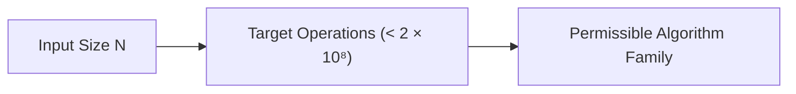

# Unit 1: Foundations of Algorithmic Thinking & The Big O Engine
> **Skill Path**: Pass the Competitive Programming & Technical Interview with Python & C++  
> **Unit Status**: Core Theoretical Foundation & Practical Tooling

---

## 🎯 Unit Overview
In this unit, you will learn the exact thought process used by competitive programming grandmasters and senior FAANG interviewers to analyze, deconstruct, and solve algorithmic problems without guessing. You will master Big-O asymptotic analysis, understand the mathematical relationship between input size $N$ and permissible algorithms, configure an automated local CLI judge, and complete your first speed drills.

---

## Lesson 1.1: Asymptotic Complexity & The Constraint-to-Complexity Mapping

### 1. The Core Principle: Working Backwards from $N$
In competitive programming (AtCoder, Codeforces) and online assessments (Amazon OA, Microsoft), every problem specifies explicit input constraints (e.g., $1 \le N \le 2 \times 10^5$, $1 \le N \le 18$, or $1 \le N \le 10^{18}$).

A modern judge server executes approximately **$10^8$ basic CPU operations per second**. Since standard problem time limits are **2.0 seconds**, your solution must perform **fewer than $2 \times 10^8$ operations**.



### 2. The Comprehensive Complexity Mapping Table

| Input Constraint ($N$) | Max Allowed Time Complexity | Permissible Algorithms & Data Structures | Typical Problem Scenarios |
| :--- | :--- | :--- | :--- |
| **$N \le 10$** | $O(N!) \text{ or } O(N \cdot N!)$ | Permutation generation (`std::next_permutation`), Backtracking | Traveling Salesperson brute-force, arrangement search |
| **$N \le 20$** | $O(2^N) \text{ or } O(N^2 2^N)$ | Bitmask Dynamic Programming, Subset Enumeration | Hamiltonian cycles, subset sum with small $N$ |
| **$N \le 100$** | $O(N^4) \text{ or } O(N^3)$ | Floyd-Warshall All-Pairs Shortest Path, 3-Loop Brute Force | Graph reachability, small grid matrix operations |
| **$N \le 500$** | $O(N^3)$ | Interval DP, 2D Grid DP with loop transition | Matrix chain multiplication, polygon triangulation |
| **$N \le 2,000$** | $O(N^2)$ | 2D Dynamic Programming, All-Pairs Comparisons, $O(N^2)$ Dijkstra | Longest Common Subsequence (LCS), Edit Distance |
| **$N \le 2 \times 10^5$** | **$O(N \log N) \text{ or } O(N)$** | **Sorting, Two Pointers, Prefix Sums, Binary Search, DSU, Segment Trees, Priority Queues, BFS/DFS** | **90% of AtCoder ABC C-E & LeetCode Medium/Hard!** |
| **$N \le 10^7$** | $O(N)$ | Linear Scan, Sieve of Eratosthenes, Sliding Window | Counting arrays, simple linear state machines |
| **$N \le 10^{12}$** | $O(\sqrt{N})$ | Prime Factorization, Divisor Counting, Square Root Decomposition | Primality testing, factoring numbers up to $10^{12}$ |
| **$N \le 10^{18}$** | $O(\log N) \text{ or } O(1)$ | Binary Search on Answer, Matrix Exponentiation, Memoized Recursion (`@cache`), Closed Math Formulas | Exponentiation modulo $P$, Fibonacci on $10^{18}$ |

---

### 3. Formal Asymptotic Proof: Why $O(\max(N, M)) \equiv O(N + M)$
*(Synthesized from [`O(max(n,m))をO(n+m)と書ける理由` by `@NAVYSHUNTA`](https://qiita.com/NAVYSHUNTA/items/9d3bf1371d5c54b38446))*

In graph algorithms like Breadth-First Search (BFS) and Depth-First Search (DFS), time complexity is conventionally written as $O(V + E)$ where $V$ is vertices and $E$ is edges. Beginners often wonder why this is equivalent to $O(\max(V, E))$.

#### Proof:
1. By definition of maximum:
   $$\max(V, E) \le V + E$$
2. Since both $V, E \ge 0$:
   $$V + E \le \max(V, E) + \max(V, E) = 2 \cdot \max(V, E)$$
3. Combining (1) and (2):
   $$\max(V, E) \le V + E \le 2 \cdot \max(V, E)$$
Because $V + E$ is strictly bounded from above and below by constant multiples of $\max(V, E)$, the asymptotic growth rates are **mathematically identical**:
$$O(V + E) = O(\max(V, E)) \quad \text{and} \quad \Theta(V + E) = \Theta(\max(V, E)) \quad \blacksquare$$

---

## Lesson 1.2: The Zero-WA Pre-Flight Shield

90% of Wrong Answer (WA) verdicts in contests and interview screening stem from simple, avoidable oversights. Before submitting code, execute this 6-point checklist:

### 1. 64-Bit Integer Overflow Trap
In C++, a standard signed 32-bit `int` holds values up to $2^{31} - 1 \approx 2.14 \times 10^9$. 
Multiplying two values $\ge 10^5$ or accumulating sums of $N=2 \times 10^5$ items will silently overflow into negative values.

```cpp
// ❌ DANGEROUS:
int N = 200000;
int sum = 0;
for (int i = 0; i < N; i++) sum += 1000000; // Overflows 2 * 10^11!

// ✅ SAFE:
long long safe_sum = 0;
using ll = long long;
ll A = 1000000000LL, B = 1000000000LL;
ll product = A * B; // 10^18 fits safely in 64-bit signed integer (up to 9 * 10^18)
```

### 2. The 0-Based vs 1-Based Indexing Trap
Problem statements describe vertices and sequences from $1$ to $N$. Array indices in C++ and Python are $0$ to $N-1$.
**Golden Rule**: Decrement indices immediately upon reading input:
```python
# Read edge (u, v) and immediately convert to 0-based:
u, v = map(int, input().split())
u -= 1
v -= 1
adj[u].append(v)
adj[v].append(u)
```

### 3. Modulo Subtraction Negative Trap
When calculating $(A - B) \pmod M$, if $A < B$, standard `%` operator in C++ returns a negative number (`-3 % 7 == -3`).
```cpp
const long long MOD = 998244353;
// ❌ WRONG:
long long ans = (A - B) % MOD; // Could be negative!

// ✅ CORRECT:
long long ans = (A - B % MOD + MOD) % MOD;
```

### 4. Single-Element Boundary ($N = 1$)
Always trace $N=1$ manually. Does your code access `A[i - 1]` when $i=0$? Does a loop with range `range(N - 1)` fail to execute?

---

## Lesson 1.3: Environment Setup & Automated CLI Workflows

*(Synthesized from [`Docker+VSCode AtCoder Python環境` by `@malleroid`](https://qiita.com/malleroid/items/ab83b5ffb8ddfd58a4d3) and [`Macからatcoder-cliを使った際の備忘録` by `@seigot`](https://qiita.com/seigot/items/ce9433e62bd2eea5a9ef))*

### Local Tooling Architecture
To compete effectively, automate downloading test samples, running local tests, and submitting with CLI commands:

```bash
# 1. Install CLI tools
npm install -g atcoder-cli
pip install online-judge-tools

# 2. Login once
acc login
oj login https://atcoder.jp/

# 3. Create contest workspace (e.g. ABC385)
acc new abc385
cd abc385/a

# 4. Run automated test against sample inputs
oj test -c "python3 main.py"
# Or for C++:
# g++ -O2 -std=c++20 main.cpp -o main && oj test -c "./main"

# 5. Submit upon passing tests
acc submit main.py
```

### High-Efficiency Stderr Debugging
*(Source: [`デバッグを標準エラー出力で` by `@amaguri0408`](https://qiita.com/amaguri0408/items/61d65c3bea3a5815d704))*

Online judges read only `stdout`. Any output sent to `stderr` is **completely ignored by the judge**. You can leave debug print statements in your submitted code without causing WA:

```python
import sys

def debug(*args):
    print("[DEBUG]", *args, file=sys.stderr)

arr = [1, 2, 3]
debug("Current state of array:", arr) # Safe in submission!
```

---

## Lesson 1.4: 25 ABC-A Speed Drills (Pattern Catalog)

*(Synthesized from `@azubiwa`'s 25-part Advent Calendar Series)*

Master these 4 recurring elementary patterns to solve Problem A in under 90 seconds:

### Pattern A: Digit Extraction & Digit Sums
- **Problem ABC023-A**: Calculate sum of digits of a 2-digit number $X$.
  ```python
  X = int(input())
  print(X // 10 + X % 10)
  ```
- **Problem ABC033-A**: Check if all 4 digits in string $S$ are identical.
  ```python
  S = input()
  print("SAME" if len(set(S)) == 1 else "DIFFERENT")
  ```

### Pattern B: Arithmetic Ceilings & Cross Multiplication
- **Problem ABC036-A**: Calculate ceiling of $B / A$ (boxes needed for $B$ items when each box holds $A$).
  ```python
  A, B = map(int, input().split())
  # Formula for ceil(B / A) using pure integer arithmetic:
  print((B + A - 1) // A)
  ```
- **Problem ABC030-A**: Compare winning rates $B/A$ vs $D/C$ without floating-point precision error:
  ```python
  A, B, C, D = map(int, input().split())
  # Instead of B/A > D/C, use cross-multiplication:
  if B * C > A * D:
      print("TAKAHASHI")
  elif B * C < A * D:
      print("AOKI")
  else:
      print("DRAW")
  ```

### Pattern C: Bitwise Logic & XOR Tricks
- **Problem ABC027-A**: Given side lengths of a rectangle $a, b, c$, find the 4th side length.
  ```python
  a, b, c = map(int, input().split())
  # Since two side lengths must be equal, XOR cancels matching pairs!
  print(a ^ b ^ c)
  ```

### Pattern D: String Case & Filtering
- **Problem ABC171-A**: Check uppercase/lowercase.
  ```python
  a = input()
  print("A" if a.isupper() else "a")
  ```
- **Problem ABC315-A**: Remove all vowels from string.
  ```python
  S = input()
  print("".join(c for c in S if c not in "aeiou"))
  ```

---

## 🛠️ Portfolio Project 1: Automated Complexity Validator & Edge-Case Scanner

### Project Goal
Build a Python script `complexity_scanner.py` that takes problem constraints ($N$, time limit in seconds) and analyzes an input algorithm to verify:
1. Expected operations count based on asymptotic formula.
2. Whether the algorithm will execute within the $2 \times 10^8$ ops/second budget.
3. Automated warning flags for 32-bit integer overflow.

### Project Implementation:
```python
"""
Portfolio Project 1: Big-O Complexity Scanner & Edge-Case Validator
ALGOVERSE Course Suite
"""

import math

def analyze_complexity(N: int, complexity_type: str, time_limit_sec: float = 2.0) -> dict:
    cpu_ops_per_sec = 1e8
    max_ops = cpu_ops_per_sec * time_limit_sec
    
    operations = 0
    if complexity_type == "O(1)":
        operations = 1
    elif complexity_type == "O(log N)":
        operations = math.log2(N) if N > 0 else 1
    elif complexity_type == "O(N)":
        operations = N
    elif complexity_type == "O(N log N)":
        operations = N * math.log2(N) if N > 0 else 1
    elif complexity_type == "O(N^2)":
        operations = N ** 2
    elif complexity_type == "O(N^3)":
        operations = N ** 3
    elif complexity_type == "O(2^N)":
        operations = 2 ** N if N <= 60 else float('inf')
    elif complexity_type == "O(N!)":
        operations = math.factorial(N) if N <= 15 else float('inf')
    else:
        raise ValueError("Unsupported complexity type.")

    will_pass = operations <= max_ops
    estimated_time = operations / cpu_ops_per_sec
    
    # 64-bit overflow warning
    overflow_risk = False
    if N ** 2 > 2.14e9 or operations > 2.14e9:
        overflow_risk = True

    return {
        "N": N,
        "complexity": complexity_type,
        "operations": f"{operations:.2e}",
        "time_limit_sec": time_limit_sec,
        "estimated_time_sec": f"{estimated_time:.4f}s",
        "verdict": "AC (Pass)" if will_pass else "TLE (Time Limit Exceeded)",
        "overflow_risk_warning": overflow_risk
    }

# Interactive Demo Execution:
if __name__ == "__main__":
    test_cases = [
        (200000, "O(N log N)"),
        (200000, "O(N^2)"),
        (20, "O(2^N)"),
        (1000000000000000000, "O(log N)")
    ]
    
    for n, comp in test_cases:
        res = analyze_complexity(n, comp)
        print(f"N = {n:<20} | {comp:<10} => {res['verdict']} (~{res['estimated_time_sec']}) | Overflow Warning: {res['overflow_risk_warning']}")
```

---

## 📝 Unit 1 Concept Quiz

1. **Question 1**: An AtCoder problem specifies $N = 2 \times 10^5$ and $M = 2 \times 10^5$ with a 2.0-second time limit. Which of the following algorithm time complexities is guaranteed to cause Time Limit Exceeded (TLE)?
   - (A) $O(N + M)$
   - (B) $O(N \log N)$
   - (C) $O(N^2)$ *(Correct: $2 \times 10^5$ squared is $4 \times 10^{10} \gg 2 \times 10^8$)*
   - (D) $O(N \log M)$

2. **Question 2**: In C++, if $A = 10^9$ and $B = 10^9$, what happens when you compute `int C = A * B;`?
   - (A) $C = 10^{18}$
   - (B) Compilation error
   - (C) Undefined behavior / 32-bit signed integer overflow resulting in an incorrect negative value *(Correct)*
   - (D) Program automatically promotes variable to `long long`

3. **Question 3**: Why does sending debug output to `sys.stderr` in Python or `std::cerr` in C++ prevent Wrong Answer (WA) on online judges?
   - (A) The judge automatically intercepts and strips debug output
   - (B) The judge evaluates only standard output (`stdout`), ignoring standard error (`stderr`) completely *(Correct)*
   - (C) The compiler removes `cerr` in release mode
   - (D) `stderr` writes to local disk only

4. **Question 4**: What is the integer ceiling formula for $\lceil B / A \rceil$ when $A, B > 0$?
   - (A) `B // A + 1`
   - (B) `(B + A) // A`
   - (C) `(B + A - 1) // A` *(Correct: Works perfectly for exact multiples and non-multiples)*
   - (D) `int(math.ceil(B / A))` without potential float error

---

## 🏆 Unit 1 Completion Checklist
- [ ] Understand the Constraint-to-Complexity Mapping Table for $N \le 10$ through $N \le 10^{18}$.
- [ ] Memorize the 4 Zero-WA Pre-Flight checks (overflow, 0/1 indexing, modulo subtraction, $N=1$).
- [ ] Execute `complexity_scanner.py` from Portfolio Project 1.
- [ ] Pass Quiz 1 with $100\%$ accuracy.
