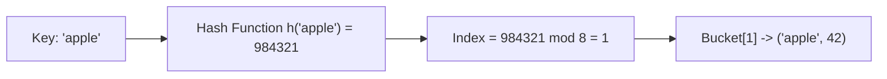

# Unit 3: Hash Maps, Sets & Two Pointers (尺取法)
> **Skill Path**: Pass the Competitive Programming & Technical Interview with Python & C++  
> **Unit Status**: Constant-Time Lookup & Linear Range Optimization

---

## 🎯 Unit Overview
In this unit, you will master the internal mechanics of hash tables, understand how to prevent worst-case hash collisions in competitive programming, and implement the **Two Pointers Technique (尺取法 - Shakutori-ho)** from scratch. Two Pointers is one of the highest-yield patterns in both AtCoder contests and FAANG technical interviews (Amazon/Microsoft), transforming brute-force $O(N^2)$ checks into optimal $O(N)$ linear scans.

---

## Lesson 3.1: Hash Map Mechanics & Collision Resolution

### 1. The Core Architecture
A Hash Map maps keys of arbitrary types to values using a **hash function** $h(k)$ that converts a key into an integer index within an internal bucket array of size $M$:
$$\text{Index} = h(k) \pmod M$$



### 2. Collision Resolution: Chaining vs Open Addressing

| Dimension | Separate Chaining (Linked Lists) | Open Addressing (Linear/Quadratic Probing) |
| :--- | :--- | :--- |
| **Collision Handling** | Each bucket points to a linked list of entries | Finds the next available empty slot in the array |
| **Cache Performance** | Poor (pointer chasing across heap memory) | Excellent (contiguous memory scanning) |
| **Load Factor ($\alpha = N / M$)** | Can exceed $\alpha > 1.0$ | Must maintain $\alpha < 0.7$ to prevent clustering |
| **Python / C++ Implementation** | Standard in Java `HashMap` | Python `dict` (compact array) & C++ `std::unordered_map` (chaining) |

### 3. Hash Map Anti-DoS Attack in Competitive Programming
In Codeforces and AtCoder, standard C++ `std::unordered_map<int, int>` can be hacked by adversarial test cases using custom integers whose hashes collide into bucket 0, causing degradation from $O(1)$ to $O(N)$ per operation ($O(N^2)$ TLE overall!).

#### Safe Custom Hash in C++20:
```cpp
#include <chrono>
#include <unordered_map>
using namespace std;

struct custom_hash {
    static uint64_t splitmix64(uint64_t x) {
        x += 0x9e3779b97f4a7c15;
        x = (x ^ (x >> 30)) * 0xbf58476d1ce4e5b9;
        x = (x ^ (x >> 27)) * 0x94d049bb133111eb;
        return x ^ (x >> 31);
    }

    size_t operator()(uint64_t x) const {
        static const uint64_t FIXED_RANDOM = chrono::steady_clock::now().time_since_epoch().count();
        return splitmix64(x + FIXED_RANDOM);
    }
};

// Hack-proof fast hash map:
unordered_map<long long, int, custom_hash> safe_map;
```

---

## Lesson 3.2: Integer-Key Hash Maps in Low-Level C

*(Synthesized from [`C言語整数キー連想配列` by `@mikecat_mixc`](https://qiita.com/mikecat_mixc/items/3bdbad1790e597d80be0))*

In performance-critical scenarios where C++ overhead or Python runtime is prohibitive, implementing an open-addressing linear-probing hash table in pure C executes in single-digit milliseconds:

```c
#include <stdio.h>
#include <stdlib.h>
#include <string.h>

#define TABLE_SIZE 1048576 // Power of 2 for fast bitwise modulo (& (SIZE - 1))
#define EMPTY -1

typedef struct {
    long long key;
    int value;
} HashEntry;

HashEntry table[TABLE_SIZE];

void init_table() {
    for (int i = 0; i < TABLE_SIZE; i++) table[i].key = EMPTY;
}

void insert(long long key, int value) {
    unsigned int idx = (unsigned int)(key * 2654435761u) & (TABLE_SIZE - 1);
    while (table[idx].key != EMPTY && table[idx].key != key) {
        idx = (idx + 1) & (TABLE_SIZE - 1); // Linear probe
    }
    table[idx].key = key;
    table[idx].value = value;
}

int find(long long key) {
    unsigned int idx = (unsigned int)(key * 2654435761u) & (TABLE_SIZE - 1);
    while (table[idx].key != EMPTY) {
        if (table[idx].key == key) return table[idx].value;
        idx = (idx + 1) & (TABLE_SIZE - 1);
    }
    return -1; // Not found
}
```

---

## Lesson 3.3: Two Pointers (尺取法 - Shakutori-ho)

*(Synthesized from [`ABC381D 尺取法` by `@comet725`](https://qiita.com/comet725/items/7129bf686daf13a2bfc5))*

### 1. The Monotonic Boundary Invariant
Two Pointers is applicable whenever a decision property $P([L, R])$ exhibits **monotonicity**:
$$\text{If window } [L, R] \text{ violates the property, no extended window } [L, R'] \text{ with } R' > R \text{ can be valid.}$$

Therefore, the left pointer $L$ never needs to reset back to the beginning. Both $L$ and $R$ advance **monotonically forward from $0$ to $N$**.

```
Initial:      L=0, R=0
Step 1:       Expand R while valid -> [L .. R]
Step 2:       When invalid, increment L until valid again
Total Steps:  L moves at most N times + R moves at most N times = 2N steps!
```

### 2. Universal Two-Pointer Template
```python
def two_pointers_solve(A: list[int], K: int) -> int:
    n = len(A)
    l = 0
    ans = 0
    current_state = {}

    for r in range(n):
        # 1. Include A[r] in window state
        current_state[A[r]] = current_state.get(A[r], 0) + 1

        # 2. While window violates constraint, shrink from left
        while len(current_state) > K and l <= r:
            current_state[A[l]] -= 1
            if current_state[A[l]] == 0:
                del current_state[A[l]]
            l += 1

        # 3. Window [l, r] is now maximally valid
        ans = max(ans, r - l + 1)

    return ans
```

---

## 🛠️ Portfolio Project 3: Continuous Substring Pattern Extractor (ABC381 D Solver)

### Problem Specification (AtCoder ABC381 D)
Given a sequence $A = (A_1, A_2, \dots, A_N)$, find the maximum length of a contiguous subsequence that is a **"1122 Sequence"**:
- A sequence of even length $2k$ where $x_1 = x_2, x_3 = x_4, \dots, x_{2k-1} = x_{2k}$.
- All $k$ pairs must consist of distinct numbers (no pair value repeated).

### Project Implementation:
```python
"""
Portfolio Project 3: ABC381 D - 1122 Substring Pattern Extractor
ALGOVERSE Course Suite
"""

def max_1122_substring(N: int, A: list[int]) -> int:
    max_len = 0

    # Since pairs must be aligned, test two parity starting offsets: 0 and 1
    for offset in range(2):
        l = offset
        seen_pairs = set()
        
        # Step in strides of 2: checking pair (A[r], A[r+1])
        for r in range(offset, N - 1, 2):
            val1 = A[r]
            val2 = A[r + 1]

            # Condition 1: Must be an identical pair
            if val1 != val2:
                # Reset pointers: invalid pair cannot be part of 1122 sequence
                l = r + 2
                seen_pairs.clear()
                continue

            # Condition 2: No duplicate pair value allowed in the same window
            while val1 in seen_pairs:
                # Shrink left pointer by 2
                left_val = A[l]
                seen_pairs.remove(left_val)
                l += 2

            # Add current pair to window
            seen_pairs.add(val1)
            
            # Current valid window length from l to r+1 inclusive:
            current_window_len = (r + 2) - l
            max_len = max(max_len, current_window_len)

    return max_len


# Interactive Test Verification:
if __name__ == "__main__":
    test_cases = [
        (10, [1, 1, 2, 2, 3, 3, 4, 4, 1, 1]), # Output: 8 (11, 22, 33, 44)
        (7, [1, 2, 2, 3, 3, 3, 3]),            # Output: 4 (22, 33)
        (4, [1, 2, 3, 4])                       # Output: 0 (No pairs)
    ]

    for n, seq in test_cases:
        ans = max_1122_substring(n, seq)
        print(f"Sequence: {seq} => Max 1122 Length: {ans}")
```

---

## 🎯 Benchmark Problem Walkthrough: LeetCode 76 / Minimum Window Substring

### Problem Statement
Given two strings `s` and `t`, return the minimum window substring of `s` such that every character in `t` (including duplicates) is included in the window.

### Step-by-Step Two-Pointer Solution:
```python
from collections import Counter

def minWindow(s: str, t: str) -> str:
    if not s or not t:
        return ""

    target_counts = Counter(t)
    required = len(target_counts) # Number of unique characters needed

    l, r = 0, 0
    formed = 0 # Unique characters meeting required frequency in window
    window_counts = {}

    min_len = float('inf')
    best_range = (0, 0)

    while r < len(s):
        char = s[r]
        window_counts[char] = window_counts.get(char, 0) + 1

        if char in target_counts and window_counts[char] == target_counts[char]:
            formed += 1

        # Shrink window from left as long as all characters remain satisfied
        while l <= r and formed == required:
            char_l = s[l]
            if (r - l + 1) < min_len:
                min_len = r - l + 1
                best_range = (l, r)

            window_counts[char_l] -= 1
            if char_l in target_counts and window_counts[char_l] < target_counts[char_l]:
                formed -= 1
            l += 1

        r += 1

    return "" if min_len == float('inf') else s[best_range[0]:best_range[1] + 1]
```
- **Time Complexity**: $O(|S| + |T|)$ single pass.
- **Space Complexity**: $O(|S| + |T|)$ for frequency maps.

---

## 📝 Unit 3 Concept Quiz

1. **Question 1**: What happens to lookup performance in a hash map when the load factor $\alpha = N/M$ approaches 1.0 without resizing?
   - (A) Performance stays strictly $O(1)$
   - (B) Collision rate increases drastically, degrading average lookup time toward $O(N)$ *(Correct)*
   - (C) Python automatically converts the hash map into a binary tree
   - (D) Memory consumption drops to zero

2. **Question 2**: In the Two Pointers technique, why is the total time complexity $O(N)$ even though the code contains a `while` loop nested inside a `for` loop?
   - (A) The inner loop only runs once per program execution
   - (B) The left pointer $L$ only moves forward and never resets backward, so both $L$ and $R$ perform at most $N$ increments each *(Correct)*
   - (C) Python optimizes while loops into C vectors automatically
   - (D) The array is sorted in logarithmic time

3. **Question 3**: In AtCoder ABC381 D (1122 Substring), why must the algorithm be run twice with offset 0 and offset 1?
   - (A) To check positive and negative values separately
   - (B) Because a sequence of pairs $(x_1, x_1), (x_2, x_2)$ can start on either an even index (0) or an odd index (1) of the 0-based array *(Correct)*
   - (C) To handle odd-length arrays without throwing IndexError
   - (D) Offset 0 checks prefix sums, offset 1 checks two pointers

---

## 🏆 Unit 3 Completion Checklist
- [ ] Understand hash map collision mitigation in C++ (`custom_hash` with `splitmix64`).
- [ ] Master the Two Pointers monotonicity invariant.
- [ ] Implement and verify the `max_1122_substring` Project 3 code.
- [ ] Solve **LeetCode 3** and **LeetCode 76** with 100% test pass.
