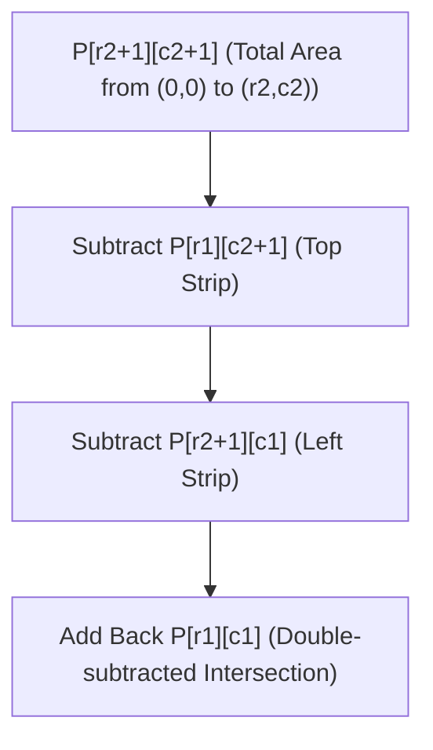

# Unit 4: Prefix Sums, Cumulative Probability & Coordinate Compression
> **Skill Path**: Pass the Competitive Programming & Technical Interview with Python & C++  
> **Unit Status**: Constant-Time Range Queries & Coordinate Space Normalization

---

## 🎯 Unit Overview
In this unit, you will transform expensive $O(N)$ and $O(N \times Q)$ range sum queries into instant $O(1)$ lookups using **Prefix Sums (累積和 - Ruiseki-wa)**. You will extend this technique to 2D submatrix geometry, discover how to solve expected value optimization problems, and master **Coordinate Compression (座標圧縮)** to shrink massive $10^9$ coordinate spaces down to manageable $O(N)$ bounds.

---

## Lesson 4.1: 1D Prefix Sums Mechanics & Theory

*(Synthesized from [`ABC381E, ABC154D, ABC347E` by `@comet725`](https://qiita.com/comet725/items/3ab9efa22c159842493d))*

### 1. Mathematical Derivation
Given an array $A = (A_0, A_1, \dots, A_{N-1})$, its 1D Prefix Sum array $P$ of length $N+1$ is defined as:
$$P[0] = 0$$
$$P[i] = \sum_{j=0}^{i-1} A[j] \quad \text{for } 1 \le i \le N$$

By the Fundamental Theorem of Calculus (discrete equivalent):
$$\sum_{j=L}^{R} A[j] = \sum_{j=0}^{R} A[j] - \sum_{j=0}^{L-1} A[j] = P[R + 1] - P[L]$$

```
Index i:     0   1   2   3   4   5
Array A:     3   1   4   1   5   9
Prefix P: 0  3   4   8   9  14  23

Query sum from L=2 to R=4 (elements 4, 1, 5):
P[4 + 1] - P[2] = P[5] - P[2] = 14 - 4 = 10 (Computed in 1 CPU cycle!)
```

### 2. Implementation Template (Python & C++)
```python
def build_prefix_sum(arr: list[int]) -> list[int]:
    n = len(arr)
    P = [0] * (n + 1)
    for i in range(n):
        P[i + 1] = P[i] + arr[i]
    return P

def query_range(P: list[int], l: int, r: int) -> int:
    """Returns sum of elements in arr[l..r] inclusive in O(1)."""
    return P[r + 1] - P[l]
```

---

## Lesson 4.2: 2D Grid Prefix Sums (Inclusion-Exclusion)

To compute the sum of numbers inside any rectangular subgrid bounded by rows $[r_1, r_2]$ and columns $[c_1, c_2]$:



$$\text{Sum}(r_1..r_2, c_1..c_2) = P[r_2+1][c_2+1] - P[r_1][c_2+1] - P[r_2+1][c_1] + P[r_1][c_1]$$

### 2D Grid Implementation:
```python
def build_prefix_2d(grid: list[list[int]]) -> list[list[int]]:
    R, C = len(grid), len(grid[0])
    P = [[0] * (C + 1) for _ in range(R + 1)]
    for r in range(R):
        for c in range(C):
            P[r + 1][c + 1] = grid[r][c] + P[r][c + 1] + P[r + 1][c] - P[r][c]
    return P

def query_2d(P: list[list[int]], r1: int, c1: int, r2: int, c2: int) -> int:
    return P[r2 + 1][c2 + 1] - P[r1][c2 + 1] - P[r2 + 1][c1] + P[r1][c1]
```

---

## Lesson 4.3: Expected Value & Probability Prefix Sums

*(Synthesized from [`ABC154D 確率累積和` by `@comet725`](https://qiita.com/comet725/items/34fabc68b938a6bf919e))*

### Problem Walkthrough: AtCoder ABC154 D (Dice in a Line)
You are given $N$ dice, where die $i$ has faces numbered $1$ to $p_i$. You must select $K$ consecutive dice to roll, maximizing the expected sum of the rolled numbers.

#### Mathematical Invariant:
The expected value $E[X]$ of a fair die with faces $1 \dots p$ is:
$$E[X] = \frac{1 + 2 + \dots + p}{p} = \frac{p(p + 1)}{2p} = \frac{p + 1}{2}$$
By Linearity of Expectation:
$$E\left[\sum_{j=i}^{i+K-1} X_j\right] = \sum_{j=i}^{i+K-1} E[X_j]$$

#### Solution Using Prefix Sums in $O(N)$ Time:
```python
def solve_dice_expected_value():
    import sys
    input = sys.stdin.read
    data = input().split()
    if not data: return
    
    N = int(data[0])
    K = int(data[1])
    P_vals = [int(x) for x in data[2:N+2]]

    # Step 1: Precompute expected values
    E = [(p + 1) / 2.0 for p in P_vals]

    # Step 2: Build Prefix Sum array
    prefix = [0.0] * (N + 1)
    for i in range(N):
        prefix[i + 1] = prefix[i] + E[i]

    # Step 3: Find max window of size K in O(1) per step
    max_ev = 0.0
    for i in range(N - K + 1):
        window_sum = prefix[i + K] - prefix[i]
        if window_sum > max_ev:
            max_ev = window_sum

    print(f"{max_ev:.12f}")
```

---

## Lesson 4.4: Coordinate Compression (座標圧縮)

*(Synthesized from [`座標圧縮別解 ABC213C` by `@kikudesuyo`](https://qiita.com/kikudesuyo/items/b652e0dd4d07c1836a8b))*

### 1. When is Coordinate Compression Required?
When coordinates $X_i, Y_i$ can be as large as $10^9$, we cannot allocate an array or grid of size $10^9 \times 10^9$ without encountering Out of Memory (OOM). 

However, if there are only $N \le 10^5$ distinct points, we only care about their **relative order (ranks)**!

### 2. The 3-Step Compression Pipeline
1. Collect all unique coordinates into a temporary list.
2. Sort and remove duplicates (`std::unique` in C++ or `sorted(set(A))` in Python).
3. Replace each original value with its 0-based or 1-based index via binary search (`bisect_left` or `lower_bound`).

```
Original X coords: [1000000000, 50, 1000000000, 200]
Unique Sorted:     [50, 200, 1000000000]
Ranks (0-based):   [2,  0,   2,          1]
```

### 3. C++20 Coordinate Compression Function:
```cpp
#include <vector>
#include <algorithm>
using namespace std;

vector<int> compressCoordinates(const vector<long long>& original) {
    vector<long long> unique_vals = original;
    sort(unique_vals.begin(), unique_vals.end());
    unique_vals.erase(unique(unique_vals.begin(), unique_vals.end()), unique_vals.end());

    vector<int> compressed_ranks(original.size());
    for (size_t i = 0; i < original.size(); i++) {
        // lower_bound finds the 0-based rank in O(log N)
        compressed_ranks[i] = lower_bound(unique_vals.begin(), unique_vals.end(), original[i]) - unique_vals.begin();
    }
    return compressed_ranks;
}
```

---

## 🛠️ Portfolio Project 4: 2D Spatial Heatmap Range Query Engine

### Project Specification
Build a high-performance spatial query engine `SpatialHeatmapEngine` that:
1. Ingests $N$ discrete spatial heat points with coordinates up to $10^9 \times 10^9$.
2. Performs 2D Coordinate Compression to construct a compact $O(N \times N)$ grid representation.
3. Builds a 2D Prefix Sum table.
4. Answers $Q$ rectangular bounding box density queries in $O(1)$ time per query.

### Project Implementation:
```python
"""
Portfolio Project 4: 2D Spatial Heatmap & Compressed Range Query Engine
ALGOVERSE Course Suite
"""

import bisect

class SpatialHeatmapEngine:
    def __init__(self, points: list[tuple[int, int, int]]):
        """
        points: list of (x, y, weight) where x, y in [0, 10^9]
        """
        self.raw_points = points
        
        # Step 1: Extract unique X and Y coordinates
        self.unique_x = sorted(list(set(p[0] for p in points)))
        self.unique_y = sorted(list(set(p[1] for p in points)))

        R = len(self.unique_x)
        C = len(self.unique_y)

        # Step 2: Build compressed 2D grid
        grid = [[0] * C for _ in range(R)]
        for x, y, weight in points:
            rx = bisect.bisect_left(self.unique_x, x)
            ry = bisect.bisect_left(self.unique_y, y)
            grid[rx][ry] += weight

        # Step 3: Build 2D Prefix Sum table
        self.P = [[0] * (C + 1) for _ in range(R + 1)]
        for r in range(R):
            for c in range(C):
                self.P[r + 1][c + 1] = grid[r][c] + self.P[r][c + 1] + self.P[r + 1][c] - self.P[r][c]

    def query_rect_weight(self, x1: int, y1: int, x2: int, y2: int) -> int:
        """
        Returns total weight of points inside [x1..x2, y1..y2] inclusive in O(log N).
        """
        # Map input query bounding box to compressed index bounds
        rx1 = bisect.bisect_left(self.unique_x, x1)
        rx2 = bisect.bisect_right(self.unique_x, x2) - 1

        ry1 = bisect.bisect_left(self.unique_y, y1)
        ry2 = bisect.bisect_right(self.unique_y, y2) - 1

        if rx1 > rx2 or ry1 > ry2:
            return 0 # No points fall within query range

        # O(1) 2D Prefix Sum Formula:
        return (self.P[rx2 + 1][ry2 + 1] 
              - self.P[rx1][ry2 + 1] 
              - self.P[rx2 + 1][ry1] 
              + self.P[rx1][ry1])


# Interactive Verification:
if __name__ == "__main__":
    test_points = [
        (1000000, 2000000, 10),
        (500, 600, 5),
        (1000000, 50, 8),
        (999999999, 999999999, 100)
    ]
    
    engine = SpatialHeatmapEngine(test_points)
    
    # Query rectangle covering all points <= 2000000:
    res = engine.query_rect_weight(0, 0, 1000000, 2000000)
    print(f"Total weight in range [0..10⁶, 0..2×10⁶]: {res}") # Expected: 10 + 5 + 8 = 23
```

---

## 📝 Unit 4 Concept Quiz

1. **Question 1**: What is the size of a 1D Prefix Sum array $P$ constructed from an original array of size $N$, and what is $P[0]$?
   - (A) Size $N$, $P[0] = A[0]$
   - (B) Size $N + 1$, $P[0] = 0$ *(Correct: Allows querying [0, R] as P[R+1] - P[0] without index error)*
   - (C) Size $2N$, $P[0] = -1$
   - (D) Size $N - 1$, $P[0] = 0$

2. **Question 2**: In 2D Grid Prefix Sums, why must $P[r_1][c_1]$ be added back in the submatrix query formula?
   - (A) To account for negative numbers
   - (B) Because subtracting both the top strip and the left strip double-subtracted the top-left overlapping region *(Correct: Inclusion-Exclusion Principle)*
   - (C) To handle 0-based boundary coordinates
   - (D) To round up fractional coordinates

3. **Question 3**: What is the primary purpose of Coordinate Compression when solving competitive programming problems?
   - (A) To reduce floating-point precision error
   - (B) To map vast coordinate spaces (e.g. $10^9$) down to compact discrete ranks $[0 \dots N-1]$ while preserving relative ordering *(Correct)*
   - (C) To encrypt sensitive user inputs
   - (D) To compress JSON logs for disk storage

---

## 🏆 Unit 4 Completion Checklist
- [ ] Understand 1D and 2D Prefix Sum mathematical derivations.
- [ ] Master Coordinate Compression using binary search ranks.
- [ ] Execute and test `SpatialHeatmapEngine` from Portfolio Project 4.
- [ ] Solve **AtCoder ABC154 D** and **LeetCode 560** with 100% test pass.
