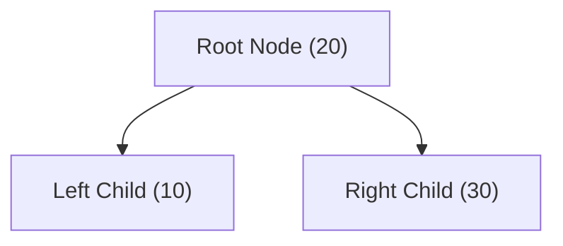
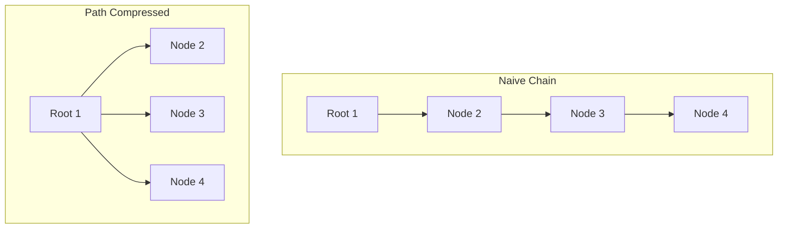

# Unit 5: Nonlinear Structures: Trees, Heaps & Disjoint Set Union (DSU)
> **Skill Path**: Pass the Competitive Programming & Technical Interview with Python & C++  
> **Unit Status**: Dynamic Graph Connectivity, Priority Queues & Splay/Heap Mechanics

---

## 🎯 Unit Overview
In this unit, you will advance beyond linear arrays to master nonlinear abstract data types. You will implement Binary Heaps, solve the common Python `heapq` min-heap pitfall, build a **Removable Priority Queue** that supports arbitrary element deletion in $O(\log N)$, and implement **Disjoint Set Union (DSU / Union-Find)** with path compression and union by rank to achieve near-constant $O(\alpha(N))$ connectivity operations.

---

## Lesson 5.1: Binary Search Trees & Tree Traversals

### 1. The BST Invariant
A **Binary Search Tree (BST)** satisfies a fundamental ordering property at every node $X$:
$$\text{All values in } \text{LeftSubtree}(X) < \text{Value}(X) < \text{All values in } \text{RightSubtree}(X)$$

### 2. Traversal Taxonomy



1. **In-Order Traversal** (`Left -> Root -> Right`): Produces elements in strictly sorted ascending order.
2. **Pre-Order Traversal** (`Root -> Left -> Right`): Useful for cloning or serializing tree structure.
3. **Post-Order Traversal** (`Left -> Right -> Root`): Essential for bottom-up Tree Dynamic Programming and garbage collection.
4. **Level-Order Traversal** (BFS using Queue): Traverses node generation by generation (depth levels).

---

## Lesson 5.2: Binary Heaps & The Python `heapq` Trap

*(Synthesized from [`Python優先度付きキュー要注意` by `@hidehic0`](https://qiita.com/hidehic0/items/3f86320683c45f008056))*

### 1. Array Representation of Complete Binary Trees
A binary heap is stored compactly in a contiguous array without pointers:
- **Parent index**: `(i - 1) // 2`
- **Left child index**: `2 * i + 1`
- **Right child index**: `2 * i + 2`

### 2. The Python `heapq` Min-Heap Pitfall
In C++, `std::priority_queue<T>` is a **Max-Heap** by default (pops largest element). 
In Python, `heapq` is strictly a **Min-Heap** (pops smallest element).

```python
import heapq

# ❌ COMMON BUG: Expecting max-heap behavior
pq = []
heapq.heappush(pq, 10)
heapq.heappush(pq, 20)
print(heapq.heappop(pq)) # Returns 10, NOT 20!

# ✅ CORRECT: The Negation Invariant for Max-Heap in Python
max_pq = []
heapq.heappush(max_pq, -10)
heapq.heappush(max_pq, -20)
largest = -heapq.heappop(max_pq) # Returns 20!
```

---

## Lesson 5.3: Removable Priority Queue (Dual-Heap Lazy Deletion)

*(Synthesized from [`削除可能な優先度付きキュー` by `@saka_pon`](https://qiita.com/saka_pon/items/7d42012e44978580a0c0))*

### The Problem
Standard heaps (C++ `std::priority_queue`, Python `heapq`) do not support deleting an arbitrary element that is not currently at the top of the heap in $O(\log N)$ time. Searching the heap takes $O(N)$.

### The Dual-Heap Solution:
Maintain two heaps:
1. `main_pq`: Contains all pushed elements.
2. `deleted_pq`: Contains all elements requested for removal.

Whenever querying `top()` or calling `pop()`, execute a **lazy synchronization clean step**: while both heaps have the same top element, pop from both!

```python
import heapq

class RemovablePriorityQueue:
    def __init__(self, is_max_heap=False):
        self.main_pq = []
        self.del_pq = []
        self.is_max = is_max_heap

    def push(self, val):
        v = -val if self.is_max else val
        heapq.heappush(self.main_pq, v)

    def remove(self, val):
        v = -val if self.is_max else val
        heapq.heappush(self.del_pq, v)

    def _clean(self):
        # Synchronize lazily
        while self.main_pq and self.del_pq and self.main_pq[0] == self.del_pq[0]:
            heapq.heappop(self.main_pq)
            heapq.heappop(self.del_pq)

    def top(self):
        self._clean()
        if not self.main_pq:
            return None
        return -self.main_pq[0] if self.is_max else self.main_pq[0]

    def pop(self):
        self._clean()
        if not self.main_pq:
            return None
        val = heapq.heappop(self.main_pq)
        return -val if self.is_max else val

    def __len__(self):
        return len(self.main_pq) - len(self.del_pq)
```

---

## Lesson 5.4: Disjoint Set Union (DSU / Union-Find)

*(Synthesized from [`ABC372E, ABC380E UnionFind` by `@comet725`](https://qiita.com/comet725/items/de899acf532ca7ef012e))*

### 1. The Dynamic Connectivity Problem
Given $N$ elements, support two operations:
1. `unite(u, v)`: Connect element $u$ and element $v$ into the same component.
2. `same(u, v)`: Check if $u$ and $v$ belong to the same component.

### 2. The Two Optimizations
Without optimization, trees can degenerate into linear chains of depth $N$, making operations $O(N)$.
1. **Path Compression**: During `find(i)`, point every node visited directly to the component root.
2. **Union by Size / Rank**: Always attach the smaller tree under the root of the larger tree.



#### Asymptotic Complexity:
Combining Path Compression + Union by Size yields an amortized time complexity of:
$$O(\alpha(N))$$
where $\alpha(N)$ is the **Inverse Ackermann function**. For all physical values of $N \le 10^{80}$ (atoms in the observable universe), $\alpha(N) \le 4$. Thus, DSU is **practically $O(1)$ constant time**!

---

## 🛠️ Portfolio Project 5: Social Network Clustering & K-th Largest Member Tracker (ABC372 E)

### Problem Specification (AtCoder ABC372 E)
Maintain a dynamic network of $N$ users. Support $Q$ queries of two types:
- `1 u v`: Connect user $u$ and user $v$.
- `2 u k`: Find the user ID of the $k$-th largest user in $u$'s connected component ($k \le 10$). If component has $< k$ users, return $-1$.

### Project Implementation:
```python
"""
Portfolio Project 5: DSU with Top-K Component Leaderboard (ABC372 E)
ALGOVERSE Course Suite
"""

class TopK_DSU:
    def __init__(self, n: int):
        self.parent = list(range(n))
        self.sz = [1] * n
        # Each root maintains a sorted list of its top-10 largest user IDs
        self.top10 = [[i + 1] for i in range(n)] # 1-based IDs

    def find(self, i: int) -> int:
        if self.parent[i] == i:
            return i
        self.parent[i] = self.find(self.parent[i]) # Path compression
        return self.parent[i]

    def unite(self, u: int, v: int) -> bool:
        root_u = self.find(u)
        root_v = self.find(v)

        if root_u == root_v:
            return False # Already in same component

        # Union by size: root_u will be the new merged root
        if self.sz[root_u] < self.sz[root_v]:
            root_u, root_v = root_v, root_u

        self.parent[root_v] = root_u
        self.sz[root_u] += self.sz[root_v]

        # Merge the two sorted top-10 lists using two pointers in O(10)
        list1 = self.top10[root_u]
        list2 = self.top10[root_v]
        merged = []
        p1, p2 = 0, 0
        
        while len(merged) < 10 and (p1 < len(list1) or p2 < len(list2)):
            if p1 < len(list1) and p2 < len(list2):
                if list1[p1] > list2[p2]:
                    merged.append(list1[p1])
                    p1 += 1
                else:
                    merged.append(list2[p2])
                    p2 += 1
            elif p1 < len(list1):
                merged.append(list1[p1])
                p1 += 1
            else:
                merged.append(list2[p2])
                p2 += 1

        self.top10[root_u] = merged
        return True

    def query_kth_largest(self, u: int, k: int) -> int:
        root = self.find(u)
        members = self.top10[root]
        if len(members) < k:
            return -1
        return members[k - 1]


# Verification Demo:
if __name__ == "__main__":
    dsu = TopK_DSU(5) # Users 1, 2, 3, 4, 5
    dsu.unite(0, 1) # Merge 1 and 2
    dsu.unite(2, 3) # Merge 3 and 4
    dsu.unite(1, 2) # Merge (1, 2) with (3, 4) => Component contains {1, 2, 3, 4}

    print("Component Top-1:", dsu.query_kth_largest(0, 1)) # Expected: 4
    print("Component Top-2:", dsu.query_kth_largest(0, 2)) # Expected: 3
    print("Component Top-4:", dsu.query_kth_largest(0, 4)) # Expected: 1
    print("Component Top-5:", dsu.query_kth_largest(0, 5)) # Expected: -1 (only 4 members)
```

---

## 📝 Unit 5 Concept Quiz

1. **Question 1**: Why does standard Python `heapq` require pushing `-x` when implementing a Max-Heap?
   - (A) Python stores numbers as unsigned 32-bit integers
   - (B) Python's `heapq` module is implemented strictly as a Min-Heap; negating values inverts their relative sort order *(Correct)*
   - (C) Python lists automatically sort descending
   - (D) Negative numbers bypass heap re-balancing

2. **Question 2**: What is the amortized time complexity of the `find` and `unite` operations in a Disjoint Set Union (DSU) structure implemented with Path Compression and Union by Size?
   - (A) $O(\log N)$
   - (B) $O(N)$
   - (C) $O(\alpha(N))$, where $\alpha$ is the Inverse Ackermann function, effectively $\le 4$ for any practical $N$ *(Correct)*
   - (D) Strictly $O(N \log N)$

3. **Question 3**: How does the Dual-Heap pattern in `RemovablePriorityQueue` achieve $O(\log N)$ arbitrary element removal without linear scanning?
   - (A) By storing a hash map of linked pointers to heap nodes
   - (B) By pushing removed elements into a secondary `deleted_pq` and lazily purging matching tops when querying the heap *(Correct)*
   - (C) By rebuilding the entire heap on every deletion
   - (D) By converting the heap to a balanced Red-Black tree

---

## 🏆 Unit 5 Completion Checklist
- [ ] Understand heap array index formulas (`2i+1`, `2i+2`, `(i-1)//2`).
- [ ] Implement `RemovablePriorityQueue` with dual-heap lazy deletion.
- [ ] Implement and test `TopK_DSU` for AtCoder ABC372 E.
- [ ] Solve **LeetCode 547 (Number of Provinces)** and **LeetCode 295 (Find Median from Data Stream)**.
