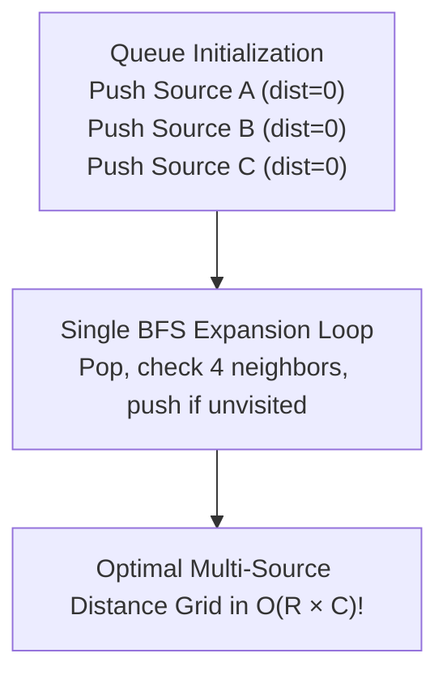

# Unit 7: Graphs, Shortest Paths & Grid Traversals
> **Skill Path**: Pass the Competitive Programming & Technical Interview with Python & C++  
> **Unit Status**: Graph Theory, Multi-Source BFS & Weighted Shortest Paths

---

## 🎯 Unit Overview
In this unit, you will master graph modeling and traversal algorithms. You will analyze memory trade-offs between adjacency matrices and adjacency lists, implement **Multi-Source Breadth-First Search (BFS)** for grid-based simulations (a high-frequency pattern in Amazon Online Assessments), master **Topological Sorting** on Directed Acyclic Graphs (DAGs), and construct **Dijkstra’s Algorithm** from scratch using priority queues.

---

## Lesson 7.1: Graph Representations & Memory Trade-Offs

### 1. Adjacency Matrix vs Adjacency List

| Feature | Adjacency Matrix (`matrix[u][v]`) | Adjacency List (`adj[u] = [v1, v2, ...]`) |
| :--- | :--- | :--- |
| **Memory Space** | $O(V^2)$ | $O(V + E)$ |
| **Check Edge $(u, v)$** | $O(1)$ | $O(\text{deg}(u))$ |
| **Iterate Neighbors of $u$** | $O(V)$ | $O(\text{deg}(u))$ |
| **Ideal Scenario** | Dense graphs ($E \approx V^2$), $V \le 1,000$ | Sparse graphs ($E \ll V^2$), $V \le 2 \times 10^5$ |

> [!WARNING]
> In competitive programming with $V = 2 \times 10^5$, allocating an adjacency matrix `int matrix[200000][200000]` requires $160 \text{ GB}$ of RAM, immediately causing **Memory Limit Exceeded (MLE)**! Always use an Adjacency List.

### 2. Adjacency List Construction Template
```python
# Read graph with N vertices and M edges:
N, M = map(int, input().split())
adj = [[] for _ in range(N)]

for _ in range(M):
    u, v = map(int, input().split())
    # Convert to 0-based indexing immediately:
    u -= 1
    v -= 1
    adj[u].append(v)
    adj[v].append(u) # Omit for directed graphs
```

---

## Lesson 7.2: Grid BFS & Multi-Source Traversal

*(Synthesized from [`ABC322 D Polyomino` by `@ponzoie`](https://qiita.com/ponzoie/items/717bd37d0dba9ba3644e) and Amazon OA Grid Patterns)*

### 1. The 2D Delta Array Idiom
When traversing 4-directionally (Up, Down, Left, Right) on a grid of dimensions $R \times C$:
```python
DR = [-1, 1, 0, 0]
DC = [0, 0, -1, 1]

# In loop:
for d in range(4):
    nr = r + DR[d]
    nc = c + DC[d]
    if 0 <= nr < R and 0 <= nc < C and grid[nr][nc] != '#':
        # Valid unblocked neighbor!
        pass
```

### 2. The Multi-Source BFS Paradigm
When an event starts simultaneously from **multiple starting locations** (e.g., rotting oranges, wildfires, flood fills):
- **DO NOT** run independent BFS passes from each source (this causes $O(S \times V)$ TLE).
- **DO THIS**: Enqueue **all starting source nodes into the queue at distance 0 simultaneously** before starting the BFS loop! The single traversal will compute the exact global minimum distances in strictly $O(R \times C)$ time.



---

## Lesson 7.3: Depth-First Search & Topological Sorting

### 1. Cycle Detection in Directed Graphs (3-Color Algorithm)
To detect cycles in directed graphs, mark nodes with three states:
- `0 (White)`: Unvisited.
- `1 (Gray)`: Currently in recursion stack (active ancestor).
- `2 (Black)`: Completely processed.

If DFS encounters a node in state `1 (Gray)`, a **back-edge** is detected $\implies$ **Cycle exists!**

### 2. Kahn's Algorithm for Topological Sort (BFS with In-Degrees)
```python
from collections import deque

def topological_sort(n: int, edges: list[tuple[int, int]]) -> list[int]:
    adj = [[] for _ in range(n)]
    in_degree = [0] * n

    for u, v in edges:
        adj[u].append(v)
        in_degree[v] += 1

    # Queue all nodes with 0 incoming dependencies
    q = deque([i for i in range(n) if in_degree[i] == 0])
    order = []

    while q:
        u = q.popleft()
        order.append(u)
        for v in adj[u]:
            in_degree[v] -= 1
            if in_degree[v] == 0:
                q.append(v)

    if len(order) != n:
        return [] # Cycle detected! Topological sort impossible.
    return order
```

---

## Lesson 7.4: Dijkstra’s Shortest Path Algorithm

*(Synthesized from [`ダイクストラ法から考える擬似コードの意義` by `@saka_pon`](https://qiita.com/saka_pon/items/dd6eaf6ec3500fc3516f))*

### 1. Invariant & Preconditions
- **Precondition**: All edge weights must be non-negative ($w \ge 0$).
- **Invariant**: Once a node $u$ is popped from the priority queue with distance $d$, **$d$ is guaranteed to be the absolute shortest distance from the start to $u$**.

### 2. High-Performance Dijkstra Implementation (C++20 & Python)

#### Python 3 Template:
```python
import heapq

def dijkstra(start: int, n: int, adj: list[list[tuple[int, int]]]) -> list[float]:
    """
    adj[u] contains tuples: (neighbor_v, edge_weight)
    """
    dist = [float('inf')] * n
    dist[start] = 0
    pq = [(0, start)] # (distance, node)

    while pq:
        d, u = heapq.heappop(pq)

        # Skip stale entries
        if d > dist[u]:
            continue

        for v, weight in adj[u]:
            if dist[u] + weight < dist[v]:
                dist[v] = dist[u] + weight
                heapq.heappush(pq, (dist[v], v))

    return dist
```

---

## 🛠️ Portfolio Project 7: Multi-Source Grid Evacuation Simulator (Rotting Oranges Engine)

### Problem Specification
Given an $R \times C$ grid representing a building floorplan:
- `0`: Empty corridor.
- `1`: Person needing evacuation.
- `2`: Hazardous chemical spill source.
- `#`: Impassable structural wall.

Every minute, any person adjacent to a spill or contaminated person becomes contaminated. Find the minimum minutes until all persons are either reached or determine if anyone is permanently isolated.

### Project Implementation:
```python
"""
Portfolio Project 7: Multi-Source Disaster Spread & Evacuation Simulator
ALGOVERSE Course Suite
"""

from collections import deque

def simulate_evacuation(grid: list[list[str]]) -> dict:
    R = len(grid)
    C = len(grid[0])
    
    q = deque()
    dist = [[-1] * C for _ in range(R)]
    total_persons = 0

    # Step 1: Push ALL hazard sources simultaneously
    for r in range(R):
        for c in range(C):
            if grid[r][c] == '2':
                q.append((r, c))
                dist[r][c] = 0
            elif grid[r][c] == '1':
                total_persons += 1

    max_minutes = 0
    persons_reached = 0

    # 4-Directional Vectors
    DR = [-1, 1, 0, 0]
    DC = [0, 0, -1, 1]

    # Step 2: Single Multi-Source BFS Pass
    while q:
        r, c = q.popleft()
        current_time = dist[r][c]

        for d in range(4):
            nr = r + DR[d]
            nc = c + DC[d]

            if 0 <= nr < R and 0 <= nc < C:
                if grid[nr][nc] != '#' and dist[nr][nc] == -1:
                    dist[nr][nc] = current_time + 1
                    if grid[nr][nc] == '1':
                        persons_reached += 1
                        max_minutes = max(max_minutes, dist[nr][nc])
                    q.append((nr, nc))

    all_reached = (persons_reached == total_persons)
    return {
        "all_reached": all_reached,
        "time_elapsed_minutes": max_minutes if all_reached else -1,
        "total_persons": total_persons,
        "persons_reached": persons_reached,
        "isolation_count": total_persons - persons_reached
    }


# Interactive Verification:
if __name__ == "__main__":
    test_grid = [
        ['2', '1', '1', '0'],
        ['1', '1', '#', '1'],
        ['0', '1', '2', '1']
    ]
    
    result = simulate_evacuation(test_grid)
    print("Simulation Outcome:")
    for k, v in result.items():
        print(f"  {k}: {v}")
```

---

## 🎯 Benchmark Problem Walkthrough: LeetCode 994 / Rotting Oranges

### Step-by-Step Multi-Source BFS Solution:
```python
from collections import deque

def orangesRotting(grid: list[list[int]]) -> int:
    R, C = len(grid), len(grid[0])
    q = deque()
    fresh = 0

    for r in range(R):
        for c in range(C):
            if grid[r][c] == 2:
                q.append((r, c, 0)) # (row, col, minutes)
            elif grid[r][c] == 1:
                fresh += 1

    if fresh == 0:
        return 0

    elapsed = 0
    while q:
        r, c, elapsed = q.popleft()
        for dr, dc in [(-1,0), (1,0), (0,-1), (0,1)]:
            nr, nc = r + dr, c + dc
            if 0 <= nr < R and 0 <= nc < C and grid[nr][nc] == 1:
                grid[nr][nc] = 2
                fresh -= 1
                q.append((nr, nc, elapsed + 1))

    return elapsed if fresh == 0 else -1
```
- **Time Complexity**: $O(R \times C)$.
- **Space Complexity**: $O(R \times C)$.

---

## 📝 Unit 7 Concept Quiz

1. **Question 1**: Why does running separate BFS passes from each of $K$ source nodes on a grid of size $R \times C$ lead to TLE, and how does Multi-Source BFS resolve this?
   - (A) Multi-Source BFS runs in parallel on multiple CPU cores
   - (B) Separate passes take $O(K \times R \times C)$, while Multi-Source BFS enqueues all $K$ sources at distance 0, completing the full search in a single $O(R \times C)$ pass *(Correct)*
   - (C) Python lists cannot store more than 100 queue elements
   - (D) Separate passes corrupt memory addresses

2. **Question 2**: Why does Dijkstra's algorithm fail to find the correct shortest path if a graph contains negative edge weights?
   - (A) Negative numbers cause integer overflow
   - (B) Dijkstra's greedy invariant assumes once a node is popped, its distance cannot be further reduced; a negative edge discovered later violates this invariant *(Correct)*
   - (C) Priority queues cannot store negative numbers
   - (D) Floating point division errors occur

3. **Question 3**: What condition must be met for a graph to possess a valid Topological Sort?
   - (A) The graph must be undirected and connected
   - (B) The graph must be a Directed Acyclic Graph (DAG) with no cycles *(Correct)*
   - (C) All edge weights must equal 1
   - (D) The graph must be bipartite

---

## 🏆 Unit 7 Completion Checklist
- [ ] Understand memory limits of adjacency matrices vs lists for $V = 2 \times 10^5$.
- [ ] Implement Multi-Source BFS delta traversal.
- [ ] Execute `simulate_evacuation` from Portfolio Project 7.
- [ ] Solve **LeetCode 994 (Rotting Oranges)** and **LeetCode 200 (Number of Islands)**.
