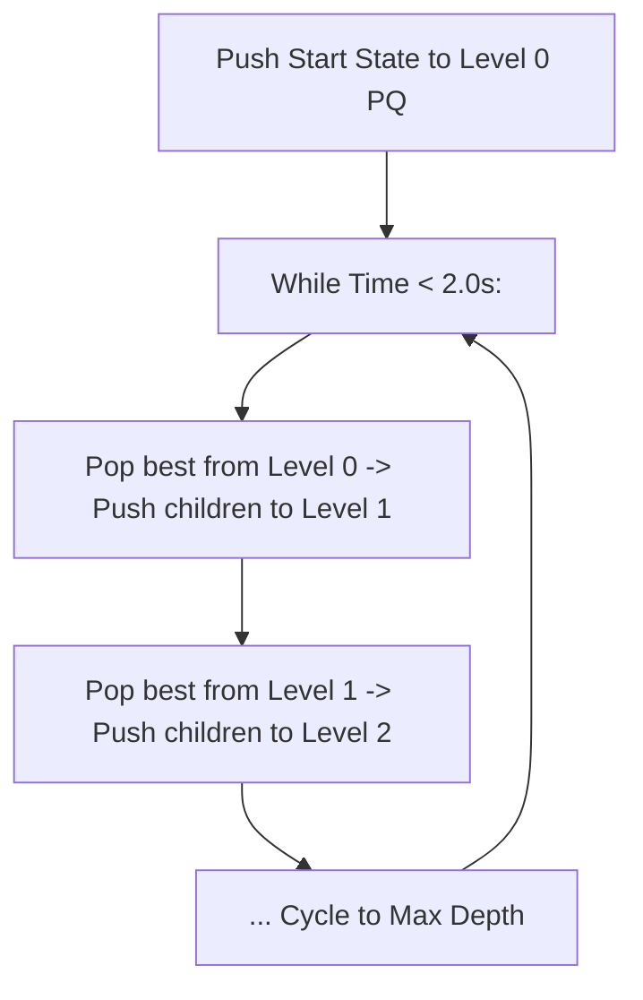

# Unit 9: Mathematical Foundations, Discrete Geometry & Heuristic Search
> **Skill Path**: Pass the Competitive Programming & Technical Interview with Python & C++  
> **Unit Status**: Discrete Math, Number Theory, Geometry & Marathon Heuristics

---

## 🎯 Unit Overview
In this unit, you will explore the mathematical foundations of competitive programming. You will master the **Shoelace Formula** and **Pick’s Theorem** for lattice polygon geometry, use the **Stern-Brocot Tree** to approximate real numbers with irreducible fractions in logarithmic time, analyze Legendre's formula for **Double Factorials**, and transition from exact algorithmic contests to **AtCoder Heuristic Contests (AHC)** using **Chokudai Search** tree pruning.

---

## Lesson 9.1: Shoelace Formula & Pick’s Theorem

*(Synthesized from [`ピックの定理とShoelace formula` by `@tmokmss`](https://tmokmss.hatenablog.com/entry/pick_theorem_and_shoelace_formula))*

### 1. The Shoelace Formula (Gauss's Area Formula)
Given a polygon with $N$ vertices $(X_0, Y_0), \dots, (X_{N-1}, Y_{N-1})$ in counterclockwise order:
$$2 \times \text{Area} = \left| \sum_{i=0}^{N-1} (X_i Y_{i+1} - X_{i+1} Y_i) \right| \quad \text{where } (X_N, Y_N) = (X_0, Y_0)$$

Because all coordinates are integers, computing $2 \times \text{Area}$ uses **pure integer arithmetic**, completely avoiding floating-point precision error!

### 2. Boundary Lattice Points Formula
The number of integer grid points strictly on the segment between $(x_1, y_1)$ and $(x_2, y_2)$ is:
$$\gcd(|x_1 - x_2|, |y_1 - y_2|)$$
Summing this across all $N$ edges yields the total boundary lattice points $B$.

### 3. Pick’s Theorem for Interior Points
Pick's Theorem connects polygon Area $A$, interior points $I$, and boundary points $B$:
$$A = I + \frac{B}{2} - 1 \implies 2A = 2I + B - 2$$
Rearranging to solve for the number of strictly **interior lattice points** $I$:
$$I = \frac{2A - B + 2}{2}$$

```python
import math

def analyze_lattice_polygon(vertices: list[tuple[int, int]]) -> dict:
    n = len(vertices)
    area2 = 0
    B = 0

    for i in range(n):
        x1, y1 = vertices[i]
        x2, y2 = vertices[(i + 1) % n]
        
        # Shoelace cross product
        area2 += (x1 * y2 - x2 * y1)
        # Boundary points on edge i -> i+1
        B += math.gcd(abs(x1 - x2), abs(y1 - y2))

    area2 = abs(area2)
    # Pick's Theorem:
    I = (area2 - B + 2) // 2

    return {
        "area": area2 / 2.0,
        "boundary_points": B,
        "interior_points": I
    }
```

---

## Lesson 9.2: Stern-Brocot Tree & Double Factorials

### 1. Stern-Brocot Tree Fraction Approximation
*(Synthesized from [`Stern-Brocot Treeで既約分数近似` by `@okaponta_`](https://qiita.com/okaponta_/items/36d485004d04b37519a3))*

The Stern-Brocot Tree is an infinite binary search tree that generates all positive irreducible fractions $\frac{p}{q}$ ($\gcd(p, q) = 1$) in sorted order.
- Given two fractions $\frac{a}{b}$ and $\frac{c}{d}$, their **mediant** is:
  $$\text{Mediant} = \frac{a + c}{b + d}$$
- Property: $\frac{a}{b} < \frac{a+c}{b+d} < \frac{c}{d}$.
- **Application**: Binary searching on mediants finds the closest irreducible fraction $\frac{p}{q}$ to any target real number with denominator $q \le N$ in $O(\log N)$ time!

### 2. Double Factorials & Trailing Zeros (ABC148 E)
*(Synthesized from [`ABC148E 二重階乗` by `@comet725`](https://qiita.com/comet725/items/17245a58c026d860e7ba))*

Double factorial $N!!$ is the product of every second integer up to $N$:
- **If $N$ is odd**: $N!! = N \times (N-2) \times \dots \times 1$. Since there are no even numbers, there are no factors of 2. Therefore, an odd double factorial has **0 trailing zeros**.
- **If $N$ is even**: Factoring out 2 from each term:
  $$N!! = 2 \times 4 \times \dots \times N = 2^{N/2} \times \left(\frac{N}{2}\right)!$$
  Trailing zeros are determined by the count of factor 5 in $(N/2)!$, calculated using **Legendre's Formula**:
  $$\text{Zeros} = \sum_{k=1}^{\infty} \left\lfloor \frac{N/2}{5^k} \right\rfloor$$

```python
def count_double_factorial_zeros(N: int) -> int:
    if N % 2 != 0:
        return 0
    
    n = N // 2
    zeros = 0
    denom = 5
    while denom <= n:
        zeros += n // denom
        denom *= 5
    return zeros
```

---

## Lesson 9.3: Heuristic Optimization & Chokudai Search

*(Synthesized from [`chokudaiサーチで探索木の枝刈りをやる` by `@At-sushi`](https://qiita.com/At-sushi/items/26781eb6cc1e9f1f0ac7) and [`ahc016参加記` by `@ueta7`](https://qiita.com/ueta7/items/87d5cd2f320b36ef3979))*

### 1. ABC (Exact) vs AHC (Heuristic) Mindset
- In algorithmic contests (ABC), solutions must be 100% provably optimal.
- In marathon contests (AHC), problems are **NP-hard** (Traveling Salesperson, Graph Optimization). There is no polynomial exact solution. The goal is to **maximize a score function within 2.0 seconds**.

### 2. Chokudai Search Architecture
Chokudai Search is a hybrid between **Beam Search** and **Priority Queue Search** invented by AtCoder CEO `@chokudai`:
- Traditional Beam Search only keeps the top $W$ best states at each depth and discards the rest. If the true optimal path requires taking a temporarily worse step, Beam Search fails.
- **Chokudai Search** maintains a separate priority queue for each depth level $0 \dots D_{\text{max}}$. It cycles repeatedly through depth levels, expanding the next best candidate from depth $d$ into depth $d+1$ until the 2.0-second time budget is exhausted!



---

## 🛠️ Portfolio Project 9: Lattice Polygon Solver & Chokudai Heuristic Optimizer

### Implementation:
```python
"""
Portfolio Project 9: Lattice Geometry & Chokudai Heuristic Search Engine
ALGOVERSE Course Suite
"""

import math
import heapq
import time

class LatticeGeometryEngine:
    @staticmethod
    def solve_polygon(vertices: list[tuple[int, int]]) -> dict:
        n = len(vertices)
        area2 = 0
        B = 0
        for i in range(n):
            x1, y1 = vertices[i]
            x2, y2 = vertices[(i + 1) % n]
            area2 += (x1 * y2 - x2 * y1)
            B += math.gcd(abs(x1 - x2), abs(y1 - y2))

        area2 = abs(area2)
        I = (area2 - B + 2) // 2
        return {"area": area2 / 2.0, "boundary_lattice_points": B, "interior_lattice_points": I}


class ChokudaiSearchEngine:
    def __init__(self, max_depth: int, beam_width: int):
        self.max_depth = max_depth
        self.beam_width = beam_width
        self.pqs = [[] for _ in range(max_depth + 1)] # Priority queues per depth

    def search(self, start_state, expand_func, score_func, time_limit_sec: float = 0.5):
        start_time = time.time()
        # Max-heap: store (-score, state)
        heapq.heappush(self.pqs[0], (-score_func(start_state), start_state))
        
        best_state = start_state
        best_score = score_func(start_state)

        while time.time() - start_time < time_limit_sec:
            for d in range(self.max_depth):
                if not self.pqs[d]:
                    continue
                
                neg_score, current_state = heapq.heappop(self.pqs[d])
                score = -neg_score
                
                if score > best_score:
                    best_score = score
                    best_state = current_state

                # Expand next states
                for nxt_state in expand_func(current_state, d):
                    nxt_score = score_func(nxt_state)
                    if len(self.pqs[d + 1]) < self.beam_width:
                        heapq.heappush(self.pqs[d + 1], (-nxt_score, nxt_state))
                    elif nxt_score > -self.pqs[d + 1][0][0]:
                        heapq.heappushpop(self.pqs[d + 1], (-nxt_score, nxt_state))

        return best_state, best_score


if __name__ == "__main__":
    # Test Lattice Geometry
    square = [(0, 0), (4, 0), (4, 4), (0, 4)]
    geo_res = LatticeGeometryEngine.solve_polygon(square)
    print("Geometry Test (4x4 Square):", geo_res) # Expected: Area 16, B 16, I 9
```

---

## 📝 Unit 9 Concept Quiz

1. **Question 1**: Under Pick’s Theorem, if a lattice polygon has Area $A = 10$ and $B = 8$ boundary integer points, how many strictly interior lattice points $I$ does it contain?
   - (A) $I = 10 - 8/2 + 1 = 7$ *(Correct)*
   - (B) $I = 10 + 8/2 - 1 = 13$
   - (C) $I = 8$
   - (D) $I = 0$

2. **Question 2**: Why does the double factorial $N!!$ have 0 trailing zeros whenever $N$ is odd?
   - (A) Odd numbers cannot be multiplied
   - (B) Trailing zeros require pairs of factor 2 and factor 5 ($2 \times 5 = 10$); an odd double factorial contains no even numbers, so factor 2 count is 0 *(Correct)*
   - (C) Because $N$ is prime
   - (D) Odd factorials overflow memory

3. **Question 3**: What is the primary operational difference between standard Beam Search and Chokudai Search?
   - (A) Chokudai Search uses simulated annealing temperatures
   - (B) Standard Beam Search discards states outside the top $W$ at each level, whereas Chokudai Search keeps multiple depth priority queues and repeatedly cycles to expand deeper states over time *(Correct)*
   - (C) Chokudai search only searches to depth 1
   - (D) Beam search requires GPU parallelization

---

## 🏆 Unit 9 Completion Checklist
- [ ] Understand Shoelace area cross products and boundary $\gcd$ counting.
- [ ] Master Pick's theorem point counting.
- [ ] Implement and test `LatticeGeometryEngine` and `ChokudaiSearchEngine`.
- [ ] Solve **AtCoder ABC148 E (Double Factorials)**.
