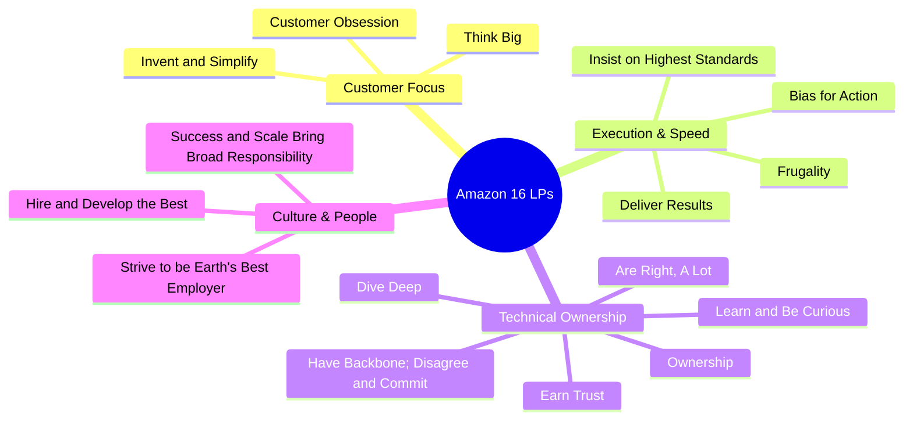
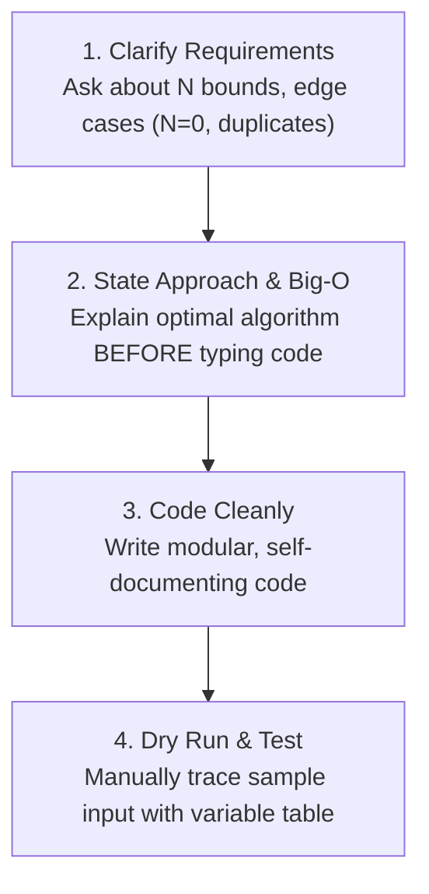

# Unit 10: FAANG Career Capstone: Amazon & Microsoft Technical Hiring Loops
> **Skill Path**: Pass the Competitive Programming & Technical Interview with Python & C++  
> **Unit Status**: Industry Interview Playbook, Behavioral Matrix & CS Fundamentals

---

## 🎯 Unit Overview
In this final capstone unit, you will synthesize all your algorithmic mastery and apply it directly to the rigorous interview pipelines of **Amazon** and **Microsoft**. You will master the **Amazon Online Assessment (OA)**, break down all **16 Amazon Leadership Principles** using the structured **STAR Method**, navigate **Microsoft’s L59–L65+ leveling ladder**, review high-yield **CS Fundamentals (OS, DBMS, Computer Networks)**, and implement object-oriented **Low-Level Design (LLD)** applying the **SOLID principles**.

---

## Lesson 10.1: The Amazon Online Assessment (OA) Playbook

### 1. Structure of the Amazon OA
The OA consists of three consecutive sections:
1. **Coding Assessment (70 minutes, 2 questions)**: LeetCode Medium/Hard difficulty. Passing all public and hidden test cases is mandatory.
2. **Work Simulation (15–20 minutes)**: Scenario-based workplace dilemmas simulating daily SDE team communication.
3. **Work Style Survey (10–15 minutes)**: 50+ self-assessment questions evaluating cultural fit with the 16 Leadership Principles.

### 2. The 5 High-Frequency Amazon OA Coding Archetypes
Based on real candidate reports on Medium:
1. **Multi-Source Grid Traversal**: Rotting Oranges, As Far from Land as Possible (Unit 7).
2. **Two Pointers & Sliding Window**: Substring with at most $K$ distinct characters (Unit 3).
3. **Priority Queue / Heap Reordering**: Reorganize String, Top $K$ Frequent Items (Unit 5).
4. **Monotonic Stack**: Daily Temperatures, Next Greater Element (Unit 2).
5. **Graph Union-Find**: Critical connections, server network connectivity (Unit 5).

---

## Lesson 10.2: Mastering the 16 Amazon Leadership Principles & STAR Method

Unlike most tech companies where behavioral rounds are secondary, **Amazon interviewers spend 20–25 minutes of EVERY 60-minute round evaluating Leadership Principles (LPs)**. Failing the LP evaluation results in rejection even with perfect code.



### The STAR Method Formula ($15\% - 15\% - 50\% - 20\%$)

| Component | Target Length | Golden Rule |
| :--- | :--- | :--- |
| **Situation** | 15% (30-45s) | Set context briefly: company, project name, deadline, and engineering constraint. |
| **Task** | 15% (30-45s) | Define the specific problem assigned specifically to **YOU**. |
| **Action** | **50% (2-3 mins)** | **CRITICAL: Use "I", NOT "We"!** Explain your individual architectural decisions, code implementation, and analytical steps. |
| **Result** | **20% (45-60s)** | **Quantify with data**: Latency reduced by $X\%$, $Y$ hours saved per deployment, $\$Z$ cloud infrastructure savings. |

### The Bar Raiser Round
- An independent senior interviewer outside the hiring organization who holds **veto power**.
- They probe deep into your STAR stories with questions like: *"What specific trade-off did YOU make?"*, *"Why didn't you choose alternative Y?"*, *"What were the exact numerical metrics?"*
- **Strategy**: Always be completely honest. Never exaggerate your individual contribution.

---

## Lesson 10.3: Microsoft Role Hierarchy (The Ladder)

*(Synthesized from Prabhu Kalyan Korivi’s Guide, `prabhukalyan.hashnode.dev`)*

| Level | Title | Typical Experience | Interview Primary Evaluation Focus |
| :--- | :--- | :--- | :--- |
| **L59 – L60** | Software Engineer (SDE I) | 0 – 2 Years (Freshers) | DSA, Core CS Fundamentals (OS/DBMS/Networks), LLD Basics |
| **L61 – L62** | Software Engineer II (SDE II) | 2 – 5 Years | Advanced Coding, Low-Level Design (SOLID / OOD), High-Level System Design |
| **L63 – L64** | Senior Software Engineer | 5 – 10 Years | Multiple System Design Rounds (HLD & LLD), Architectural Impact, Mentorship |
| **L65+** | Principal Software Engineer | 10+ Years | Enterprise Tech Vision, Strategic Architecture, Cross-Org Impact |

---

## Lesson 10.4: Microsoft CS Fundamentals Crash Course

Microsoft explicitly evaluates Computer Science core subjects in technical rounds for SDE I and SDE II candidates:

### 1. Operating Systems (OS)
- **Process vs Thread**: A process has an isolated virtual address space in memory; threads share code, data, and open file descriptors, but maintain separate call stacks and program counters.
- **The 4 Coffman Deadlock Conditions**:
  1. Mutual Exclusion
  2. Hold and Wait
  3. No Preemption
  4. Circular Wait  
  *Breaking any ONE condition guarantees deadlock prevention!*
- **Virtual Memory & Page Faults**: Virtual addresses map to physical RAM frames via Page Tables and the CPU Translation Lookaside Buffer (TLB). A Page Fault occurs when a page is requested that is not resident in physical RAM.

### 2. Database Management Systems (DBMS)
- **ACID Properties**: Atomicity (all-or-nothing transactions), Consistency (preserves schema constraints), Isolation (concurrency control via locking/MVCC), Durability (committed writes survive system crashes via WAL write-ahead logging).
- **B-Trees vs Hash Indexes**: Hash indexes provide $O(1)$ equality lookups but fail at range queries. B-Trees/B+ Trees support both $O(\log N)$ point queries and $O(\log N + K)$ ordered range scans.
- **Normalization**: 1NF (atomic values), 2NF (no partial functional dependency on composite key), 3NF (no transitive dependencies on non-key columns).

### 3. Computer Networks
- **TCP vs UDP**: TCP is connection-oriented, reliable (acknowledgments, sequence numbers, packet retransmission), and implements flow control. UDP is connectionless, lightweight, and prioritized for real-time streaming and gaming.
- **TCP 3-Way Handshake**: `Client --(SYN)--> Server --(SYN-ACK)--> Client --(ACK)--> Server`.
- **DNS Resolution Pipeline**: Browser Cache $\to$ OS Cache $\to$ Local Resolving DNS Server $\to$ Root Name Server (`.`) $\to$ TLD Server (`.com`) $\to$ Authoritative Name Server $\to$ IP returned.

---

## Lesson 10.5: Low-Level Design (LLD) & SOLID Principles

### The 5 SOLID Principles:
1. **S - Single Responsibility Principle (SRP)**: A class should have one, and only one, reason to change.
2. **O - Open/Closed Principle (OCP)**: Classes should be open for extension, but closed for modification (use abstract interfaces and strategy patterns).
3. **L - Liskov Substitution Principle (LSP)**: Subclasses must be substitutable for base classes without breaking program correctness.
4. **I - Interface Segregation Principle (ISP)**: Clients should not be forced to depend on methods they do not use (prefer small, cohesive interfaces).
5. **D - Dependency Inversion Principle (DIP)**: Depend on abstractions, not concrete implementations. High-level business logic should not depend on low-level database or network drivers.

#### LLD Code Sample: Extensible Parking Lot Billing (Strategy Pattern)
```python
from abc import ABC, abstractmethod

# 1. Open/Closed & Strategy Pattern: Pricing Strategy
class PricingStrategy(ABC):
    @abstractmethod
    def calculate_fee(self, hours: int) -> float:
        pass

class HourlyPricingStrategy(PricingStrategy):
    def calculate_fee(self, hours: int) -> float:
        return hours * 5.0

class VIPPricingStrategy(PricingStrategy):
    def calculate_fee(self, hours: int) -> float:
        return hours * 2.5

# 2. Single Responsibility: Vehicle Entity
class Vehicle:
    def __init__(self, license_plate: str, vehicle_type: str):
        self.license_plate = license_plate
        self.vehicle_type = vehicle_type

# 3. Dependency Inversion: ParkingSpot depends on abstraction
class ParkingSpot:
    def __init__(self, spot_id: int, pricing_strategy: PricingStrategy):
        self.spot_id = spot_id
        self.pricing_strategy = pricing_strategy
        self.assigned_vehicle = None

    def calculate_exit_charge(self, hours_parked: int) -> float:
        return self.pricing_strategy.calculate_fee(hours_parked)
```

---

## Lesson 10.6: Live Coding 4-Step Communication Protocol

When presented with a coding problem in live interviews, follow this exact 4-step sequence:



> [!TIP]
> **Growth Mindset Response to Interviewer Hints**: If the interviewer interjects: *"What if the array has negative numbers?"*, do NOT be defensive. Immediately say:  
> *"That's a great point. If negative numbers are present, our two-pointer monotonicity invariant no longer holds, which means we should transition to Prefix Sums with a Hash Map."*  
> Demonstrating agility and welcoming feedback signals high maturity and collaborative strength.

---

## 🛠️ Capstone Portfolio Project: Full FAANG Mock Interview Simulation

### Deliverables:
1. **Timed OA Simulation**: Solve 2 LeetCode Medium/Hard problems under a strict 70-minute countdown timer.
2. **Behavioral STAR Portfolio**: Produce a complete written document containing **at least 4 distinct STAR stories** mapped to Amazon’s Core Leadership Principles (*Customer Obsession, Ownership, Bias for Action, Dive Deep*).
3. **LLD Architecture Blueprint**: Design a production-ready class structure for a real-world system (*Elevator Management System* or *Rate Limiter*) implementing all 5 SOLID principles.

---

## 📝 Final Comprehensive Assessment (40-Question Exam Blueprint)
- 10 Questions on Asymptotic Complexity & Data Structures (DSU, Heaps, Monotonic Stacks, SegTrees).
- 10 Questions on Algorithmic Patterns (Two Pointers, Prefix Sums, Binary Search, DP).
- 10 Questions on Computer Science Fundamentals (OS Threads/Deadlocks, DBMS Normalization/Indexing, Networks TCP/UDP).
- 10 Questions on System Design, Object-Oriented Design (SOLID), and Amazon Leadership Principles.

---

## 🏆 Certificate of Completion

Upon successful completion of all 10 Units and submission of the Capstone Project, you are awarded the:  
**Certified Competitive Programming & FAANG Technical Interview Specialist Credential**.
